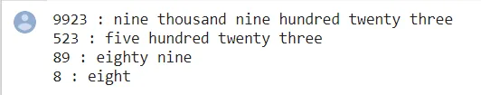
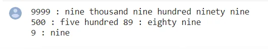

Following is the implementation for the same. The code supports numbers up to 4 digits, i.e., numbers from 0 to 9999. Idea is to create arrays that store individual parts of output strings. One array is used for single digits, one for numbers from 10 to 19, one for 20, 30, 40, 50, .. etc, and one for powers of 10.

Here, I created the words list such as single_digit, two_digit, tens_multiple, and tens_power. so then I get the input from the user. this number divide by 10 by 10. then I mapped the word to each value of module of 10 values.

# Author: Aruna Nuwantha
# Data Scientist program
# NumToWord convertor

# A function that prints
# given number in words

def convert_to_words(num):

 # Get number of digits
 # in given number
 l = len(num)

 # Base cases
 if (l == 0):
 print("empty string")
 return

 if (l > 4):
 print("Length more than 4 is not supported")
 return

 # The first string is not used,
 # it is to make array indexing simple
 single_digits = ["zero", "one", "two", "three",
 "four", "five", "six", "seven",
 "eight", "nine"]

 # The first string is not used,
 # it is to make array indexing simple
 two_digits = ["", "ten", "eleven", "twelve",
 "thirteen", "fourteen", "fifteen",
 "sixteen", "seventeen", "eighteen",
 "nineteen"]

 # The first two string are not used,
 # they are to make array indexing simple
 tens_multiple = ["", "", "twenty", "thirty", "forty",
 "fifty", "sixty", "seventy", "eighty",
 "ninety"]

 tens_power = ["hundred", "thousand"]

 # Used for debugging purpose only
 print(num, ":", end=" ")

 # For single digit number
 if (l == 1):
 print(single_digits[ord(num[0]) - 48])
 return

 # Iterate while num is not '\0'
 x = 0
 while (x < len(num)):

 # Code path for first 2 digits
 if (l >= 3):
 if (ord(num[x]) - 48 != 0):
 print(single_digits[ord(num[x]) - 48],
 end=" ")
 print(tens_power[l - 3], end=" ")
 # here len can be 3 or 4

 l -= 1

 # Code path for last 2 digits
 else:

 # Need to explicitly handle
 # 10-19. Sum of the two digits
 # is used as index of "two_digits"
 # array of strings
 if (ord(num[x]) - 48 == 1):
 sum = (ord(num[x]) - 48 +
 ord(num[x+1]) - 48)
 print(two_digits[sum])
 return

 # Need to explicitely handle 20
 elif (ord(num[x]) - 48 == 2 and
 ord(num[x + 1]) - 48 == 0):
 print("twenty")
 return

 # Rest of the two digit
 # numbers i.e., 21 to 99
 else:
 i = ord(num[x]) - 48
 if(i > 0):
 print(tens_multiple[i], end=" ")
 else:
 print("", end="")
 x += 1
 if(ord(num[x]) - 48 != 0):
 print(single_digits[ord(num[x]) - 48])
 x += 1

if __name__ == '__main__':
# Driver Code
 convert_to_words("9999") # Four Digits
 convert_to_words("500") # Three Digits
 convert_to_words("89") # Two Digits
 convert_to_words("9") # One Digits

[#here](https://www.datainsightonline.com/blog/hashtags/here) is some test cases

[Github repo](https://github.com/arunanuwantha97/Datacamp-Assignment/blob/main/number.ipynb)
