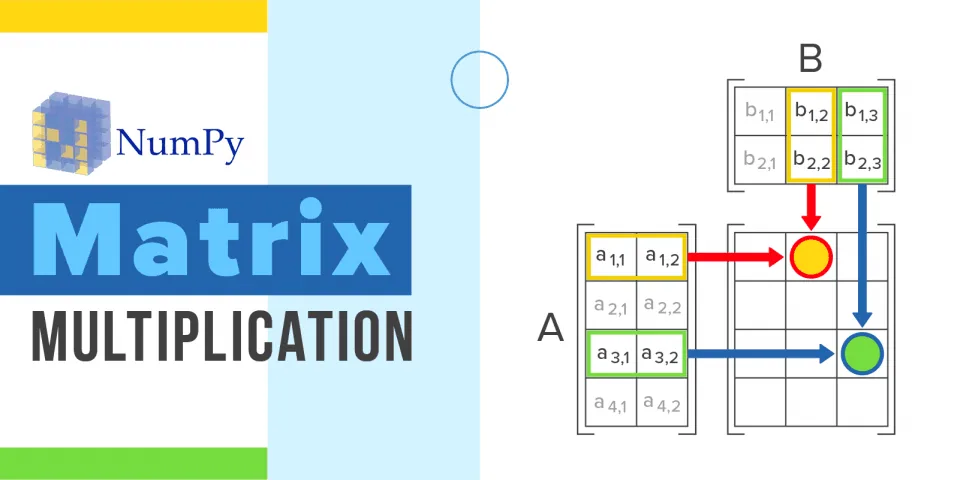

This article will show you how to use Python to execute element-wise matrix multiplication. Every element of the first matrix is multiplied by the corresponding element of the second matrix in element-wise matrix multiplication.



Both matrices should have the same dimensions when doing element-wise matrix multiplication. The size of the resultant matrix c of element-wise matrix multiplication a\*b = c is always the same as that of a and b.

The NumPy library's np.multiply(x1, x2) method accepts two matrices as input, performs element-wise multiplication on them, and returns the resultant matrix as input.

To execute element-wise input, we must send the two matrices as input to the np.multiply() method. The example code below shows how to use Python's np.multiply() function to perform element-wise multiplication of two matrices.

```python
# importing numpy library
import numpy as np

num1 = np.array([[17,46,33,7,12],[13,25,8,3,26]])
num2 = np.array([[5,26,11,17,22],[21,38,19,3,4]])

print(np.multiply(num1,num2))
```

Output:

```python
[[  85 1196  363  119  264]  [ 273  950  152    9  104]]
```

This is a very simple example of array multiplication using numpy library in python.
