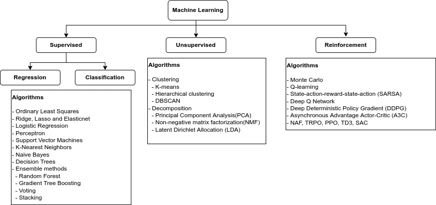
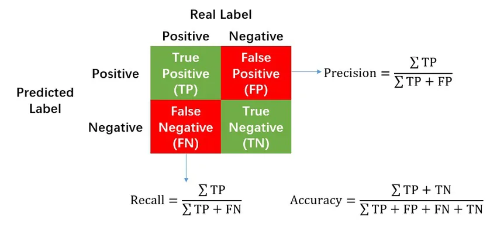

## What is Machine Learning?

Arthur Samuel (1959) - Machine Learning: Field of study that gives computers the ability to learn without being explicitly programmed

Tom Mitchell (1998) - A computer program is said to learn from experience E with respect to some task T and some performance measure P, if its performance on T, as measured by P, improves with experience E.

Suppose your disease detection system classifies which patient has diabetes mellitus (DM) or not based on some features like age, sex, family history, smoking history, and so on. Classifying patients having DM or not having DM is the task, T. Looking at previous data and matching the features with labels is the experience, E. The number of patients correctly classified as having DM or not is the performance, P.

There are mainly two types of machine learning algorithms: supervised learning and unsupervised learning. Others are reinforcement learning, recommender systems, and so on.

## Supervised learning VS UnSupervised learning

If the experience, E or previous data, has the answers (labels), it is supervised learning. From the previous example, the data must contain which patient has DM and which patient does not have DM.

If the experience, E has no answer (label), it is unsupervised learning.

## Supervised Learning

According to the data type of the label, there are two types of learning: regression and classification. If the data type of the label is a numerical variable, eg- price, the problem is regression. If the data type of the label is a categorical variable, eg-having DM or not, the problem is classification. Most of the algorithms support both regression and classification problems. Some do not support it. For example, logistic regression is not for regression problems though its name contains regression.

## Steps for machine learning

1. Frame the problem

- The first question to ask is what exactly the objective is?
- Can data be easily available?
- Which advantages will get if the model is built successfully?
- Will this model be easily applicable to real-world situations?
- Then, decide the problem is a classification task, regression task, or reinforcement task.
- How should performance be measured?
- What would be the minimum performance needed to reach the objective?

2. Get the data

- List the data you need and how much you need
- Find and document where you can get the data.
- Check how much space it will take.
- Check legal obligations, and get authorization if necessary.
- Create a workspace
- Get the data
- Check the type of data (eg- time series, geographical, etc)
- Sample a test set put it aside, and never look at it.

3. Explore the data

- Explore with summary statistics, name and type of attributes, missing values, types of distribution
- For supervised learning tasks, identify the target attribute.
- Visualize the data
- Study the correlations between attributes.
- Data transformation if needed.

4. Prepare the data

- Work on copies of the data
- Data cleaning - fill in missing values or drop the rows or columns
- Feature selection if needed - drop attributes that provide no useful information for the task
- Feature engineering where appropriate
- Feature scaling - standardize or normalize features.

5. Finding the models

- Train many quick models from different categories such as linear, SVM, random forest, neural nets, etc.
- Measure and compare their performance
- Analyze the most significant variables for each algorithm
- Perform a quick round of feature selection and engineering
- Repeat these four steps
- Shortlist the top models

6. Fine-tune the system

- Fine-tune the hyperparameters using cross-validation
- Try ensemble methods

7. Present your solution

- Document what you have done
- Create a presentation

8. Launch

These are the complete steps for a machine learning project. Next, I want to discuss some of the most important concepts in machine learning.

## How is the performance, T measured?

It depends on the type of label data, classification task, or regression task. For regression tasks, the commonly used measures are

- Mean absolute error (MAE)
- Mean squared error (MSE)
- Root mean squared error (RMSE)
- Mean absolute percentage error (MAPE)
- R-square score (R2)

The concept for the calculation of MAE, MSE, and RMSE is the difference between the actual label values and the predicted values. For MAE, calculate the average of the absolute differences between the actual and predicted value, for MSE, the average of the squared difference values and for RMSE, the square root of MSE. For MAPE, calculate the difference between the actual and predicted value, then it is divided by the actual value, then calculate the average value of the absolute value of that result and multiply by 100 to make a percentage.

For classification tasks, the commonly used measures are

- Accuracy
- Precision
- Recall or Sensitivity
- F1 score
- ROC-AUC score

For binary classification tasks, there are only two labels (0 or 1, true or false, positive or negative). For example, having DM can be labeled as 1 or true or positive.

For classification tasks, we need to understand the following terms.

You can think of the values of the label as an array. If you have 1000 data, the label is a list of 1000 numbers and for the following terms, you can think of comparing the list of 1000 data of actual value and the list of 1000 data of predicted value.

TRUE POSITIVE (TP) - the actual is true and the prediction is true.

TRUE NEGATIVE (TN) - the actual is false and the prediction is false.

FALSE POSITIVE (FP) - the actual is false and the prediction is true.

FALSE NEGATIVE (FN) - the actual is true and the prediction is false.

**Accuracy - overall effectiveness of a classifier**

> ACC = True values / Total values

Accuracy can be calculated by dividing the true number which is the sum of TP and TN by the total number which is the sum of TP, TN, FP, and FN.

It is not the best metric for all cases. Suppose our data contain 1000 people with only 10 patients with DM. Our model predicts as all normal. The accuracy is still 99% as it correctly predicts the 990 normal people.

**Recall - effectiveness of a classifier to identify positive labels (sensitivity)**

> Recall = TP / Actual true values

Recall can be calculated by dividing the true positive numbers by actual true numbers which is the sum of TP and FN.

From the previous example, the recall score is 0 as there is no true positive.

**Precision - positive predicted value**

> Precision = TP / Predicted true numbers

Precision can be calculated by dividing the true positive numbers by predicted true numbers which is the sum of TP and FP.

From the previous example, the precision score is 1 as it can predict all the actual true values, but in sklearn library, it will give an error for ill-defined.

**F1 score - geometric mean of the precision and recall score**

> **F1 = (2\*Precision\*Recall) / (Precision + Recall)**

F1 score can be calculated by multiplying the precision and recall score and the result is multiplied by 2 and then the result is divided by the sum of precision and recall score.

**Which score should I use?**

It depends on the condition. If you are interested in the positive value and you do not want to miss the positive value as in the above example, the recall score should be used. If you are interested in the negative value, the precision is fine. If the positive and negative values are equally weighted, f1-score should be used.

## Why do we need Train-Test-Split?

The goal of machine learning is to find the best model that can predict the most correct result for real-world situations. In supervised learning, training data means giving a job to the computer to find the best model or algorithm that is well-fitted with the labels. Suppose we have 100000 data and if we use all the data, the computer does the best. It can fit all the data and accuracy is 100%. But, it can be used in real-world situations? We do not know the result of the unseen or untrained data as we used all the data as training. So, training and testing or hold-out sets are split to test and compare the results.

**Underfitting and Overfitting or Bias-Variance trade-off** concept come from comparing the performance results of the training and test sets. Overfitting resembles a student who studies math by heart and he will not answer unseen questions. So, in training data, it will give high results but in testing data, it will give poor results. Underfitting resembles a student who does not study. So, in both training and testing data, it will give poor results.

That’s all for now. I think these are the most important concepts in machine learning.

Reference:

[Hands-On Machine Learning with Scikit-Learn, Keras, and TensorFlow, 2nd Edition](https://www.oreilly.com/library/view/hands-on-machine-learning/9781492032632/)
