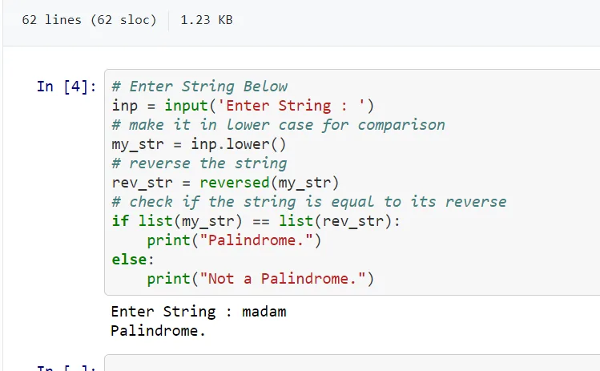

This is my task # 02 for the first assignment which is not from the task list uploaded in Google Classroom.

Program Description: User will enter the string and the program will check whether the string and its reverse are same or not which is called Palindrome.

For Example:

- madam and its reverse madam both are same so this is a Palindrome.

- water and its reverse retaw both are different so this is not a Palindrome.

Code Description:

- User enters a string.

- Make the string into lower case so its reverse would also be in lower case and it would be easy.

- Then used reversed function to reverse the string.

- Then using if condition and putting both string and its reverse into separate lists and check the letters if the reverse and its string are same or not.

- If string is same the program will print "Palindrome." else it will print "Not a Palindrome."

Code Is Attached Below as a snip of Jupyter Notebook.

Thankyou.

Regards,

Hamza Khalid
