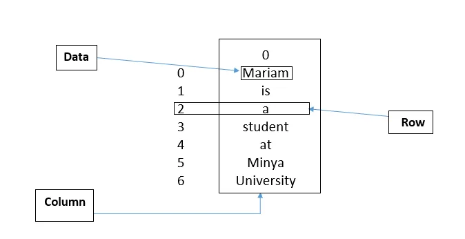

A Data frame is a two-dimensional data structure.

Data Frame is a module in Pandas Library, so to use it for the first time we should make sure that we install Pandas. if not, we can install it by using the following command:

```python
pip install pandas
```

We can use Data Frame by importing it first from pandas as follows:

```python
import pandas as pd
```

An example code of using Data Frame:

```python
lst = ['Mariam', 'is', 'a', 'student', 'at', 'Minya',                      'University']
df = pd.DataFrame(lst)
print(df)
```

So, the output will be as follows:

|  |  |
| --- | --- |
| 0 | Mariam |
| 1 | is |
| 2 | a |
| 3 | student |
| 4 | at |
| 5 | Minia |
| 6 | University |

Pandas Data Frame consists of three components, the data, rows, and columns. We can see that in the previous output:



Pandas Data Frame can be made from the lists, dictionaries, a list of dictionaries, etc.

We can make it from lists the same as the previous example and more complex as follows:

```python
lst3 = [['Mariam', 'Ahmad', 21], ['Hoda', 'Ali', 18],
    ['Alaa', 'Adel', 22], ['Gehad', 'Mosa', 21.5], ['Ahmad', 'Khabeer', 31], ['Mohamad', 'Ahmad', 23], ['Omar', 'Al-Saidi', 19.5]]

df = pd.DataFrame(lst3, index = ['a', 'b', 'c', 'd', 'e', 'f', 'g'], columns = ['First Name', 'Last Name', 'Age'])

df
```

The output will be:

|  |  |  |  |
| --- | --- | --- | --- |
| ​ | First Name | Last Name | Age |
| A | Mariam | Ahmed | 21 |
| B | Hoda | Ali | 18 |
| C | Alaa | Adel | 22 |
| D | Gehad | Mosa | 21.5 |
| E | Ahmed | Khabeer | 31 |
| F | Mohamed | Ahmed | 23 |
| G | Omar | Al-Saidi | 19.5 |

We can form a Data Frame from the Dictionary of lists as follows:

```python
name = ["Mariam", "Alaa", "Gehad", "Aya"]
age = [21, 22, 21.5, 22]
score = [90, 85, 65, 50]
dict = {'Name': name, 'Age': age, 'Score': score}
df = pd.DataFrame(dict)
df
```

So, the output will be:

|  |  |  |  |
| --- | --- | --- | --- |
| ​ | Name | Age | Score |
| 0 | Mariam | 21 | 90 |
| 1 | Alaa | 22 | 85 |
| 2 | Gehad | 21.5 | 65 |
| 3 | Aya | 22 | 50 |

We can perform basic operations on rows/columns like selecting, deleting, adding, and renaming as follows:

```python
# Adding Column:
df.insert(3, "Grade", ['A+', 'A', 'D+', 'D'], True)

# Deleting Column using drop:
df.drop('Score', inplace = True, axis=1)

# Renaming Column:
df.rename(columns = {'Name': 'Student_Name'}, inplace = True)
```

In real-life, a Pandas Data Frame is created by loading the data sets from existing storage, storage can be SQL Database, CSV file, and an Excel file.

We can use 'Titanic.csv' to form a DataFrame as follows:

```python
myData = pd.read_csv("Titanic.csv")
```

We can select (or display) some columns from a CSV file as follows:

```python
selected2 = pd.read_csv("Titanic.csv", usecols = ["Name", "Age", "Sex", "Survived"])
```

We can select a row from the selected columns as follows:

```python
row1 = selected2.iloc[1]
```

That's it, I hope this article was worth reading and helped you acquire new knowledge no matter how small.

Feel free to check up on the [notebook](https://github.com/MariamAlsaedy/Data-Insight-Scholarship-Article-1/blob/main/DataFrame.ipynb). You can find the results of code samples in this post.
