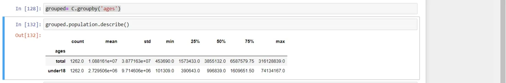

Pandas is one of the brilliant software libraries that is written in Python. It has vast techniques in data manipulation and analysis for numerical tables and time series and also plotting.

Today we will walk through the different techniques of Pandas to learn more about them with examples to apply.

**1- Merging and joining DataFrames:**

Pandas has the ability to merge two dataframes like merging two tables together.

Let's assume that we have two dataframes A and B, so if we want to merge them

pd.merge(A,B, how=" ", on=)

The dots here refer to many specifications that will lead to different results after merging.

how : specifies the merge method

|  |  |
| --- | --- |
| Merge Method | Description |
| left | Use keys from left frame only |
| right | Use keys from right frame only |
| outer | Use union of keys from both frames |
| inner | Use intersection of keys from both frames |

on: defines the key or list of keys we merge the data on.

Let's take an example on merging the states data with their abbreviations.

The full notebook is found here.

```python
pd.merge(A, B , how='right' , on='state')
```

**2- Imputing missing values:**

After merging the two dataframes into one, there might be some missing data. There are two ways to deal with them in pandas; either to drop them or to fill them with a certain value.

.dropna(): we can drop data either on row level or on column level.

If You want to drop the entire row where some value is NaN, specify the index=0. This will drop only the row.

On the other hand you can drop the entire column containing any NaN value.

If you have a lot of missing data, there might be a better option which is the fill option.

.fillna(): There are many techniques to fill the missing data, such as .fillna(0) or .fillna("missing")where it replaces the NaN with 0 or the string missing.

There are though some better choices that help more through the data analysis phase such as filling with the mean of the data .fillna(df.mean()).

Another way is method= ffill or forward fill which replaces the missing data with the prcedent value to it either in row or column. Similarily, method = bfill replaces the missing data with the one comes after it.

In simple words, it is like duplicating the cell either the previous or the one comes later.

Since there are no empty data, I will use the general code to clarify the point.

```python
C.fillna(0)
```

**3- Grouping data**

After making sure the dataframes are joined and that we have handled the missing values, now it is time for analysis. But sometimes we need to group data using a specific Pandas object or list of objects.

Here comes .groupby()

We can even group by dropna so as to exclude them from any further operation without handling them as in technique 2.

After grouping the data we can do all sorts of functions on them.

Now let's group our data by ages.

```python
grouped= C.groupby('ages')
grouped.population.describe()
```

The output gives the statistics of population grouped by the age.



Now we will work on different data sets that contain dates, for the last two techniques.

**4- Time and date functionality**

Pandas has the ability to convert any string into timedate using pd.to_datetime() after importing datetime package.

Handling the dates and times in their special way in python allows to perform many tasks. Like having a timestamp or extracting a certain time unit from your data such as .month or .day

It also allows working amongst different time zones and creating a time zone alert functions.

Take an example the data set of Nobel prize winners:

```python
from datetime import datetime
nobel['dateAwarded'] = pd.to_datetime(nobel['dateAwarded'])
```

Converting the format of the date into datetime allows to extract the year or the month from it : .dt.year

**5- Time Deltas**

Another similar technique and complementary to the previous is time deltas. Time deltas allows to perform mathematical operations on time as subtracting and adding days or weeks. In other words, it handles time in its units.

Using this technique we can count how far ago the nobel prize was awarded to someone.
