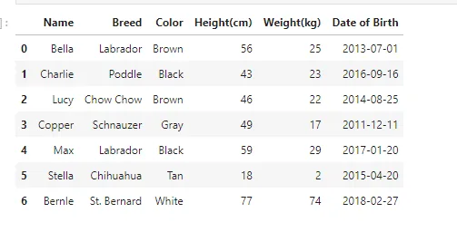
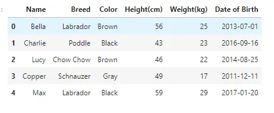
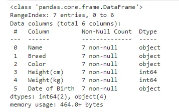
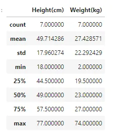

Data exploration can be overwhelming for anyone who has little to no background in data analysis. There is technically no limits to what you can explore and there is no guidelines to what you should be looking for. But as the saying goes, all journeys begin with a single step.

```python
import pandas as pd
import numpy as np
```

## Read Dataset
```python
df = pd.read_csv('Rectangular Data.csv')
df
```



## Explore Dataset-head()
we use head() method to see the first five rows in the dataset.

```python
df.head()
```



## Explore Dataset:info()
The info() function is used to print a concise summary of a DataFrame. This method prints information about a DataFrame including the index dtype and column dtypes, non-null values and memory usage. Whether to print the full summary. By default, the setting in pandas.

```python
df.info()
```



## Explore Dataset: .shape
The shape attribute of pandas. DataFrame stores the number of rows and columns as a tuple (number of rows, number of columns) . It is also possible to unpack and store them in separate variables.

```python
df.shape
```

(7, 6)

## Explore Dataset: .describe()
Pandas describe() is used to view some basic statistical details like percentile, mean, std etc. of a data frame or a series of numeric values. When this method is applied to a series of string, it returns a different output which is shown in the examples below.

```python
df.describe()
```



## Components of a DataFrame: .values
The values property is used to get a Numpy representation of the DataFrame. Only the values in the DataFrame will be returned, the axes labels will be removed. The values of the DataFrame. A DataFrame where all columns are the same type (e.g., int64) results in an array of the same type.

```python
df.values
```

```python
array([['Bella', 'Labrador', 'Brown', 56, 25, '2013-07-01'],
       ['Charlie', 'Poddle', 'Black', 43, 23, '2016-09-16'],
       ['Lucy', 'Chow Chow', 'Brown', 46, 22, '2014-08-25'],
       ['Copper', 'Schnauzer', 'Gray', 49, 17, '2011-12-11'],
       ['Max', 'Labrador', 'Black', 59, 29, '2017-01-20'],
       ['Stella', 'Chihuahua', 'Tan', 18, 2, '2015-04-20'],
       ['Bernle', 'St. Bernard', 'White', 77, 74, '2018-02-27']],
      dtype=object)
```

## Components of a DataFrame: .columns and .index
The values property is used to get a Numpy representation of the DataFrame. Only the values in the DataFrame will be returned, the axes labels will be removed. The values of the DataFrame. A DataFrame where all columns are the same type (e.g., int64) results in an array of the same type.
What does .columns do in Pandas? It can be thought of as a dict-like container for Series objects. This is the primary data structure of the Pandas. Pandas DataFrame. columns attribute return the column labels of the given Dataframe

```python
df.columns
```

```python
Index(['Name', 'Breed', 'Color', 'Height(cm)', 'Weight(kg)', 'Date of Birth'], dtype='object')
```

```python
df.index
```

```python
RangeIndex(start=0, stop=7, step=1)
```
