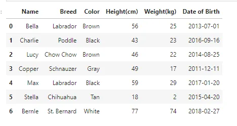
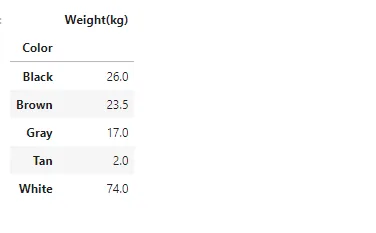
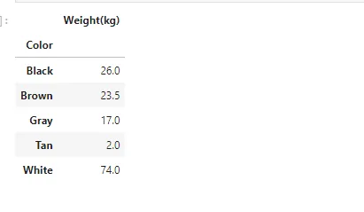
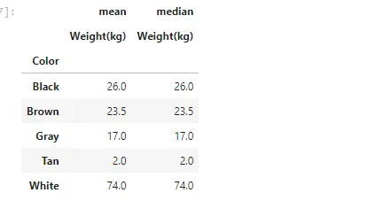
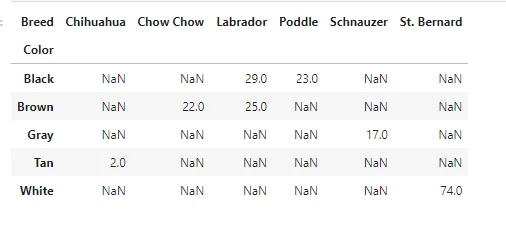
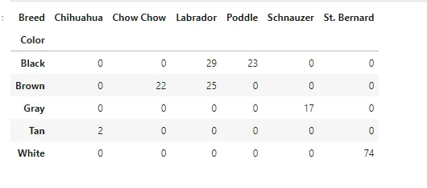
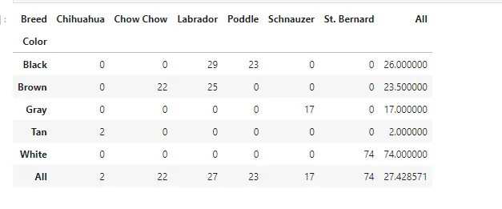

Pivot table in pandas is an excellent tool to summarize one or more numeric variable based on two other categorical variables. Pivot tables in pandas are popularly seen in MS Excel files. In python, Pivot tables of pandas dataframes can be created using the command: pandas. pivot_table.

```python
import pandas as pd
import numpy as np
```

## Read Dataset
```python
df = pd.read_csv('Srt_dta.csv')
df
```



## Pivot Table
Here we calculated the mean of individual weight(kg) with color
**values: column to aggregate, optional**
(If an array is passed, it must be the same length as the data.
The list can contain any of the other types (except list). Keys to group by on the pivot table index. If an array is passed, it is being used as the same manner as column values.)
**index: column, Grouper, array, or list of the previous**

```python
df.pivot_table(values='Weight(kg)', index='Color')
```



## Different Statistics
```python
df.pivot_table(values='Weight(kg)', index='Color', aggfunc=np.median)
```



## Multiple Statistics
**aggfunc : function, list of functions, dict, default numpy.mean**

If list of functions passed, the resulting pivot table will have hierarchical columns whose top level are the function names (inferred from the function objects themselves) If dict is passed, the key is column to aggregate and value is function or list of functions.

```python
df.pivot_table(values='Weight(kg)', index='Color', aggfunc=[np.mean, np.median])
```



## Pivot on two variable
**columns: column, Grouper, array, or list of the previous**

If an array is passed, it must be the same length as the data. The list can contain any of the other types (except list). Keys to group by on the pivot table column. If an array is passed, it is being used as the same manner as column values.

```python
df.pivot_table(values='Weight(kg)', index='Color', columns='Breed')
```



## Filling missing values in pivot tables
**fill_value: scalar, default None**

Value to replace missing values with (in the resulting pivot table, after aggregation).

```python
df.pivot_table(values='Weight(kg)', index='Color', columns='Breed', fill_value=0)
```



## Summing with pivot tables
**margins: bool, default False**

Add all row / columns (e.g. for subtotal / grand totals)

```python
df.pivot_table(values='Weight(kg)', index='Color', columns='Breed', fill_value=0, margins=True)
```



## [GitHub](https://github.com/abubinfahd/Data-Insight/blob/main/Assignments/Pandas%20Technique/Pandas%20Technique-Pivot%20Table.ipynb)
