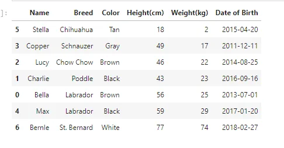
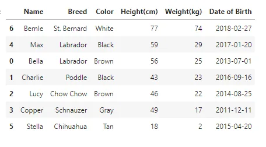
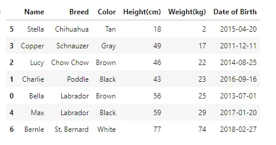
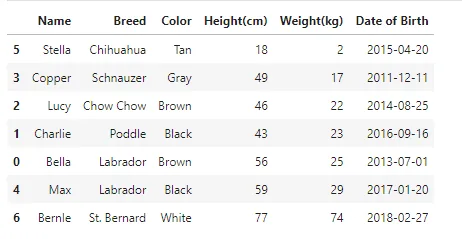

```python
import pandas as pd
import numpy as np
```

## Read Dataset
```python
df = pd.read_csv('Srt_dta.csv')
df
```


## Sorting
Pandas sort_values() function sorts a data frame in Ascending or Descending order of passed Column. It's different than the sorted Python function since it cannot sort a data frame and particular column cannot be selected.

```python
df.sort_values('Weight(kg)')
```



## Sorting in** descending **value
To sort in descending order, we need to specify ascending=False

```python
df.sort_values('Weight(kg)', ascending=False)
```



## Sorting by multiple variables
Call pandas.DataFrame.sort_values(by, ascending) with by as a list of column names to sort the rows in the DataFrame object based on the columns specified.

```python
df.sort_values(['Weight(kg)', 'Height(cm)'])
```



## Sorting by multiple variables
Call pandas. DataFrame. sort_values(by, ascending) with by as a list of column names to sort the rows in the DataFrame object based on the columns specified in by . Set ascending to a tuple of booleans corresponding to the columns in by , where True sorts in ascending order and False sorts in descending order.

```python
df.sort_values(['Weight(kg)', 'Height(cm)'], ascending=[True, False])
```



## [GitHub Link](https://github.com/abubinfahd/Data-Insight/blob/main/Assignments/Pandas%20Technique/PandasTechnique-Sorting%20DataFrame.ipynb)
