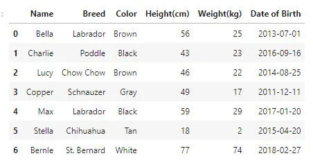
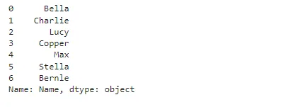
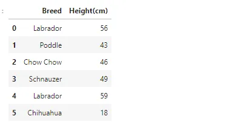
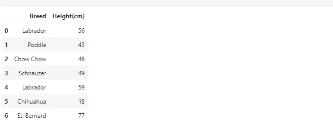
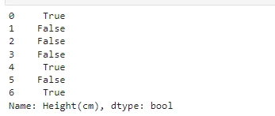
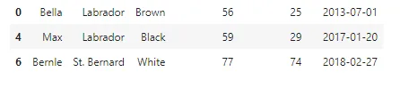
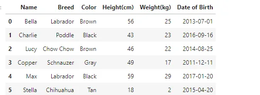
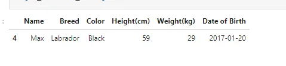
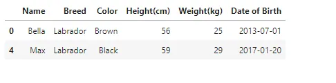

```python
import pandas as pd
import numpy as np
```

**Read Dataset**

```python
df = pd.read_csv('Srt_dta.csv')df
```



## Subsetting columns
To select a single column, use square brackets [] with the column name of the column of interest.

```python
df['Name']
```



## Subsetting multiple columns
```python
# method 1
df[["Breed","Height(cm)"]]
```



```python
# method 2
cols_to_subset = ["Breed","Height(cm)"]
df[cols_to_subset]
```



## Subsetting rows
This return boolean value.

```python
df["Height(cm)"] > 50
```



```python
# This return numeric value
df[df["Height(cm)"] > 50]
```



## Subsetting based on text data
```python
df[df["Breed"] > '2015-01-01']
```



## Subsetting based on multiple conditions
```python
is_lab = df['Breed'] == 'Labrador'
is_black = df['Color'] == 'Black'
df[is_lab & is_black]
```



## Subsetting using .isin()
Pandas isin() method is used to filter data frames. isin() method helps in selecting rows with having a particular(or Multiple) value in a particular column. Parameters: values: iterable, Series, List, Tuple, DataFrame or dictionary to check in the caller Series/Data Frame.

```python
is_black_or_brown = df['Color'].isin(['Black', 'Brown'])
df[is_black_or_brown]
```



<https://github.com/abubinfahd/Data-Insight/blob/main/Assignments/Pandas%20Technique/Pandas%20Tecnique-Subsetting.ipynb>
