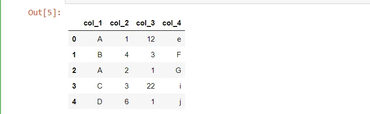
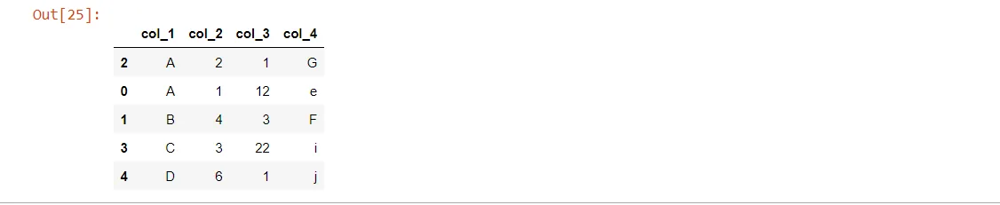
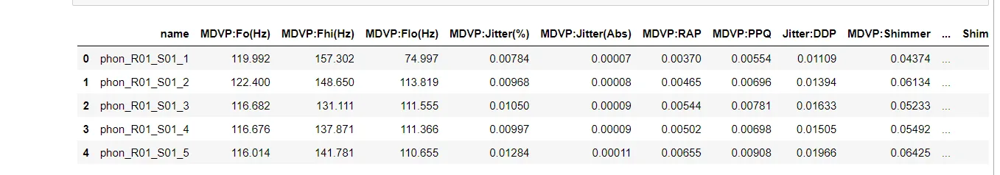
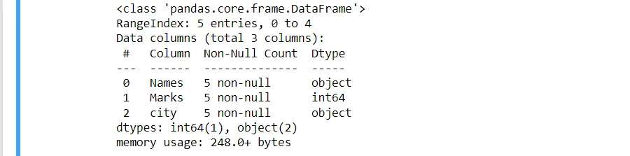

Python is a great language for doing data analysis, primarily because of the fantastic ecosystem of data-centric Python packages. **Pandas** is one of those packages, and makes importing and analyzing data much easier.

In this blog, we will learn how to manipulate data using some simple pandas techniques. These are;

1. Merging
2. Sorting
3. Loading a Dataset
4. Removing duplicates
5. Getting general information about the data

**Merging**

*'Merging' two datasets is the process of bringing two datasets together into one, and aligning the rows from each based on common attributes or columns.*

Merging can also be likened to 'JOIN' operation in Structured Query Language (SQL).

Let's start by importing the pandas library and create two dataFrames to illustrate how merging works in python

```python
import pandas as pd

df1 = pd.DataFrame({'city':['orlando','chicago','new york'],
                     'temperature':[21,20,30]})
df1
```


```python
df2 = pd.DataFrame({'city':['chicago','orlando','new york'],
                    'humidity':[65,68,75]})
df2
```


From the code above, we created our own dataFrames, since both dataframes have a similar column name called 'city', we can merge the two dataframes on that column.

```python
df = pd.merge(df1,df2,on='city')
df
```


The code above does just that.

**Sorting**

we use .sort_values() to sort values in a DataFrame along either axis (columns or rows). Typically, you will want to sort the rows in a DataFrame by the values of one or more columns.

As with the first technique, we will create a dataframe and sort the data on a specific column.

```python
df = pd.DataFrame({'col_1':['A','B','A','C','D'],
                   'col_2':[1,4,2,3,6],
                   'col_3':[12,3,1,22,1],
                   'col_4':['e','F','G','i','j']})
df
```



To sort one column, we use the code below;

```python
df.sort_values(by='col_1')
```


As you can see, 'col_1' has been sorted in ascending order

We can also sort by multiple columns,

```python
df.sort_values(by=['col_1','col_4'])
```



**Loading a Dataset**

Loading the dataset is the first method in any data analysis or science project, as simple as it is, it's very vital to take note of the kind of the data you are using as pandas has different functions for different kinds of data.

In this post, we will see how to load a comma-separated values (csv) file into a dataframe using pandas, and display the first few rows of the dataset.

```python
import pandas as pd
filename = 'D:\Datasets\parkinson_data.csv'

df = pd.read_csv(filename)
display(df.head())
```



The first part of the code imports the pandas library, then we set the filename to a dataset on a local machine.

The .read_csv() function takes in the filename or location of the file to read it into the dataframe (df) assigned to it as a variable, then the display function outputs few rows of the dataset.

**Removing Duplicates**

In most data science projects, you will be required to query data from a database, datasets from databases can contain millions of rows and columns, as such, it's important to find out and remove any duplicates from it as it may ruin your data analysis when not done.

Here, we will create a simple dataframe to give us an idea on how to remove duplicates.

```python
data={'Names':['James','Evans','Stephen','Kristos','James'],
      'Marks':[56,89,22,45,56],
      'city':['Mumbai','new york','orlando','Bangalore','Mumbai']
}

df = pd.DataFrame(data)
display(df)
```


In the above dataframe, the first row and the last row contain the same values, we can remove one and keep the other using this code;

```python
df.drop_duplicates(subset='Names',keep='first')
```


In the code above, we remove the last row and kept only the first row, likewise, we can also remove the first row and keep the last row

```python
df.drop_duplicates(subset='Name', keep='last')
```


**Getting general information about the data**

Exploratory data analysis (EDA)  is an approach to analyzing datasets to summarize their main characteristics, often with visual methods, during EDA, it is very important to get a gist of what the whole data is about, ie the number of rows, columns and also find out if there's any missing values.

Pandas has a function called .info() which we can use to explore the dataset.

The code below takes into account the previous dataframe and gives us a simple and concise explanation about the dataset.

```python
df.info()
```



Taking a closer look, the output tells us that we have three(3) columns in the dataset, and with each column, it gives us the data type(Dtype) of the column. It also display whether there are any null values.

**Summary**

Pandas gives us a wide range of functions we can use to explore our datasets as a data scientist, in this post, we only take into account few of those techniques which include, merging, sorting, removing duplicates, loading datasets and using the .info() method. Go on and explore more of what you can use pandas for !
