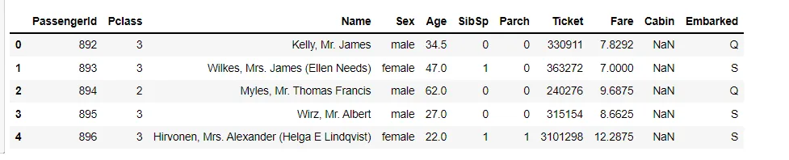
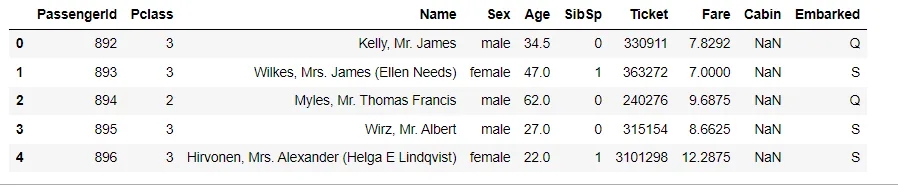
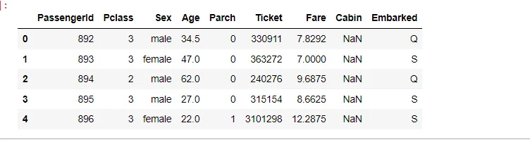
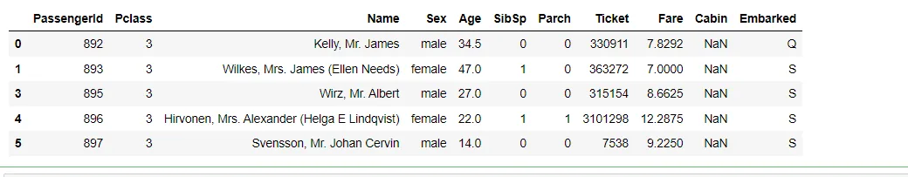
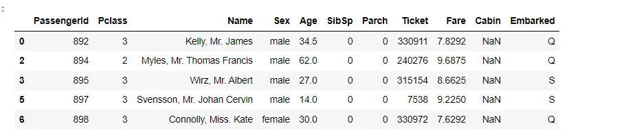
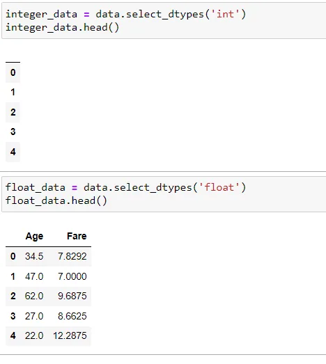
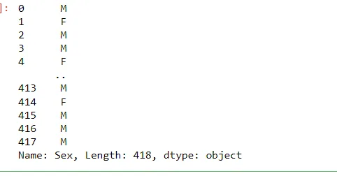

Python is fast becoming the preferred language in data science. It provides the larger ecosystem of a programming language and the depth of good scientific computation libraries. Pandas is a popular Python data analysis tool. It provides easy to use and highly efficient data structures. These data structures deal with numeric or labeled data, stored in the form of tables.

In this blog, we will discover some of the most important data manipulation techniques using pandas. For this purpose, we are going to use [Titanic Dataset](https://www.kaggle.com/c/titanic/data) which is available on Kaggle. Techniques that will be discussed are:

1. Reading a CSV File
2. Dropping columns in the data
3. Dropping rows in the data
4. Select columns with specific data types
5. Replacing values in a DataFrame

#### 1. Reading a CSV file
The CSV (Comma Separated Values) format is quite popular for storing data. A large number of datasets are present as CSV files which can be used either directly in software like Excel or can be loaded up by using programming languages like Python.

```python
import pandas as pd
# read the csv data using pd.read_csv function
data = pd.read_csv('test.csv')
data.head()
```



DataFrame provides a member **function drop** () i.e. It accepts a single or list of label names and deletes the corresponding rows or columns (based on the value of axis parameter i.e. 0 for rows or 1 for columns).

```python
DataFrame.drop(labels=None, axis=0, index=None, columns=None, level=None, inplace=False, errors='raise')
```

#### 2. Dropping columns in the data

```python
df_dropped = data.drop('Parch', axis=1)
df_dropped.head()
```



The ‘Parch’ column is dropped in the data. The axis=1 denotes that it ‘Parch’ is a column, so it searches ‘Parch’ column-wise to drop.

We can drop multiple columns at the same time using the following code:

```python
# Drop multiple columns
df_dropped_multiple = data.drop(['SibSp', 'Name'], axis=1)
df_dropped_multiple.head()
```



The columns ‘SibSp’ and ‘Name’ are dropped in the data.

#### 3. Dropping rows in the data
```python
df_row_dropped = data.drop(2, axis=0)
df_row_dropped.head()
```



The row with index 2 is dropped in the data. The axis=0 denotes that index 2 is a row, so it searches the index 2 column-wise.

We can drop multiple rows at the same time using the following code:

```python
# Drop multiple rows
df_row_dropped_multiple = data.drop([1,4], axis=0)
df_row_dropped_multiple.head()
```



#### 4. Select columns with specific data types
Pandas select_dtypes function allows us to specify a data type and select columns matching the data type.

```python
#for integer data type
integer_data = data.select_dtypes('int')
integer_data.head()
```

```python
#for float data type
float_data = data.select_dtypes('float')
float_data.head()
```



The above code selects all columns with integer and float data types

#### 5. Replacing values in a DataFrame
We can also replace values inplace, rather than having to re-assign them. This is done simply by setting inplace= to True

```python
data['Sex'].replace(['male', 'female'], ["M", "F"])
```



The above code replaces ‘male’ as ‘M’ and ‘female’ as ‘F’.

References:

1. [Python Pandas : How to Drop rows in DataFrame by conditions on column values – thisPointer.com](https://thispointer.com/python-pandas-how-to-drop-rows-in-dataframe-by-conditions-on-column-values/#:~:text=In%20this%20article%20we%20will%20discuss%20how%20to,i.e.%200%20for%20rows%20or%201%20for%20columns%29.)
2. [Titanic - Machine Learning from Disaster | Kaggle](https://www.kaggle.com/c/titanic/data?select=test.csv)
3. [Pandas In Python | Data Manipulation With Pandas (analyticsvidhya.com)](https://www.analyticsvidhya.com/blog/2016/01/12-pandas-techniques-python-data-manipulation/)

Link to the GitHub Repo: [Data-Insight-s-Data-Scientist-Program-2021/Pandas Technique at master · Tanushree28/Data-Insight-s-Data-Scientist-Program-2021 (github.com)](https://github.com/Tanushree28/Data-Insight-s-Data-Scientist-Program-2021/tree/master/Pandas%20Technique)

Thank you for your time.
