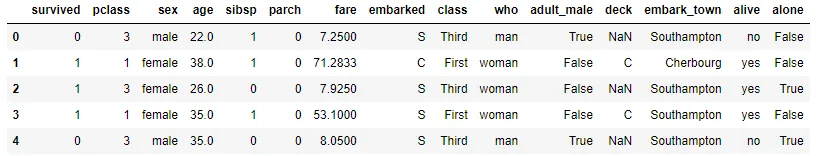
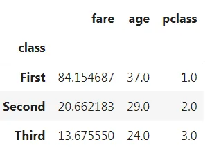
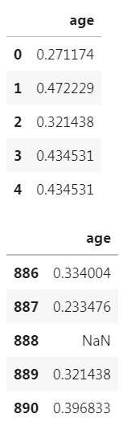
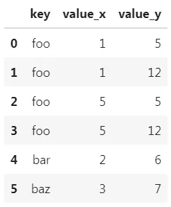
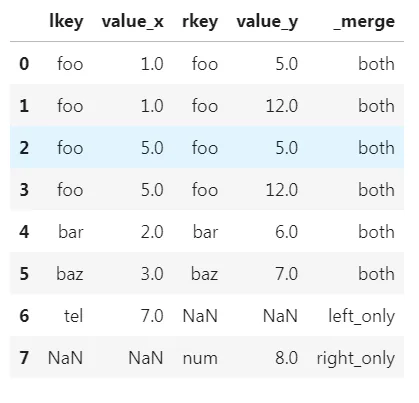
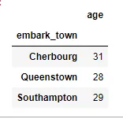
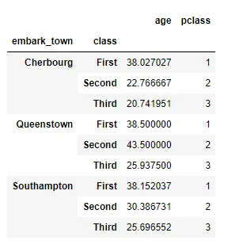
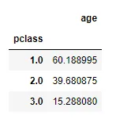

### Introduction
As we know Pandas provide us many usefull functions .In this blog post we will cover some often encountered Pandas Techniques. We will use [titanic](https://www.kaggle.com/c/titanic/data) dataset. This dataset contains information about the people on the titanic.

First of all let's look at the first view of dataset. For that we need to before read data and after use head() func.



Pandas provide us several functions for modify, change or get some summary about column. Ex: Apply(), Agg(), Aggregate(), Map() ect.

### Apply
First, let's look at **Apply()**

df.apply(*func***,** *axis=0***,** *raw=False***,** *result_type=None***,** *args=()***,** *\*\*kwargs*)

There are several parameters for apply function.

Output:

```python
fare     32.204208
age      29.699118
sibsp     0.523008
dtype: float64
```

But what if we want to use different columns with different function. If we repeat this process for each columns it could be exhausting. To get rid of that we can define what function we will apply to each column by dictionary. Let's look at the example.

Output:

```python
fare      32.204208
age       28.000000
pclass     2.308642
dtype: float64
```

Additionally we can group our dataframe during applying some function.



Also we can use our custom function in apply. To make process more easier python has [lambda](https://www.geeksforgeeks.org/python-lambda-anonymous-functions-filter-map-reduce/).

Output:



Here we [scale](https://towardsdatascience.com/how-and-why-to-standardize-your-data-996926c2c832) age column between 0 and 1. It help Machine Learning module to predict more exactly, because we could have 1 column in range of 1 to 10 another 30 to 1000. Scaling take away that.Also we use StandardScaler() from preprocessing.

### Merge
Many times we need to combine DataFrames. Especially if we work in bank we get data from sql, and in bank system data tables stored splitted format. We keep Primary keys in main dataframe and split another information separately. In that case we have to merge dataframes.

Output:



In this simple example we see merging 2 dataframe on 'key' column. It means merge function concate on axis 1 where key values is equal in each dataframe. Sometimes we can faced with columns that has columns with different name. For example: we combine two dataframe on lkey and rkey columns.

we have 'how' keyword that contain {"inner", "outer", "left", ''right", "cross"}. default = inner.

With outer keyword we take all columns from both column and merge them. Logically with left and right methods we take all values from left(right) column and combine it with right one (there usually we see Null values).

Here we also have indicator parameter that show us type of joining.

Output:



Also we can use suffixes for overlapped columns' name. For additional information about suffixes and other methods you can research pandas documentation for merge technique.

### Unique
Unique method return unique values one time.

```python
df['age'].unique()
```

Output:

```python
array(['male', 'female'], dtype=object)
```

Also we have nunique() mehtod to count number of unique values.

```python
df["age"].nunique()
```

output:

```python
2
```

Aso we can calculate it just with unique()

```python
# unique() methd return numpy array and numpy has size method # to calculate size of array
df["age"].unique().size
```

### map
Map is also functional method for constructing dataframe.

Let's look at example.

output:

```python
0      1
1      2
2      1
3      1
4      1
      ..
886    1
887    1
```

### Groupby
Groupby is widely used method. Especially if we want to get some information by categories of column we use this method. The main idea is gather data by the line to which it belongs.

Here first we use groupby on 'embark_town' column, second we use .agg method to aggregate (apply) function to each grouped part in a given path. There given that we have to apply mean method of numpy to age column.

Output:



However, sometimes we could need apply groupby method more than one time to get more accurate answer.

Output:



And because of work job requirement we could need to group columns more than one time. To see affect better I create age type column which contain type of age by age column.

Output:



### Conclusion
In this blog we cover some important techniques of pandas such as, apply, merge, unique, groupby, map. For additional information if you want see whole code snipped click [here](https://github.com/Ibrahimbeu/Pandas-Techniques-for-data-manipulation).
