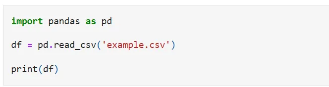
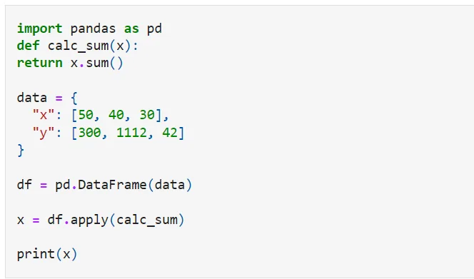
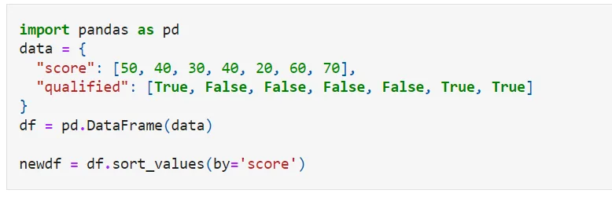
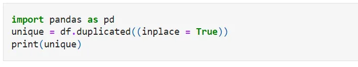
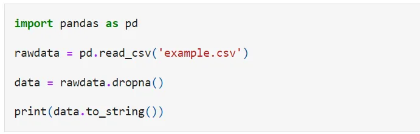

Pandas is a powerful python library. Which is mostly used to manipulate and analyze data.

Here, we discuss the basic tools that are used to manipulate and analyze data.

1. Read datasets with Pandas
2. Apply functions
3. Sorting DataFrames
4. Removing duplicates
5. Cleaning Empty Cells

**Read datasets with Pandas**

An easy way to save large data sets is to use CSV files. CSV files contain plain text and are a well-known format that everyone, including Panda, can read.

**Apply functions**

Apply function in pandas is one of the commonly used functions for manipulating a pandas data frame and creating new variables.

**Sorting DataFrames**

The Pandas sort_values ​​() function arranges a data frame in ascending or descending order of the passed column. This is different from the sorted Python function because it cannot pick a data frame and select a specific column.

**Removing duplicates**

We can use Pandas's built-in method drop_duplicates () to drop duplicate rows. By default, this method deletes duplicate rows and provides a new DataFrame. To remove duplicates from the original DataFrame, we can set the argument in place = True.

**Cleaning Empty Cells**

Empty cells can give you an incorrect result when you analyze data. One way to deal with empty cells is to remove the rows that hold the empty cells.

