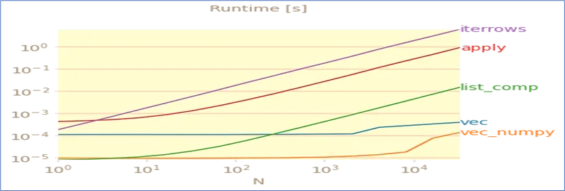

```python
# importing pandas as pd
import pandas as pd
import numpy as np
from pandas.api.types import CategoricalDtype
```

```python
# creating a dataframe
df = pd.DataFrame({'A': ['John', 'Boby', 'Mina', 'Peter', 'Nicky'],
  'B': ['Masters', 'Graduate', 'Graduate', 'Masters', 'Graduate'],
  'C': [27, 23, 21, 23, 24]})

df
```

### 1. [Pivot tables](https://pandas.pydata.org/pandas-docs/stable/user_guide/reshaping.html#reshaping-reshaping)

While [**pivot()**](https://pandas.pydata.org/pandas-docs/stable/reference/api/pandas.DataFrame.pivot.html#pandas.DataFrame.pivot) provides general-purpose pivoting with various data types (strings, numerics, etc.), pandas also provide [**pivot_table()**](https://pandas.pydata.org/pandas-docs/stable/reference/api/pandas.pivot_table.html#pandas.pivot_table) for pivoting with aggregation of numeric data. The function [**pivot_table()**](https://pandas.pydata.org/pandas-docs/stable/reference/api/pandas.pivot_table.html#pandas.pivot_table) can be used to create spreadsheet-style pivot tables.

*It takes a number of arguments*:

- **Data:** a DataFrame object.
- **values**: a column or a list of columns to aggregate.
- **columns**: a column, Grouper, an array that has the same length as data, or a list of them. Keys to group by on the pivot table column. If an array is passed, it is being used as the same manner as column values.
- **aggfunc**: function to use for aggregation, defaulting to numpy. mean.

```python
# Creates a pivot table dataframe
table = pd.pivot_table(df, values ='A', index =['B', 'C'],
                         columns =['B'], aggfunc = np.sum)
table
```

### 2. [Iterating over rows of DataFrame](https://pandas.pydata.org/pandas-docs/stable/user_guide/basics.html#:~:text=Iterating%20through%20pandas%20objects%20is%20generally%20slow.%20In%20many%20cases%2C%20iterating%20manually%20over%20the%20rows%20is%20not%20needed%20and%20can%20be%20avoided%20with%20one%20of%20the%20following%20approaches)

Iterating through **pandas** objects is generally **slow**. In many cases, iterating manually over the rows is not needed and can be avoided with one of the following approaches(*in order as per performance* ).

1. **Vectorization** :

many operations can be performed using built-in methods or NumPy functions or (boolean) indexing.

2. **List Comprehensions**:

**3. df.apply():**

4. **Iter__family** [df.itertuples / df.iteritems / df.itterrows]



Performance for iteration operations

```python
#iterate using victorization
df_grad_vec = df['B'] == 'Graduate'
print(df_grad_vec)

#iterate using list comprehensions
df_grad_comp = [x == 'Graduate' for x in df['B']]
print(df_grad_comp)

#iterate using apply()
df_grad_apply = df.apply(lambda x:df['B']== 'Graduate' )
print(df_grad_apply)
```

### 3. df.**[**groupby**](https://pandas.pydata.org/pandas-docs/stable/reference/api/pandas.DataFrame.groupby.html?highlight=groupby#:~:text=Extensions-,pandas.DataFrame.groupby,-%C2%B6) **(split / apply / combine)
```python
    df.groupby(by=None, axis=0, as_index=True, dropna=True)
```

*It takes a number of arguments**:*

- **by** : mapping, function, label, or list of labels
- **axis** *{0 or ‘index’, 1 or ‘columns’}, default 0*
- **as_index** {*bool, default True}* :for aggregated output, return object with group labels as the index.
- **dropna** {*bool, default True}* **:** if group keys contain NA values, NA values together with row/column will be dropped

*By “group by” we are referring to a process involving one or more of the following steps:*

1. **Splitting** the data into groups based on some criteria.

2. **Applying** a function to each group independently as the following:

**2.1. Aggregation:** compute a summary statistic (or statistics)
 for each group.

2.2. **Transformation**: perform some group-specific computations
 and return a like-indexed object.

2.3. **Filtration**: discard some groups, according to a group-wise
 computation that evaluates True or False.

3. **Combining** the results into a data structure.

```python
df_grad_groupby = df.groupby(by='B', as_index=True)['C'].mean()
df_grad_groupby
```

### 4.** **Categorical data

Categorical are a pandas data type corresponding to categorical variables in statistics. A categorical variable takes

on a limited, and usually fixed, number of possible values. Examples are gender, social class, blood type.

###### 4.1. Controlling behaviors

the default behaviors is:

- Categories are inferred from the data
- Categories are unordered.

To control these behaviors we could use either

- ***df.astype(‘category’)***
- passing argument (*dtype=’category’*) while creating the DataFrame
- using ***CategoricalDtype****.*

###### 4.2. Statistics for Categorical data(frequencies/proportions):

- statistic for categorical data using ***describe()***
- statistic for categorical data using ***value_counts()***

### **4.** [**Statistical Functions**](https://pandas.pydata.org/pandas-docs/stable/user_guide/computation.html#:~:text=Computational%20tools-,Statistical%20functions,-%C2%B6)

5.1. Covariance

to compute pairwise covariances among the series in the DataFrame

```python
df.cov()
```

###### 5.2. Correlation

to compute pairwise correlation among the series in the DataFrame

```python
df.corr()
```

```python
df3= pd.DataFrame(np.random.randn(1000, 5), columns=["a", "b", "c", "d", "e"])
df3.corr()
```
