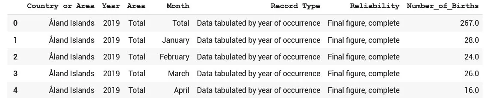
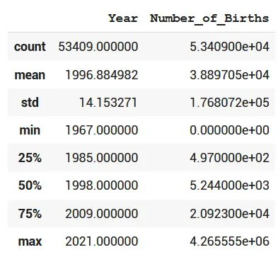
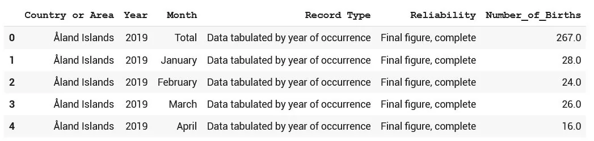
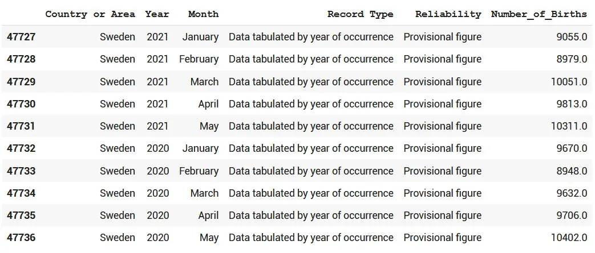
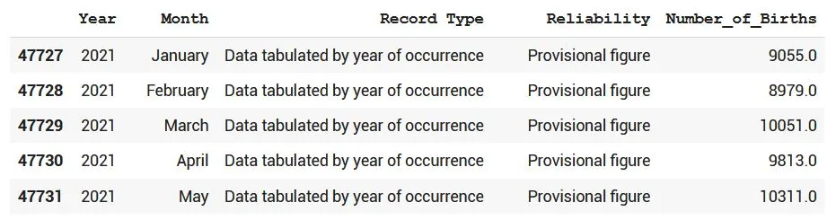
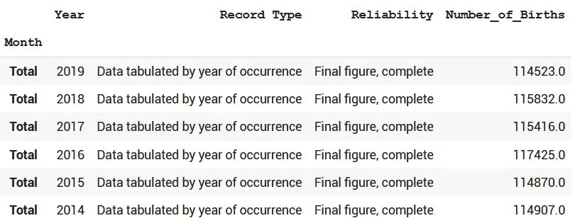
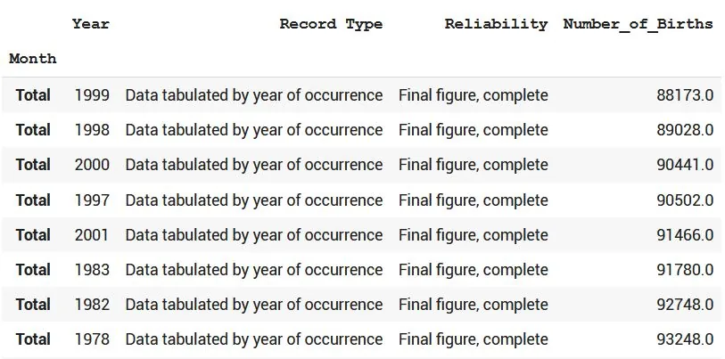
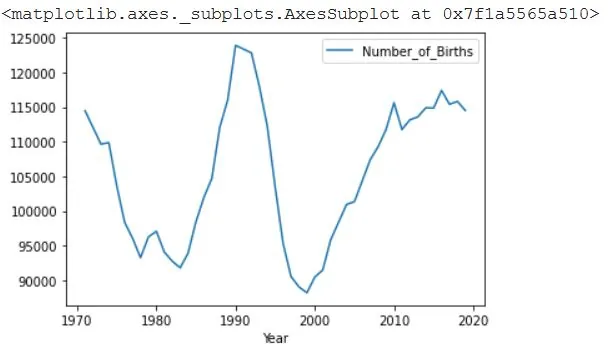
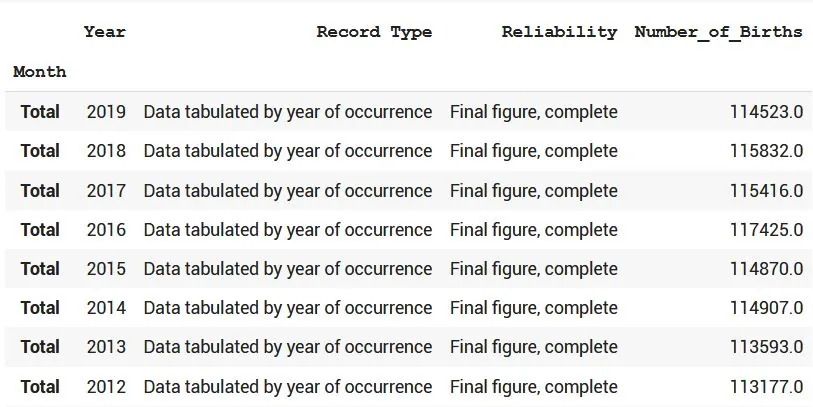
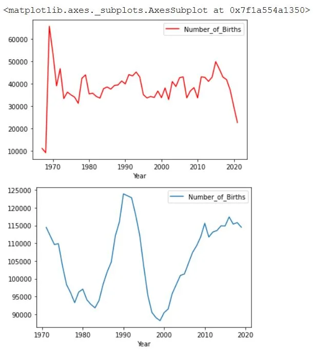

### Seasonal Births dataset analysis


## [Data Understanding and Manipulation using Pandas - link](https://github.com/omarmohamed2011/Data-Understanding-and-Visualization)

##### Description:

Data on number of births every month for approximately 135 different counties.

##### Column Description

Country or area: The name of the country.

Year: the year for which the record is stored.

Month: The name of the month.

Number of births: The total number of births that happened in the month.

Note that: All credits to Kaggle for providing us with such a great community for various types of datasets.

#### Data Manipulation

Let's first read the data and see how it looks like;

```python
import pandas as pd

file_path = '/content/BirthMonthsData.csv'
df = pd.read_csv(file_path)

## Let's see then how data looks like
df.head(5)
```



Now we can see data and its 7 columns.

We can also try to understand data by some numbers by using the describe method

```python
df.describe()
```



Here we saw the total number of births, mean number of births, 25th ,50th, 75th percentiles and the max value, let's ignore the part of the Year column as it is not much useful.

```python
## Let's see all countries and areas in the dataset

df['Country or Area'].unique()

output:

array(['Åland Islands', 'Albania', 'Algeria', 'American Samoa', 'Andorra','Anguilla', 'Antigua and Barbuda', 'Argentina', 'Armenia', 'Aruba','Australia', 'Austria', 'Azerbaijan', 'Bahamas', 'Bahrain', 'Barbados', 'Belarus', 'Belgium', 'Bermuda','Bosnia and Herzegovina', 'Botswana', 'Brazil', 'British Virgin Islands', 'Brunei Darussalam', 'Bulgaria', 'Cabo Verde', 'Canada', 'Cayman Islands', 'Chile', 'China, Hong Kong SAR', 'China, Macao SAR', 'Cook Islands', 'Costa Rica', 'Croatia', 'Cuba', 'Curaçao', 'Cyprus', 'Czechia', 'Denmark', 'Egypt', 'El Salvador', 'Estonia','Falkland Islands (Malvinas)', 'Faroe Islands', 'Fiji', 'Finland',
       'France', 'French Guiana', 'French Polynesia', 'Georgia',
       'Germany', 'Ghana', 'Gibraltar', 'Greece', 'Greenland',
       'Guadeloupe', 'Guam', 'Guatemala', 'Guernsey', 'Guyana', 'Hungary',
       'Iceland', 'Iran (Islamic Republic of)', 'Ireland', 'Isle of Man',
       'Israel', 'Italy', 'Jamaica', 'Japan', 'Jersey', 'Jordan',
       'Kazakhstan', 'Kuwait', 'Kyrgyzstan', 'Latvia', 'Lebanon', 'Libya',
       'Liechtenstein', 'Lithuania', 'Luxembourg', 'Malawi', 'Malaysia',
       'Maldives', 'Mali', 'Malta', 'Martinique', 'Mauritius', 'Mayotte',
       'Mexico', 'Mongolia', 'Montenegro', 'Montserrat', 'Morocco',
       'Netherlands', 'New Caledonia', 'New Zealand', 'Niue',
       'Norfolk Island', 'North Macedonia', 'Norway', 'Oman', 'Pakistan',
       'Palau', 'Panama', 'Peru', 'Philippines', 'Poland', 'Portugal',
       'Puerto Rico', 'Qatar', 'Republic of Korea', 'Republic of Moldova',
       'Reunion', 'Romania', 'Russian Federation',
       'Saint Helena ex. dep.', 'Saint Helena: Ascension',
       'Saint Kitts and Nevis', 'Saint Lucia',
       'Saint Pierre and Miquelon', 'Saint Vincent and the Grenadines',
       'Saint-Martin (French part)', 'Samoa', 'San Marino',
       'Sao Tome and Principe', 'Serbia', 'Seychelles', 'Singapore',
       'Slovakia', 'Slovenia', 'South Africa', 'Spain', 'Sri Lanka',
       'State of Palestine', 'Suriname', 'Sweden', 'Switzerland',
       'Tajikistan', 'Thailand', 'Tonga', 'Trinidad and Tobago',
       'Tunisia', 'Turkey', 'Turks and Caicos Islands', 'Ukraine',
       'United Arab Emirates',
       'United Kingdom of Great Britain and Northern Ireland',
       'United States of America', 'United States Virgin Islands',
       'Uruguay', 'Uzbekistan', 'Venezuela (Bolivarian Republic of)',
       'Wallis and Futuna Islands'], dtype=object)
```

As we can see there is a vast majority of countries and regions, they are 153, so enough of studying one country and generalize from it.

Let's explore the Area column using the unique method in order to find its different values;

```python
df['Area'].unique()

out:

array(['Total'], dtype=object)
```

This column contains one value, we can safely drop it as it doesn't affect much or add enough information.

Let's use the pandas drop method to do so;

```python
df = df.drop(['Area'],axis=1)
```

Let's see the data after dropping the column;

```python
df.head(5)
```



Now let's see the different record types;

```python
## Let's see the different record types

df['Record Type'].unique()

out:

array(['Data tabulated by year of occurrence',
       'Data tabulated by year of registration',
       'Vital statistics from census'], dtype=object)
```

The record types are three, one type of tabulation is done by occurrence,

the other one by registration and the third one done statistically.

```python
## Let's see the different Reliability types

df['Reliability'].unique()

out:

array(['Final figure, complete', 'Provisional figure', 'Other estimate'],
```

Now I do think of studying - not each of these columns as an example but only Sweden could be a good example, so let's study only Sweden and try to get some insights..

```python
df_sweden = df[df['Country or Area']=='Sweden']
df_sweden.head(10)
```



Let's now drop the country column as it only contains Sweden;

```python
df_sweden = df_sweden.drop(['Country or Area'],axis=1)
df_sweden
```



Let's take in the summation of all months only as the example to understand the data using the set index method to set the Month column as index and then loc method to have the Total value in the month column.

```python
df_sweden = df_sweden.set_index(['Month'])

df_sweden = df_sweden.loc['Total']
df_sweden.head(10)
```



Now, let's arrange the years with the sorting column of the number of births by using the sort_values method of pandas ..

```python
df_sweden.sort_values(by='Number_of_Births')
```



Let's now plot the number of births vs Year using the plotting method of Pandas - plot..

```python
df_sweden.plot(x= 'Year',y='Number_of_Births')
```



That's a lot of fluctuations in data especially between 80 and 2000, let's print only the above 110 thousands using the query method to experiment it as well.

```python
df_sweden.query('Number_of_Births > 110000')
```



Let's analyze data more generally not only Sweden country, but also others and find the average number of births globally over the years, and try to compare Sweden to the average of all of the world countries.

```python
df_births = df.groupby(['Year']).mean()
df_births = df_births.reset_index()
df_births.head(20)
```

Average numbers of birth here differs from Sweden, let's plot the data and see how Sweden compares to other world countries..

```python
df_births.plot(x= 'Year',y='Number_of_Births',c='r')
df_sweden_births.plot(x= 'Year',y='Number_of_Births')
```



Here we can get insight of the explosion in the number of births globally in 1970s, however in Sweden the number of births regresses in the period from 1970-1983, then it increases between 1984-1992 and then it regresses until 2000 to start over again to increase ..

#### Resource

#### Dataset Resource: [Kaggle](https://www.kaggle.com/deepcontractor/seasonal-variation-in-births)

All credits to Kaggle for providing us with such a great community for various types of datasets.
