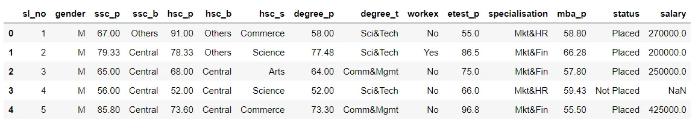
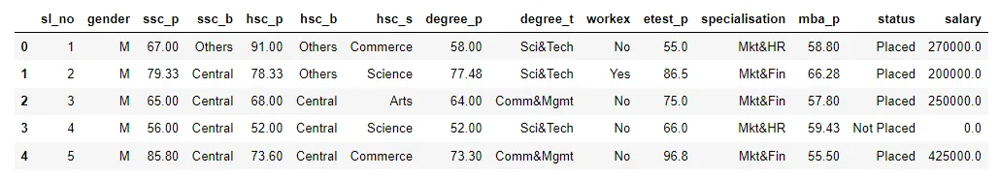
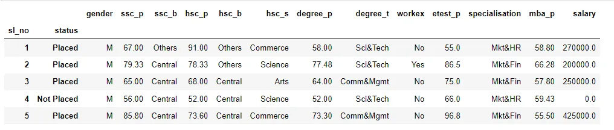

### Techniques will be discussed are:
### - Imputing missing values
### - Boolean Indexing
### - Apply Function
### - Groupby and Plotting
### - Plotting
### - value_counts()
## Data
### The dataset used for illustration purpose is related campus recruitment and taken from [Kaggle page on Campus Recruitment](https://www.kaggle.com/benroshan/factors-affecting-campus-placement).

### This data set consists of Placement data of students in a XYZ campus. It includes secondary and higher secondary school percentage and specialization. It also includes degree specialization, type and Work experience and salary offers to the placed students

libraries and read data

```python
import pandas as pd
import numpy as np
import matplotlib.pyplot as plt
df = pd.read_csv("Campus Recruitment.csv")
df.head()
```



## Imputing missing values
### Why do you need to fill in the missing data?****Because most of the machine learning models that you want to use will provide an error if you pass NaN values into it. The easiest way is to just fill them up with 0, but this can reduce your model accuracy significantly.
Missing values are usually represented in the form of Nan or null or None in the dataset.

```python
df.info()
```

```python
<class 'pandas.core.frame.DataFrame'>
RangeIndex: 215 entries, 0 to 214
Data columns (total 15 columns):
 #   Column          Non-Null Count  Dtype
---  ------          --------------  -----
 0   sl_no           215 non-null    int64
 1   gender          215 non-null    object
 2   ssc_p           215 non-null    float64
 3   ssc_b           215 non-null    object
 4   hsc_p           215 non-null    float64
 5   hsc_b           215 non-null    object
 6   hsc_s           215 non-null    object
 7   degree_p        215 non-null    float64
 8   degree_t        215 non-null    object
 9   workex          215 non-null    object
 10  etest_p         215 non-null    float64
 11  specialisation  215 non-null    object
 12  mba_p           215 non-null    float64
 13  status          215 non-null    object
 14  salary          148 non-null    float64
dtypes: float64(6), int64(1), object(8)
memory usage: 25.3+ KB
```

```python
print(df.isnull().sum())
```

```python
sl_no              0
gender             0
ssc_p              0
ssc_b              0
hsc_p              0
hsc_b              0
hsc_s              0
degree_p           0
degree_t           0
workex             0
etest_p            0
specialisation     0
mba_p              0
status             0
salary            67
dtype: int64
```

**Make a note of** **NaN** **value under the salary column.**

**Different methods that you can use to deal with the missing data.**
**The methods I will be discussing are:**
**1- Deleting the columns with missing data** **df.dropna(axis=1)**
**2- Deleting the rows with missing data** **df.dropna(axis=0)**
**3- Filling the missing data with (Mean,Median,Mode)value of other salary values or Constant** **df['salary'].fillna(0.0)**[**¶**](http://localhost:8888/notebooks/Documents/Data%20Insight/New%20folder/pandas-techniques-for-data-manipulation-python-di.ipynb#3--Filling-the-missing-data-with-(Mean,Median,Mode)value-of-other-salary-values-or-Constant--df['salary'].fillna(0.0))

```python
df['salary'] = df['salary'].fillna(0.0)
df.head()
```



## Indexing
we can index by sl_no as it is a serial number more index by status as I care aboute it.

```python
df = df.set_index(['sl_no','status'])
df.head()
```



## Apply Function
```python
df['salary'].apply([np.min, np.max, np.mean])
```

```python
amin         0.000000
amax    940000.000000
mean    198702.325581
Name: salary, dtype: float64
```

## Groupby and Plotting
```python
High_Placed = df.groupby(['gender','status']).size()
print(High_Placed)
High_Placed.plot(kind='bar')
```

```python
gender  status
F       Not Placed     28
        Placed         48
M       Not Placed     39
        Placed        100
dtype: int64
```


Number of men who placed more then femal and number of men who Not placed more then femal.

### value_counts()
```python
df['hsc_s'].value_counts()
```

```python
Commerce    113
Science      91
Arts         11
Name: hsc_s, dtype: int64
```

[NoteBook Link](https://www.kaggle.com/emancs/pandas-techniques-for-data-manipulation-python-di)

References:

- <https://www.analyticsvidhya.com/blog/2021/05/dealing-with-missing-values-in-python-a-complete-guide/>

- <https://vitalflux.com/pandas-impute-missing-values-mean-median-mode/>

- <https://sparkbyexamples.com/pandas/pandas-apply-function-usage-examples/>

- <https://mode.com/python-tutorial/python-filtering-with-boolean-indexes/>
