## Table of Contents

1. Introduction
2. Data Frame Construction
3. Dealing with Missing Values
4. Filtering and Selecting Dataframe Columns
5. Selecting Specific Dataframe Rows
6. Plotting Dataframes

## 1. Introduction

Before any analysis can be performed on data the data has to be first cleaned and prepared for the analysis. This is done so because real world data is usually messy and in formats that are not suitable for analysis. thus, the first steps in any data analysis task is to first source the data in a format that is appropriate and then prepare it for the analysis. Pandas is a popular python library that is suitable for performing the various data preparation. In this post we explore a number of Pandas techniques that we can perform in manipulating data for various use.

## 2. Dataframe Construction

A Pandas Dataframe is a two dimensional data structure in form of a table that constitutes of rows and columns. The rows represents the observations in the dataset where as the columns are the features or attributes of those individual columns.

The general syntax for creating a dataframe is using a DataFrame() function from the pandas library:

```python
pandas.DataFrame(data, index, columns)
```

Where:

- **data** is the data that we want to pass into a dataframe which can be a list, a dictionary, an array etc
- **index** is a list of index values which by default runs from zero to n-1 with n being the number of observations
- **columns** provides the column names to be passed to the dataframe. If not defined, the column names will be assigned from 0 to n-1 with n being number of columns

A Data Frame can be constructed from other data structures. We will look at constructing of dataframes from lists, dictionaries, arrays and importing from a csv file into a dataframe.

### 2.1 Creating Dataframe from lists

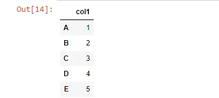

### 2.2 Creating Dataframe from List of Lists

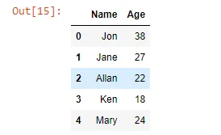

### 2.3 Creating a Dataframe from an Array

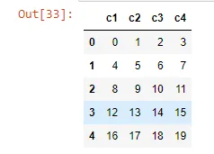

### 2.4 Creating a Dataframe from a Dictionary

When we pass a dictionary to a dataframe function, the dictionary keys are the columns and the values are the dataframe observations

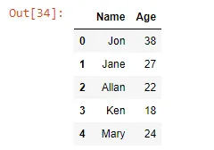

### 2.5 Importing Dataframe from a csv

Data mainly come in various formats that needs to be imported into a dataframe using pandas. We will look at importing a dataframe from a csv file using the function

```python
 pandas.read_csv(filepath)
```

The function has a number of arguments which includes specifying whether a csv has headers or not. However, the default for these arguments will mostly do for csv files with headers and as such we need only specify the file path of the file we want to read in.

We will load a csv file for data on different countries of the world into a pandas dataframe. The data is sourced from [kaggle](https://www.kaggle.com/datasets/fernandol/countries-of-the-world).

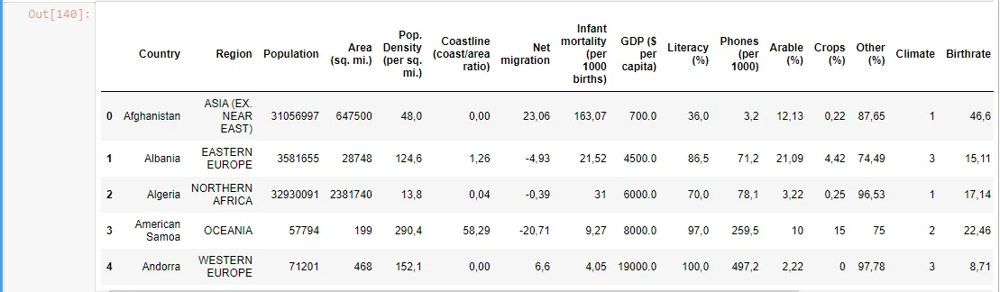

## 3. Dealing with Missing Values
### 3.1 Checking Missing Values
```python
#identify Missing Values per column
countries_df.isna().sum()
```

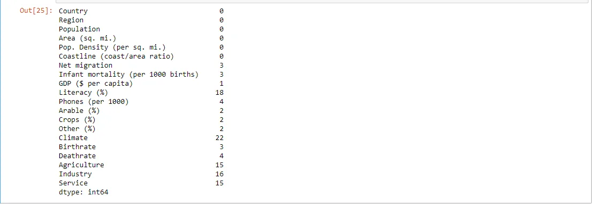

```python
#get the total missing values in dataframe
sum(countries_df.isna().sum())
```

```python
110
```

### 3.2 Missing Values Imputation
once we identify that we have missing values in our data we need to deal with them by either replacing them or removing them. We can use the dropna() method to drop all the rows that contain missing data. we can also use the fillna() method were we can define a value to use to to fill missing values or we can specify a method for filling missing data. The methods include ‘backfill’, ‘bfill’, ‘pad’, ‘ffill’.


## 4. Filtering and Selecting Dataframe Columns
Dataframe columns can be selected by using a dot and name of column after the dataframe name. This method is ideal for column names that do not contain spaces. The other method is to specify the column name or names is square brackets after a dataframe name.

We will use the countries_df_clean to select specific columns that we are interested in working with.

```python
#selecting a column using 'dot'

countries_df_clean.Country
```

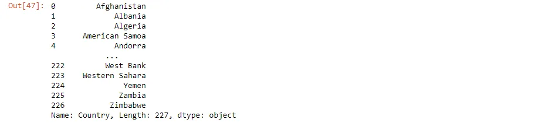

```python
#selecting a column using square brackets
countries_df_clean['Country']
```

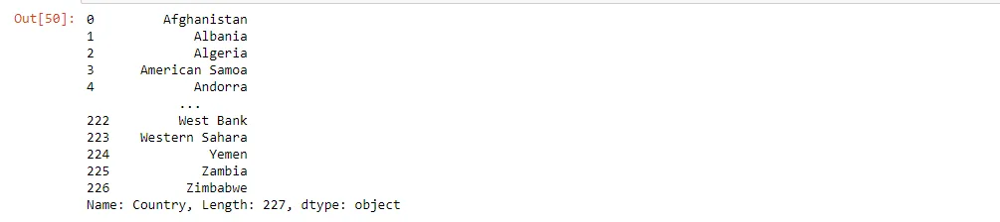

```python
#the selection with a sigle pair of brackets returns an object
#to return a dataframe with specified column, use double square brackets

countries_df_clean[['Country']]
```

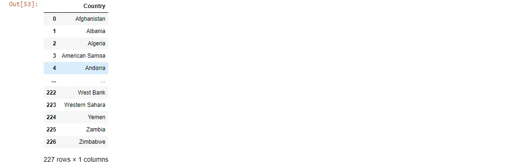

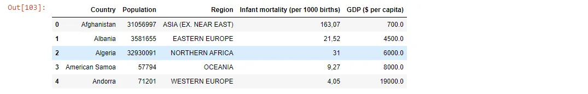

## 5. Selecting Specific Dataframe Rows
We can subset the dataframe to return only rows with specific conditions by using conditional operations such as ==, !=, <=, >=, <, > for columns with numerical data types. We can use isin to selcet columns with strings within a specified list. These can be accompained by & for AND and | for OR operators so as to specify multiple conditions.

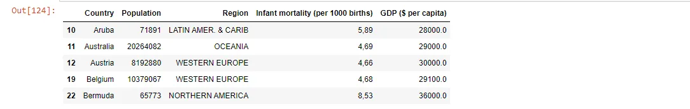

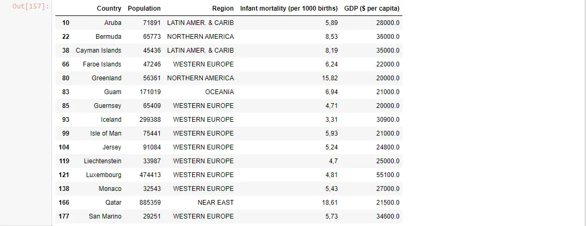

## 6. Plotting Dataframes
Dataframe columns can be ploted by using the `plot()` method on a dataframe and specifying the column names to plot and the type of plot. The general syntax is as follows:

```python
df.plot(kind, x, y, color)
```

Were:

**df** is the name of a dataframe **kind** is the kind of plot **x and y** are the column names for the x and y values **color** is the color of the plot

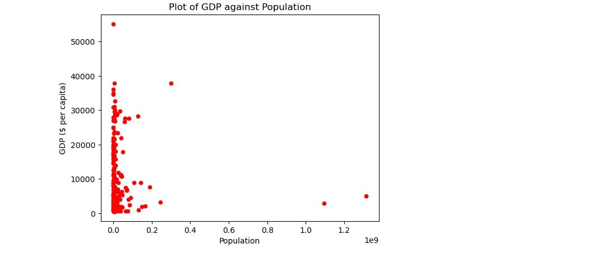

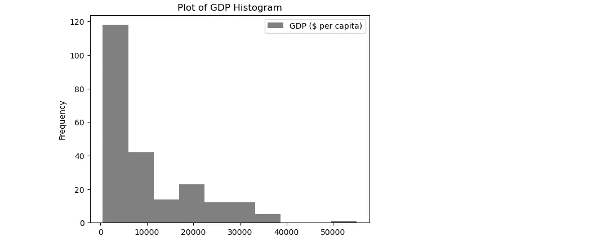

## Notebook

The notebook for the code can be found from the following [GitHub Link](https://github.com/Musonda2day/Pandas-Techniques-for-Data-Preparation-)
