Pandas is an open-source python library that is used for data manipulation and analysis. It provides many functions and methods to speed up the data analysis process. It is one of the most important and useful tools in the arsenal of a Data Scientist and a Data Analyst.

In this blog post, we will be talking about **5 Pandas Techniques** which are: **Pivot table, Value Counts, Plotting, Groupby, Uniques Values.**

Let us dive into the pandas world.

> **Pivot Table**

First off, let’s quickly cover off what a pivot table actually is: it’s a table of statistics that helps summarize the data of a larger table by “pivoting” that data.

Let us import pandas package and load the "sample_excel.xlsx" spreadsheet.

```python
import pandas as pd
df=pd.read_excel('sample_pivot.xlsx')
```

Now let us take a look at the first 5 rows of the dataset.

```python
df.head()
```

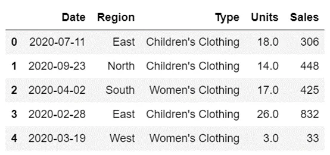

Now that we have a bit more context around the data, let’s explore creating our first pivot table in Pandas.

```python
sales_by_region = pd.pivot_table(df, index = 'Region', values = 'Sales')
print(sales_by_region)
```

This returns the following output:

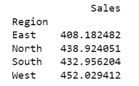

This gave us a summary of the **Sales** field by **Region**. By default values of Sales column are average sales for each region. If we wanted to return the **sum** of all **Sales** across a **region**, we could write:

```python
total_by_region = pd.pivot_table(df, index = 'Region', values = 'Sales', aggfunc='sum')
print(total_by_region)
```

This returns:

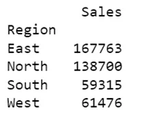

Pivot tables in Python allow you to easily generate insights into data sets, whether large or small. The multitude of parameters available in the pivot_table function allows for a lot of flexibility in how data is analyzed.

> **Value_counts**

An important step in exploring your dataset is to explore how often unique values show up. Pandas makes this incredibly easy using the Pandas value_counts function.

Let’s begin by creating a value_counts series of the *Region* column:

```python
df['Region'].value_counts()
```

This returns the following:

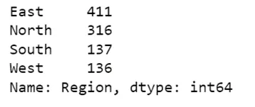

The value_counts function has a useful parameter (the normalize parameter) to return relative frequencies.

Let’s create relative frequencies of the *Type* column:

```python
df['Type'].value_counts(normalize=True)
```

This returns:

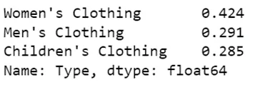

If we wanted to turn these into percentages, we can multiply it by 100:

```python
df['Type'].value_counts(normalize=True)*100
```

Which returns:

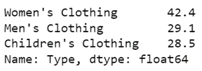

If you’re working with large numbers of numerical data, it can be helpful to bin your data into different bins to get a more general overview of the data.

For example, you can use the **bins=** argument to split the resulting series into bins. Let’s split the data into three bins:

```python
df['Sales'].value_counts(bins=3)
```

This returns:

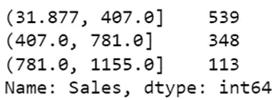

> **Plotting**

Now let us try plotting the columns of the dataset. We have a simple command for plotting the data. Let us plot the *Type* column.

```python
df['Type'].value_counts().plot(kind='pie')
```

This gives us a pie chart:

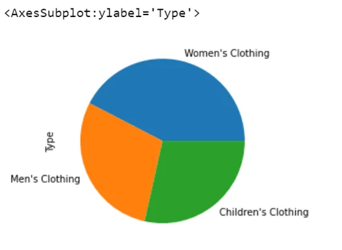

Here the value_counts() function is used to return the value for different for different classes present in the column of a dataset.

We can change the kind of plot by bar or line according to our requirement.

```python
df['Region'].value_counts().plot(kind='bar')
```

This gives us a bar graph for *Region* column:

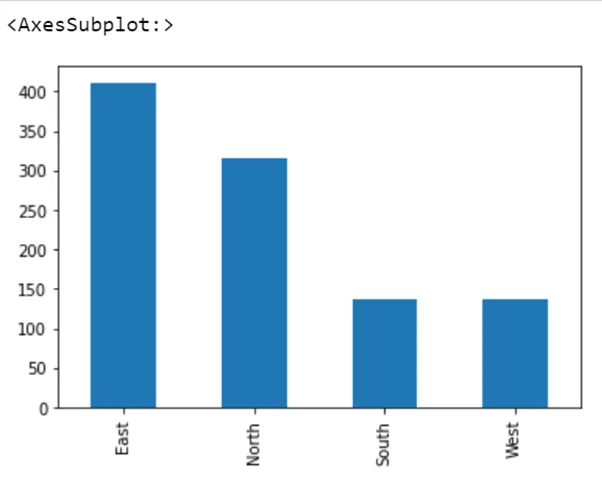

Now we can plot a line chart for *Region* column by assigning kind parameter to "line".

```python
df['Region'].value_counts().plot(kind='line')
```

Which returns:

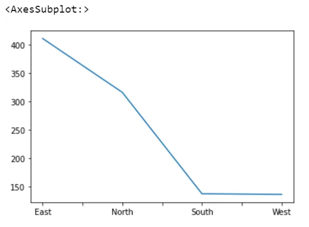

Visualizing data provides us with a quick and clear understanding of the information.

> **Groupby** and **Unique values**

The Pandas .groupby() method is an essential tool in your data analysis toolkit, allowing you to easily split your data into different groups and allow you to perform different aggregations to each group. We can count unique values in a Pandas groupby object, using the incredibly useful .nunique() Pandas method.

The Pandas .groupby() works in three parts:

1. Split – split the data into different groups
2. Apply – apply some form of aggregation
3. Combine – recombine the data

Let’s see how you can use the .groupby() method to find the maximum of a group, specifically the Type group, with the maximum value of Sales in that group:

```python
groupby=df.groupby('Type')['Sales'].max()
print(groupby.head())
```

This returns the following:

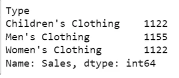

Let’s see how we can use the method to count the number of unique values in each group. In order to do this, we can use the helpful Pandas .nunique() method, which allows us to easily count the number of unique values in a given segment.

```python
groupby=df.groupby('Type')['Sales'].nunique()
print(groupby.head())
```

This returns the following:

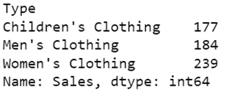

Let’s see what we’ve done here:

1. We first used the .groupby() method and passed in the *Type*  column, indicating we want to split by that column
2. We then passed in the *Sales* column to indicate we want the number of unique values for that column
3. We then apply the .nunique() method to count the number of unique values in that column

You can find the jupyter notebooks which are used in this blog at [here](https://github.com/iamNargiz/Pandas-Techniques).
