**1. Apply Function:**

This function takes a function as an input and applies this function to an entire DataFrame or every single value of the pandas series. The **apply()** function can be used with default or user-defined functions. When we work with DataFrame, we must specify an axis we want the function to act on(columns: 0, rows: 1).

Let’s see an example:

1. **import** **pandas** **as** **pd**
2. df = pd.read_csv('summer2016.csv')
3. df.head(2)

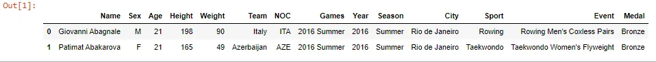

Let's say we want to create a new column which is transforming the Height by meter (= Height / 100) of each player

we can use apply() with lambda function

1. df['Height_Square'] = df['Height'].apply(**lambda** h: h/100)
3. df.head(2)

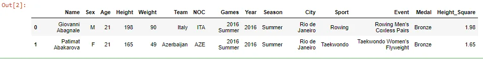

Now, let's try to calculate PMI(= Weight / Height\*\*2), then create a new column "PMI"

We use the second argument "axis = 1" to make calculations for each row

1. df['PMI'] = df.apply(**lambda** row: row['Weight'] / row['Height_Square']\*\*2, axis = 1)
3. df.head(2)

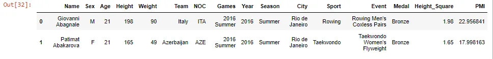

We can create another column "PMI_Status" and fill it with the status related to this PMI value. We can define a function and use it with apply()

1. **def** pmi_range(row):
2. status = ""
3. **if** row['PMI'] < 18.5:
4. status = 'Thin'
5. **elif** row['PMI'] > 25:
6. status = 'Obese'
7. **else**:
8. status = 'Normal'
10. **return** status
12. df['PMI_Status'] = df.apply(pmi_range, axis=1)
14. df.head(2)

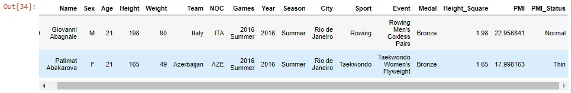

Also, we can use the built-in function from the NumPy module, to calculate the mean of two columns("Weight" and "Height").

like this

1. **import** **numpy** **as** **np**
2. df[['Weight', 'Height']].apply(np.mean, axis=0)

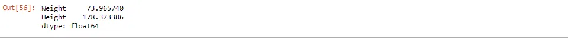

Note: We can use map() when dealing with one column (Series) in the data frame (map() is used to substitute each value in a Series with another), but when dealing with more than one column we use apply() (apply() is used to apply a function along an axis of the DataFrame or on values of Series. )

**2. Boolean Indexing****:**

Its main task is to use the actual values of the data in the DataFrame to select subsets of data based on the actual values of the data in the DataFrame and not on their row/column labels or integer locations.. In boolean indexing, we use a boolean vector to filter the data. We can filter the data in the boolean indexing in different ways, which are as follows:

1. **import** **pandas** **as** **pd**
2. df = pd.read_csv('summer2016.csv')
3. df.head(2)

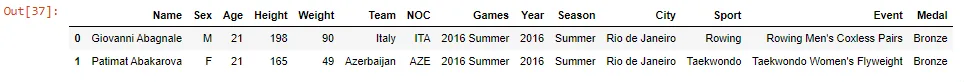

We can select rows and columns of a data frame using boolean arrays.

1. mask = df['Age'] > 50
2. print(mask)

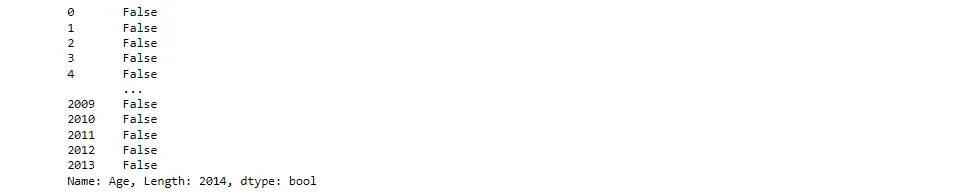

1. df[mask]

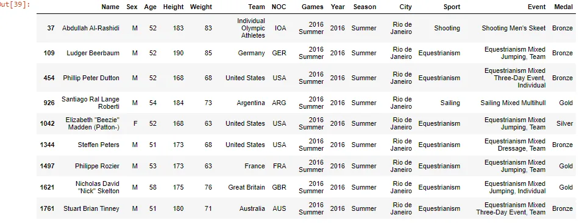

We also can make a boolean index first

1. df.index = mask
3. df.head(2)

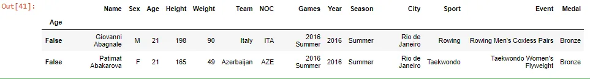

then, we can access dataframe using .loc[] function

1. df.loc[**True**]

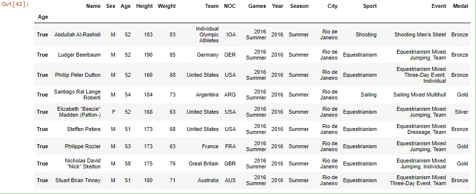

**3. Cut function****:**

Pandas cut() function is used to segregate array elements into separate bins.
The cut() function works only on one-dimensional array-like objects.
The cut() function is useful when we have a large number of scalar data and we want to perform some statistical analysis on it.

1. **import** **pandas** **as** **pd**
2. df = pd.read_csv('summer2016.csv')
3. df.head(2)

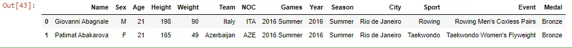

1. df['Age_bins'] = pd.cut(x=df['Age'], bins = [10, 20, 30, 40, 50, 60])
3. df.head(10)

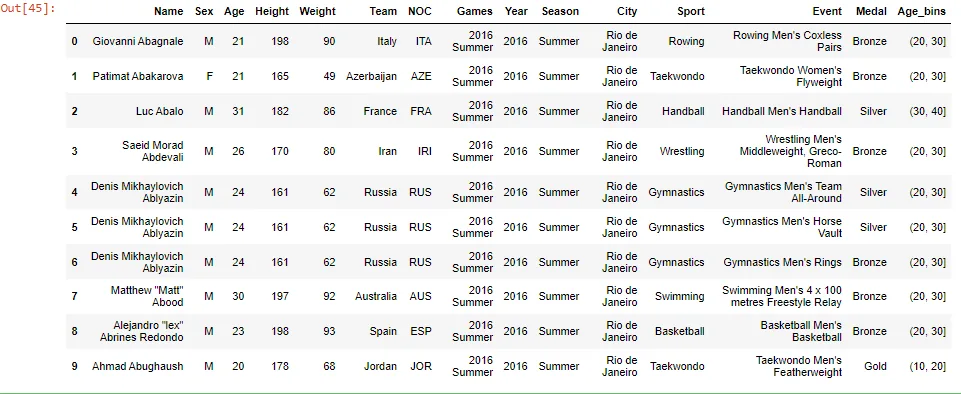

We can also add labels to these bins

1. df['Age_bins'] = pd.cut(x=df['Age'], bins = [10, 20, 30, 40, 50, 60],
2. labels=['ten to twenty', 'twenty to thirty', 'thirty to forty', 'forty to fifty', 'fifty to sixty'])
4. df.head()

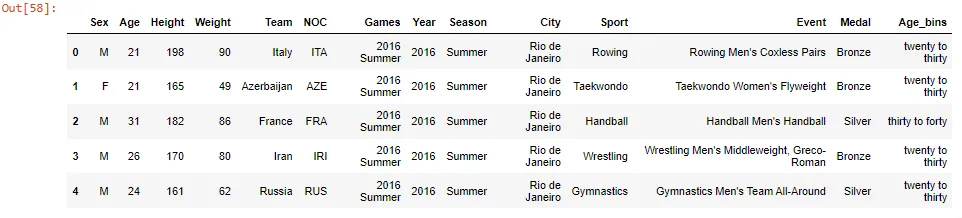

**4. query() method****:**

It's is one of the methods pandas provide to filter (subsetting) a data frame.

1. **import** **pandas** **as** **pd**
2. df = pd.read_csv('summer2016.csv')
3. df.head(2)

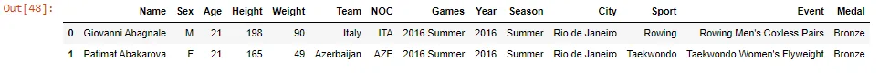

1. df.query('Age > 55')

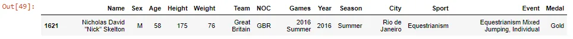

We can use multi conditions

1. df.query('Age > 50 and Height > 175')

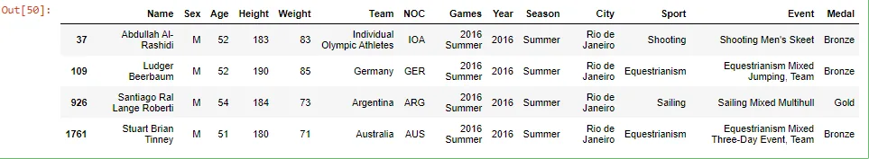

### 5. Removing VAriables from a data frame****:
1. **import** **pandas** **as** **pd**
2. df = pd.read_csv('summer2016.csv')
3. df.head(2)

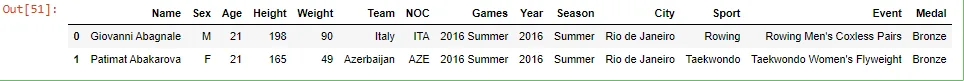

We can remove a column, like this:

1. df.drop('NOC', axis=1)

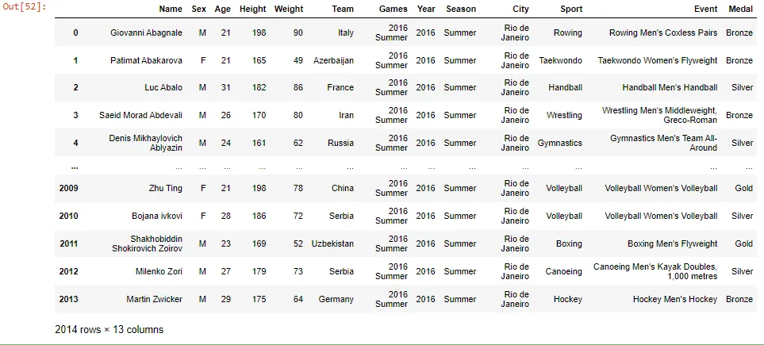

We also can remove multiple columns, by putting a list in the .drop() method, containing all the columns we want to remove. like this:

1. df.drop(['NOC', 'Team'], axis=1)

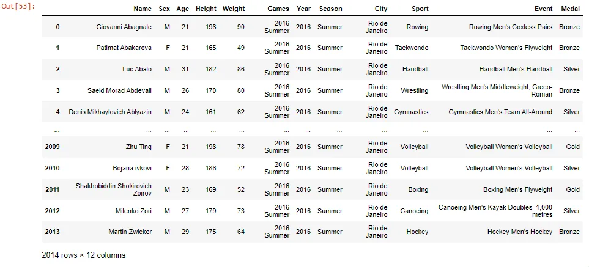

If we want to make the change permanent, we add the inplace argument:

1. df.drop('Name', axis=1, inplace=**True**)
3. df

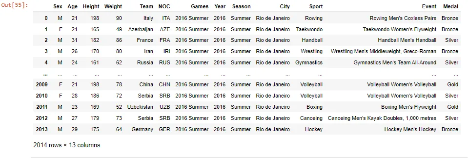
