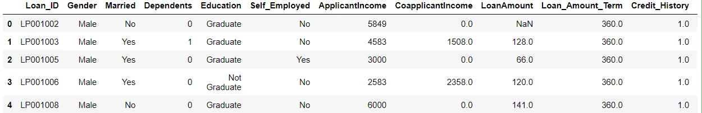
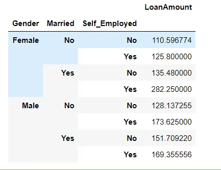
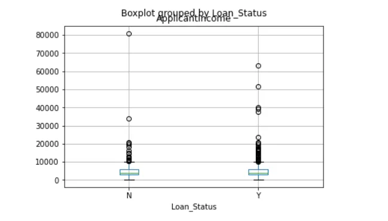
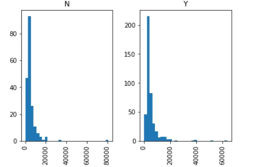
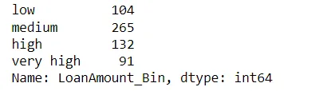
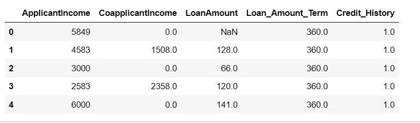
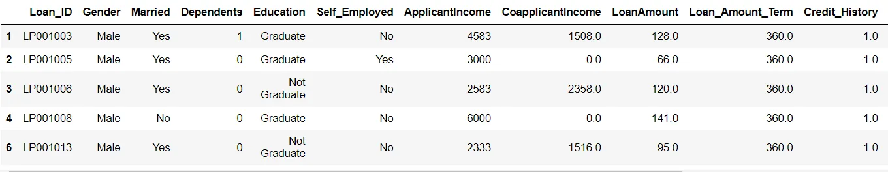

Python is the most preferred language for data scientists. It provides the greater ecosystem of a programming language and the acumen of good scientific computation libraries.

Pandas is an open-source python library that implements easy, high-performance data structures and data analysis tools. The name comes from the term ‘panel data’, which relates to multidimensional data sets found in statistics and econometrics.

**Import Pandas**

```python
import pandas as pd
```

**Read Data**

```python
data = pd.read_csv("train_ctrUa4K.csv")
```

**Explore the data**

```python
data.head()
```

**The Output:**



We are going to talk about some Pandas techniques for data manipulation in Python

**1.Pivot Table** : Pandas can be used to create MS Excel style pivot tables. For instance, in this case, a key column is “LoanAmount” which has missing values. We can impute it using mean amount of each ‘Gender’, ‘Married’ and ‘Self_Employed’ group. The mean ‘LoanAmount’ of each group in Pandas dataframe can be determined as:

```python
impute_grps = data.pivot_table(values=["LoanAmount"], index=["Gender","Married","Self_Employed"], aggfunc=np.mean)
impute_grps
```

The output:



**2.Plotting:** Many of you might be unaware that boxplots and histograms can be directly plotted in Pandas and calling matplotlib separately is not necessary. It’s just a 1-line command. For instance, if we want to compare the distribution of ApplicantIncome by Loan_Status:

```python
import matplotlib.pyplot as plt
%matplotlib inline
data.boxplot(column="ApplicantIncome",by="Loan_Status")
```



```python
data.hist(column="ApplicantIncome",by="Loan_Status",bins=30)
```



**3.Cut function for binning:** Sometimes numerical values make more sense if clustered together. For example, if we’re trying to model traffic (# cars on road) with time of the day (minutes). The exact minute of an hour might not be that relevant for predicting traffic as compared to actual period of the day like “Morning”, “Afternoon”, “Evening”, “Night”, “Late Night”. Modeling traffic this way will be more intuitive and will avoid overfitting.

Here we define a simple function which can be re-used for binning any variable fairly easily.

```python
#Binning:
def binning(col, cut_points, labels=None):
  #Define min and max values:
  minval = col.min()
  maxval = col.max()

  #create list by adding min and max to cut_points
  break_points = [minval] + cut_points + [maxval]

  #if no labels provided, use default labels 0 ... (n-1)
  if not labels:
    labels = range(len(cut_points)+1)

  #Binning using cut function of pandas
  colBin = pd.cut(col,bins=break_points,labels=labels,include_lowest=True)
  return colBin
```

```python
#Binning age:
cut_points = [90,140,190]
labels = ["low","medium","high","very high"]
data["LoanAmount_Bin"] = binning(data["LoanAmount"], cut_points, labels)
print(pd.value_counts(data["LoanAmount_Bin"], sort=False))
```

The output:



**4. select_dtypes():** We can separate the numerical and categorical features from our data frame and create new ones by using the “select_dtypes()” function and include “np.number” to select numerical columns whereas include “objects” for categorical columns.

```python
numerical_data = data.select_dtypes(include=[np.number])
numerical_data.head()
```

The output:



**5.Query:** We can use the Pandas query() function to filter our data frame as per our conditions or requirements as shown below:

```python
data.query('50<LoanAmount<150').head()
```

The output:



For complete code follow this [link](https://github.com/MarehanRefaat/Data-Insights/blob/main/Assignments/Pandas%20Techniques%20for%20Data%20Manipulation%20in%20Python/Pandas%20Techniques%20for%20Data%20Manipulation%20in%20Python.ipynb)
