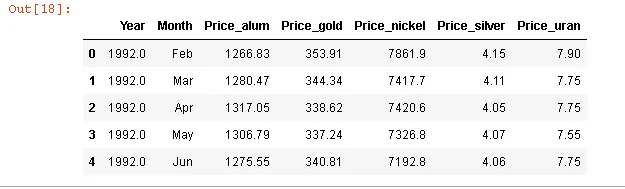
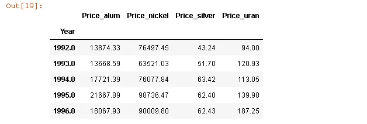
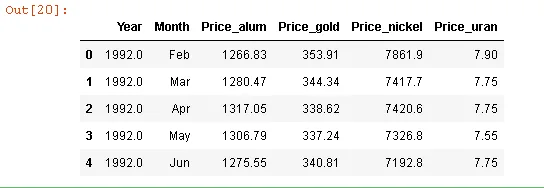
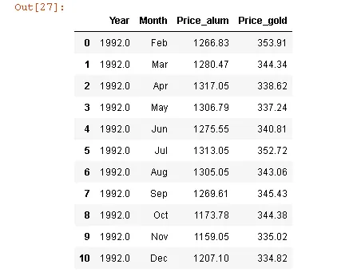
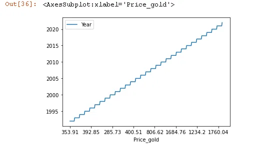
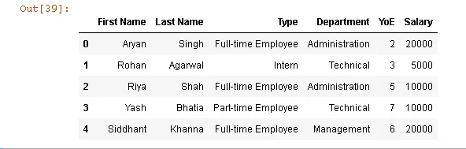
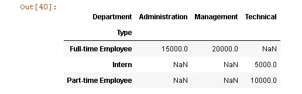

## Introduction
Pandas is an open-source python library that is used for data manipulation and analysis. It provides many functions and methods to speed up the data analysis process. Pandas is built on top of the NumPy package, hence it takes a lot of basic inspiration from it. The two primary data structures are **Series** which is 1 dimensional and **DataFrame** which is 2 dimensional.

As pandas is the best Library for data manipulation , today we are going to learn some of techniques that we always use to get our job done.

--------------------------------------------------------------------------------------------------

first we will load our data set.

```python
import pandas as pd
df = pd.read_csv("minerals_price_changes.csv")
df.head()
```

Output is :



### 1- groupby()
The “groupby()” function is very useful in data analysis as it allows us to unveil the underlying relationships among different variables. And then we can apply Aggregations as well on the groups with the “**agg()**” function and pass it with various aggregation operations such as mean, size, sum, std etc.

now let's group by year and take the sum.

```python
df.groupby('Year').agg(sum).head()
```

Output is :



### **2-** drop column

DataFrame has a method called drop() that removes rows or columns according to specify column(label) names and corresponding axis.

let's see an example if we need to delete Price_silver column:

```python
df.drop("Price_silver", axis = 1, inplace = True)
df.head()
```

Output is :



### 3- . loc() and iloc()

loc() and iloc() methods are used in slicing data from the pandas DataFrame which helps in filtering the data according to some given condition.

**loc** – select by labels

**iloc** – select by positions

let's see an example if we want to slice a price of alum and gold in 1992.

```python
df.loc[0:10,['Year','Month','Price_alum', 'Price_gold']]
```

Output is:


now let's see an example if we want to slice a price of alum and gold in 1992 using iloc.

```python
df.iloc[0:10,:4]
```

Output is :



### **4-** Plotting

We can plot a dataframe using **the plot()** method. But we need a dataframe to plot. We can create a dataframe by just passing a dictionary to the **DataFrame()** method of the pandas library.

let's now see an example of The price of gold has changed over the years.

```python
df.plot(kind='line',x='Price_gold',y='Year')
```

Output is:



### **5-** Pivot Table

*Pivot table in pandas is an excellent tool to summarize one or more numeric variable based on two other categorical variables.*

Pivot tables in pandas are popularly seen in MS Excel files. In python, Pivot tables of pandas dataframes can be created using the command: pandas.pivot_table.

You can aggregate a numeric column as a cross tabulation against two categorical columns. In this article, you’ll see how to create pivot tables in pandas and understand its parameters with worked out examples.

## pandas.pivot_table

**Syntax**

```python
pandas.pivot_table(data, values=None, index=None, columns=None, aggfunc=’mean’, fill_value=None, margins=False, dropna=True, margins_name=’All’, observed=False)
```

**Purpose:**

```python
Create a spreadsheet-style pivot table as a DataFrame. The levels in the pivot table of pandas will be stored in MultiIndex objects (hierarchical indexes) on the index and columns of the result DataFrame
```

**Parameters:**

> ***data****: Dataframe, The dataset whose pivot table is to be made.*
> ***values****: Column, The feature whose statistical summary is to be seen.*
> ***index****: Column, Used for indexing the feature passed in the values argument*
> ***columns****: Column, Used for aggregating the values according to certain features*
> ***observed bool, (default False):*** *This parameter is only applicable for categorical features. If it is set to ‘True’ then the table will show values only for categorical groups*

**Returns:**

> *DataFrame, An Excel style pivot table*

Use the pd.pivot_table() function and specify what feature should go in the rows and columns using the index and columns parameters respectively. The feature that should be used to fill in the cell values should be specified in the values parameter.

Let’s create a sample dataset.

```python
import numpy as np

df = pd.DataFrame({'First Name': ['Aryan', 'Rohan', 'Riya', 'Yash', 'Siddhant', ],'Last Name': ['Singh', 'Agarwal', 'Shah', 'Bhatia', 'Khanna'],'Type': ['Full-time Employee', 'Intern', 'Full-time Employee','Part-time Employee', 'Full-time Employee'],'Department': ['Administration', 'Technical', 'Administration','Technical', 'Management'],'YoE': [2, 3, 5, 7, 6],'Salary': [20000, 5000, 10000, 10000, 20000]})

df
```



**Use pd.pivot_table and specify the data, index, columns, aggfunc and `values` parameters.**

```python
output = pd.pivot_table(data=df,index=['Type'],                                  columns=['Department'],values='Salary',                         aggfunc='mean')
output
```

Output is :



Here, we have made a basic pivot table in pandas which shows the average salary of each type of employee for each department. As there are no user-defined parameters passed, the remaining arguments have assumed their default values.
