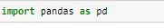
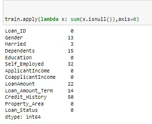
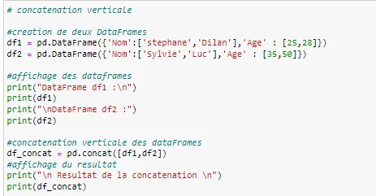
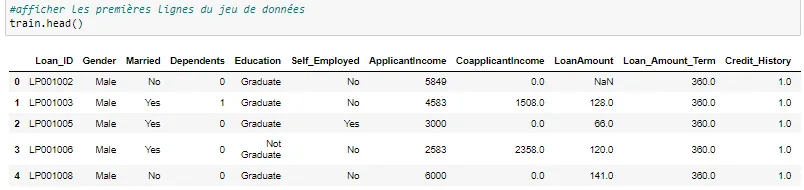
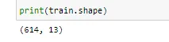
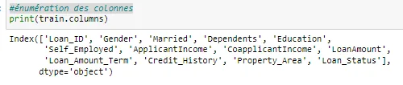
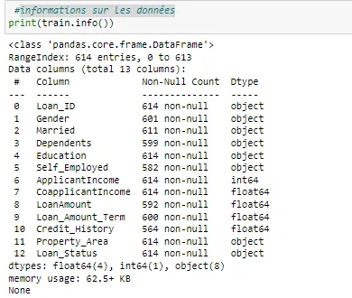
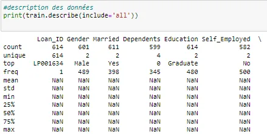

Pandas: a must-have library for data processing in Python.

Pandas is an open-source library allowing data manipulation and analysis in a simple and intuitive way in Python, actively used in the field of Big data and data science because it offers high performance and productivity at these users

Why use Panda Python?

Now that the mystery is lifted on what Pandas is and its importance in the field of data, we will detail in this part the main strengths of this tool.

Panda's strength is that it:

provides a fast and efficient data structure called Dataframe for data manipulation with built-in indexing;

has tools to read and write to files of different formats (.csv, .txt, .xlsx, .sql, .hdf5, etc…);

offers flexibility to process heterogeneous or missing data types;

is open-source;

provides very detailed and easy to read documentation;

is used in a wide variety of academic and business fields including finance, neuroscience, economics, statistics, advertising, web analytics.

In his blog we will use some essential data manipulation techniques to know with pandas:

- Apply : this is one of the main functions for playing with the data and creating new variables. apply returns a value after passing each row/column of a DataFrane with a function. The function can be a default or user-defined function. for example here apply can be used to find missing values of each row and column

- concat() : Concatenating objects

The concat() function (in the main pandas namespace) does all of the heavy lifting of performing concatenation operations along an axis while performing optional set logic (union or intersection) of the indexes (if any) on the other axes. Note that I say “if any” because there is only a single possible axis of concatenation for Series.

Suppose you have multiple dataframes with the same fields and you want to combine them into one along the row axis. Or, if you have additional fields for your current data that you wanted to add, you can concatenate them along the axis of the columns. we will see how to concatenate two or more dataframes with Pandas

- **head()** : display of the first rows of the dataset

- shape : dimensions: number of lines, number of columns the header line is not counted in the number of lines

- columns : column enumeration

- dtypes : checking the types of our variables

-info() : dataset data information

- describe() : The .describe() method

The describe() method is used to provide all essential information about the dataframe, which can be used for data analysis and to derive different mathematical assumptions for further study. The DataFrame describe()

function works in the statistical part of the Pandas library.

- duplicated() : The pandas.DataFrame.duplicated() method is used to find duplicate rows in a DataFrame. It returns a boolean series which identifies whether a row is duplicate or unique.

you will learn how to use this method to identify the duplicate rows in a DataFram.

Access to variables It is possible to explicitly access variables. First, we use the field names directly (the variable names, in the column header).
