Pandas is a Python Library for data analysis, started by **Wes McKinney** in 2008, which was created to fill need for powerful and flexible quantitative analysis tool.

Pandas is built on top of tow core python libraries - **matplotlib** for data visualization and **NumPy** for mathematical operations. Pandas acts as a wrapper over these libraries, allowing you to access many of matplotlib's and NumPy's methods with less code.

```python
import pandas as pd        #Import Pandas Library named as 'pd'
import numpy as np         #Import Numpy Library named as 'np'
```

### Loading Data in Pandas
The most important thing to do when dealing with data is to first load the data files for analysis. Received data can be in a variety of configurations and file types. Data can be in any of the popular formats - CSV, TXT, XLS/XLSX (Excel), sas7bdat (SAS), Stata, Rdata (R) etc.

While importing external files, we need to check the following points -

- Check whether header row exists or not
- Treatment of special values as missing values
- Consistent data type in a variable (column)
- Date Type variable in consistent date format.
- No truncation of rows while reading external data

In this Blog, I will mainly explain with **supermarket_sales** datasets from **kaggle** in [here](https://www.kaggle.com/aungpyaeap/supermarket-sales). Let’s start by importing the supermarket_sales csv file. In order to do this we use Pandas 'read_csv()' function and pass the path to the file (which in our case is stored in the 'dataset/supermarket_sales.csv') as a parameter. We also parse the 'Date' of the datasets to change 'datetime' datatype.

```python
data = pd.read_csv('datasets/supermarket_sales.csv',parse_dates=['Date'])
print(data.info())
```

<class'pandas.core.frame.DataFrame'>

RangeIndex:1000 entries,

0 to 999 Data columns(total 17 columns):

# Column Non-Null Count Dtype

0 Invoice ID 1000 non-null object

1 Branch 1000 non-null object

2 City 1000 non-null object

3 Customer type 1000 non-null object

4 Gender 1000 non-null object

5 Product line 1000 non-null object

6 Unit price 1000 non-null float64

7 Quantity 1000 non-null int64

8 Tax 5% 1000 non-null float64

9 Total 1000 non-null float64

10 Date 1000 non-null datetime64[ns]

11 Time 1000 non-null object

12 Payment 1000 non-null float64

13 cogs 1000 non-null float64

14 gross margin percentage 1000 non-null float64

15 gross income 1000 non-null float64

16 Rating 1000 non-null float64

dtypes: datetime64[ns](1),float64(7),int64(1),object(8) memory usage:132.9+KB None

### Grouping by summary statistic
Grouping data is a pretty simple concept. We can create a grouping of categories and apply a function to the categories. It’s a simple concept but it’s an extremely valuable technique that’s widely used in data science. In real data science projects, you’ll be dealing with large amounts of data and trying things over and over, so for efficiency, we use Groupby concept. Groupby concept is really important because it’s ability to aggregate data efficiently, both in performance and the amount code is magnificent. Groupby mainly refers to a process involving one or more of the following steps they are:

**Splitting** : It is a process in which we split data into group by applying some conditions on datasets. **Applying** : It is a process in which we apply a function to each group independently **Combining** : It is a process in which we combine different datasets after applying groupby and results into a data structure.

#### groupby() in Pandas
Pandas datasets can be split into any of their objects. There are multiple ways to split data like:

- df.groupby(key)
- df.groupby(key, axis=1)
- df.groupby([key1, key2])

##### ***grouping data with one key:***[***¶***](http://localhost:8888/notebooks/Documents/Data%20Scientinst%20Program/Assignment/Pandas%20Techniques%20for%20Data%20Manipulation%20in%20Python.ipynb#grouping-data-with-one-key:)

In order to group data with one key, we pass only one key as an argument in groupby function.

```python
data.groupby('City').sum()
```

```python
Unit price	Quantity	Tax 5%	Total	cogs	gross margin percentage	gross income	Rating
City
Mandalay	18478.88	1820	5057.0320	106197.6720	101140.64	1580.952381	5057.0320	2263.6
Naypyitaw	18567.76	1831	5265.1765	110568.7065	105303.53	1561.904762	5265.1765	2319.9
Yangon	18625.49	1859	5057.1605	106200.3705	101143.21	1619.047619	5057.1605	2389.2
```

***Grouping data with multiple keys :***

In order to group data with multiple keys, we pass multiple keys in groupby function.

```python
data.groupby(['Customer type', 'City']).sum()
```

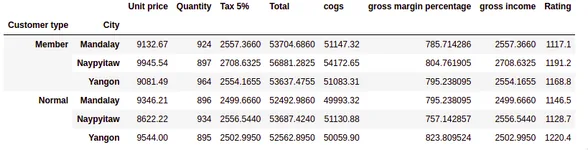

##### *Grouping data by sorting keys :*
Group keys are sorted by default uring the groupby operation. User can pass sort=False for potential speedups.

```python
data.groupby('City', sort = False).sum()
```

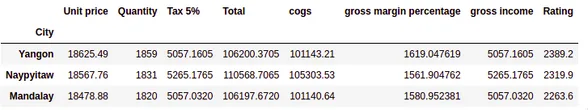

##### *Selecting a groups*
In order to select a group, we can select group using GroupBy.get_group(). We can select a group by applying a function GroupBy.get_group this function select a single group.

```python
data.groupby('City', sort = False).sum()
```

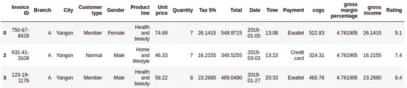

Now we select an object grouped on multiple columns

```python
data.groupby(['Customer type', 'City']).get_group(('Member','Yangon')).head(3)
```

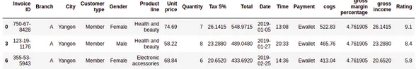

#### Applying function to group
After splitting a data into a group, we apply a function to each group in order to do that we perform some operation they are:

- **Aggregation** : It is a process in which we compute a summary statistic (or statistics) about each group. For Example, Compute group sums or means.
- **Transformation** : It is a process in which we perform some group-specific computations and return a like-indexed. For Example, Filling NAs within groups with a value derived from each group
- **Filtration** : It is a process in which we discard some groups, according to a group-wise computation that evaluates True or False. For Example, Filtering out data based on the group sum or mean

##### *Aggregation :*
Aggregation is a process in which we compute a summary statistic about each group. Aggregated function returns a single aggregated value for each group. After splitting a data into groups using groupby function, several aggregation operations can be performed on the grouped data.

```python
data.groupby(['City'])[['Tax 5%', 'Total', 'gross income']].aggregate(np.sum)
```

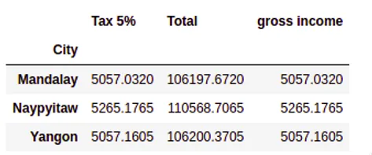

Applying multiple functions at once :

We can apply a multiple functions at once by passing a list or dictionary of functions to do aggregation with, outputting a DataFrame.

```python
data.groupby(['City'])[['Tax 5%', 'Total', 'gross income']].agg([np.sum, np.mean, np.std])
```

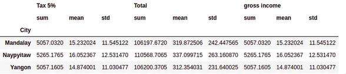

##### *Transformation :*
Transformation is a process in which we perform some group-specific computations and return a like-indexed. Transform method returns an object that is indexed the same (same size) as the one being grouped. The transform function must:

- Return a result that is either the same size as the group chunk
- Operate column-by-column on the group chunk
- Not perform in-place operations on the group chunk. Now we perform some group-specific computations and return a like-indexed.

```python
groupByCity = data.groupby(['City'])[['Tax 5%', 'Total', 'gross income']]
sc = lambda x: (x - x.mean()) / x.std()*10
groupByCity.transform(sc)
```

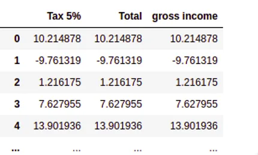

#### Filtration :
Filtration is a process in which we discard some groups, according to a group-wise computation that evaluates True or False. In order to filter a group, we use filter method and apply some condition by which we filter group.

```python
groupByCity = data.groupby(['Product line'])
groupByCity.filter(lambda x:x['Total'].median() >= 260)
```

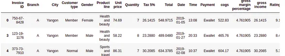

```python
groupByCity = data.groupby(['Product line'])
groupByCity.filter(lambda x:x['Total'].median() >= 260)
```


## Pivot Table
Pivot table in pandas is an excellent tool to summarize one or more numeric variable based on two other categorical variables.In python, Pivot tables of pandas dataframes can be created using the command: **pandas.pivot_table()**. The function is quite similar to the group by function also available in Pandas, but offers significantly more customization.

#### Creating a Pivot Table in Pandas
To get started with creating a pivot table in Pandas, let’s build a very simple pivot table to start things off. We’ll begin by aggregating the Total Price by the Product line the sale took place in:

```python
data.pivot_table(values = 'Total', index = 'Product line')
```

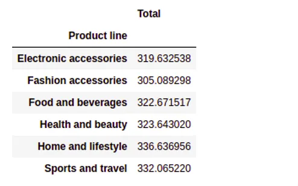

As the default parameter for aggfunc is mean,This gave us a mean of the Sales field by Region.

If we wanted to change the type of function used, we could use the aggfunc parameter. if we wanted to return the sum of all Sales across a region, we could write:

```python
data.pivot_table(values = 'Total', index = 'Product line', aggfunc = 'sum')
```

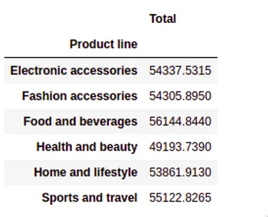

#### Creating a Multi-Index Pivot Table
Single index pivot tables are great for generating high-level overviews. However, we can also add additional indices to a pivot table to create further groupings. Say, we wanted to calculate the sum per "Customer type" and per Product line, we could write the following:

```python
data.pivot_table(values = 'Total', index = ['Customer type', 'Product line'], aggfunc = 'sum')
```

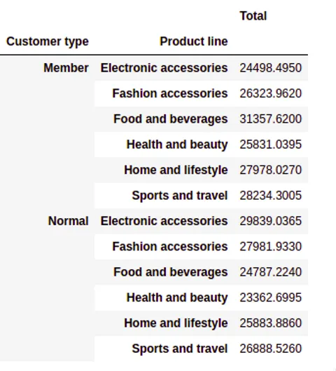

We could also apply multiple functions to our pivot table. Say we wanted to have the same pivot table that showed us the total sum but also the mean of "Total", we could write:

```python
data.pivot_table(values = 'Total', index = ['Customer type', 'Product line'], aggfunc = ['sum', 'mean'])
```

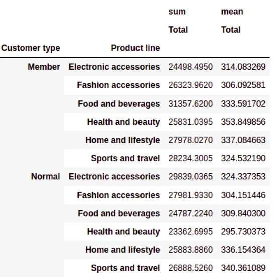

#### Adding Columns to a Pandas Pivot Table
Adding columns to a pivot table in Pandas can add another dimension to the tables. Based on the description we provided in our earlier section, the Columns parameter allows us to add a key to aggregate by. For example, if we wanted to see Total of Sale by "City" and by "Product Line", we could write:

```python
data.pivot_table(values = 'Total', index = 'City', columns = 'Product line', aggfunc = 'sum')
```

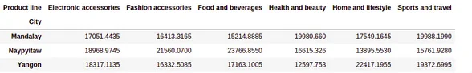

#### Handling Missing Data
No data set is perfect! Let’s see how we can handle missing data in Python pivot tables. When there are missing data in pivot table, the table will display with "NaN" in the missing place. But the reference dataset has no missing values, it is difficult to show how to handling missing data. if we wanted to fill N/A for any missing values, we could write the following:

```python
data.pivot_table(values = 'Total', index = 'City', columns = 'Product line', aggfunc = 'sum', fill_value = 'N/A')
```

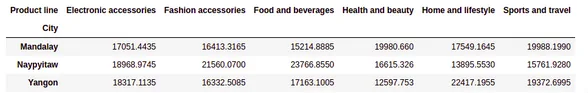

#### Adding Totals for Rows and Columns to Pandas Pivot Tables
Let’s explore how to add totals to both rows and columns in our Python pivot table. We do this with the margins and margins_name parameters. If we wanted to add this to the pivot table we created above, we would write the following:

```python
data.pivot_table(values = 'Total', index = 'City', columns = 'Product line', aggfunc = 'sum',fill_value = 'N/A', margins = True, margins_name='Total')
```

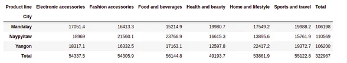

In this post, we explored how to summarize grouped of data and easily generated a pivot table off of a given data-frame using Python and Pandas. The multitude of parameters available in the groupby and pivot_table function allows for a lot of flexibility in how data is analyzed. In this post, we explored how to summerize groups and how to generate a pivot table, how to filter groupby tables in Python, how to add multiple indices and columns to pivot tables, how to deal with missing values.

The mainly used reference datasets is downloaded from **kaggle**.
