There is no **Data Science** without **Pandas**. **Pandas** is a library with data manipulation tools that are built on top of and add to those of the established NumPy library. It relies on the NumPy array structure for implementation of its objects and therefore shares many features with NumPy and is frequently used alongside it. Pandas plays an essential role when working with datasets. Using pandas takes the stress out of data manipulation by extracting, filtering and transforming data in DataFrames thereby clearing a path for quick and reliable data. This posts aims to review some Pandas techniques that are extremely useful for dealing with data in Python during:

- Inspecting Data
- Filtering Data
- Manipulating and Transforming Data

### Inspecting Data

When a DataFrame is loaded from a csv file, we want to know what it looks like. It’s helpful to inspect a few rows without necessarily having to look at the entire DataFrame. The method .head() gives the first 5 rows of a DataFrame whereas the .tail() method displays the last 5 rows. The methods .info() and .describe() provides some statistics for each column.

The movies dataset will be used in illustrating these methods.

We begin by importing Pandas and then read the csv file.

```python
import pandas as pd
movies = pd.read_csv('movies.csv')
```

.head() and .tail() are used to view the first five and last rows respectively.

```python
movies.head()
```

This yields:

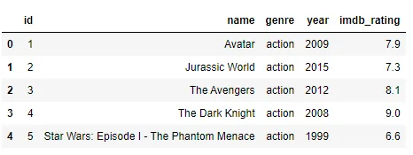

Whereas,

```python
movies.tail()
```

outputs,

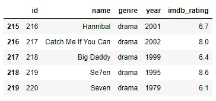

The .describe() and .info() methods both display summary statistics and extra information about the columns in the dataset.

```python
movies.describe()
```

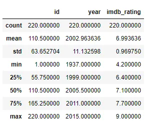

```python
movies.info()
```

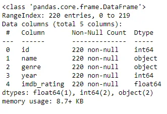

### Filtering Data

Suppose we would want to select some parts of the DataFrame for analysis, we could do that by subsetting it based on a condition. We'll look at various ways to accomplish this.

##### Selecting A Column

A column of a DataFrame can be selected by either of the following ways.

```python
df['column_name']
```

```python
df.column_name
```

Now, back to our movies dataset, we can select the name column by:

```python
movies.name
```

The output shows:

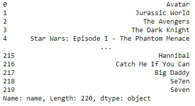

##### Selecting Multiple Columns

What about selecting multiple columns? This follows the method of selecting a single column but with the twist of an extra bracket. It returns a DataFrame of the selected columns.

```python
df[['column1', 'column2', 'column3']]
```

Let's select the name, year and imdb_ratings columns from the movies dataset.

```python
movies[['name', 'year', 'imdb_rating']]
```

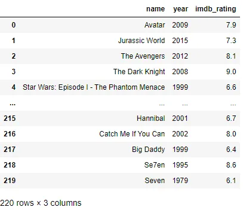

##### Selecting Rows

Rows within a DataFrame can be selected in a number of ways. We will look at using the .iloc method. This method selects rows by indexing.

We can use this method to select any number of rows, let's select the first hundred.

```python
movies.iloc[:100]
```

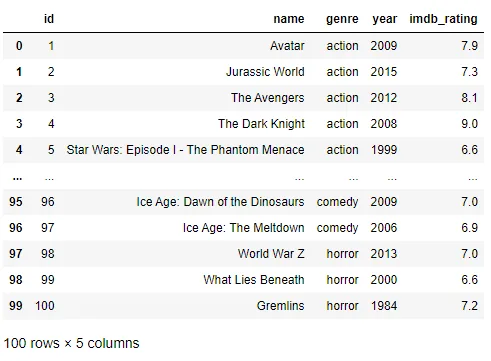

##### Selecting Rows Based on Condition

What if we want a portion of the dataset based on certain conditions. We can select a subset of a DataFrame by using logical statements.

Let's select movies that were produced after 2010.

```python
movies[movies.year >= 2010]
```

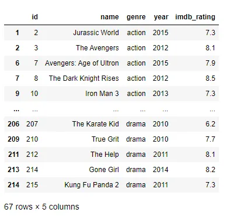

What about movies with a rating of 8 or higher?

```python
movies[movies.imdb_rating >= 8]
```

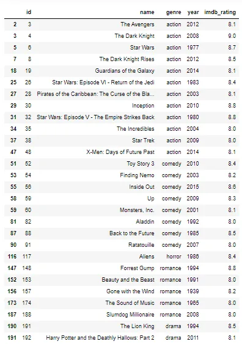

Let's go a bit further and combine two conditions. Select movies produced after 2010 and with a rating of 8 or higher.

```python
movies[(movies.year >= 2010) & (movies.imdb_rating >= 8)]
```

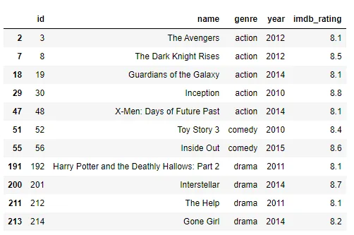

### Manipulating and Transforming Data

There are quite a number of operations that can be done on DataFrames to manipulate and transform its contents. The following will be reviewed under this section:

- GroupBy
- Apply Function

##### GroupBy

There are situations when we want to get an aggregate statistic to summarize a subset of the dataset. Pandas comes to our rescue with the method .groupby(). Generally, the following syntax is used to calculate aggregates:

```python
df.groupby('column_one').column_two.aggregate_function()
```

where:

- column_one is the column that we want to group by
- column_two is the column that we want to perform the measurement on
- aggregate_function is the function we want to apply

Find below some common aggregate functions

|  |  |
| --- | --- |
| **Command** | **Description** |
| ```python mean() ``` | Average of all values in column |
| ```python std() ``` | Standard Deviation |
| ```python median() ``` | Median |
| ```python max() ``` | Maximum value in a column |
| ```python min() ``` | Minimum value in a column |
| ```python count() ``` | Number of values in a column |
| ```python nunique() ``` | Number of unique values in a column |

Revisiting the movies dataset, let's calculate the average rating for each genre.

```python
movies.groupby('genre').imdb_rating.mean().reset_index()
```

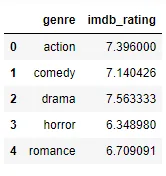

##### Apply Function

Sometimes, we want to add a column to a DataFrame or modify an existing column. We might want to add new information or perform a calculation based on the data available. The apply function comes in handy here, it can be used to apply a function to every value in a particular column. Most often, lambda functions are used to perform complex operations on columns.

In this section, we'll be using the employees dataset. Each row contains the id, name, hourly wage and hours worked for each employee. Let's add another column which contains the user name of each employee. The user name is the first letter of the employee's first name added to the last name of the employee.

```python
employees['user_name'] = employees.name.apply(lambda x: x.split()[0][0] + x.split()[-1])
employees.head()
```

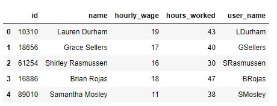

We can also decide to operate on multiple columns at once. This can be done by using the apply function without specifying a single column and adding the argument axis=1. Let's calculate the total amount earned by each employee by multiplying their hourly wage with the hours worked.

```python
employees['total_earned'] = employees.apply(lambda row: (row['hourly_wage'] * row['hours_worked']), axis = 1)
employees.head()
```

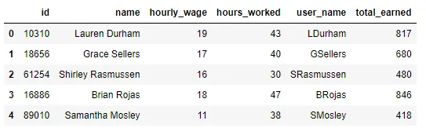

### Conclusion

Pandas proves to be very effective working with data. Its DataFrame object presents data in a form easily accessible and easy to work with. The methods reviewed and many others makes the herculean task of data manipulation quite simple to perform.

Datasets in this post were obtained from [Kaggle](https://www.kaggle.com/). Here is a [link](https://github.com/catiemokeseku/Pandas-Techniques.git) to the repo.
