Python is a great language for doing data analysis as it provides large number of data-centric python packages. Pandas is an open-source python library that is used for data manipulation and analysis. It provides many functions and methods to speed up the data analysis process.

Here , we discuss about some of the pandas techniques for data manipulation.

### Importing Dataset and inspecting Dataframe.

In this tutorial , we are basically learning about reading a csv(Comma Separated Values) file into a dataframe and inspect the dataframe, learn about the data types of the columns values .

For this we created a csv file on our local computer named as emp_data.csv which contained the employee information of a company.

**Reading csv file into dataframe:**

First of all ,we import the pandas library.Pandas is usually imported under the 'pd' alias.we use as keyword to create an alias.

```python
import pandas as pd
```

here a dataframe emp_df is created:

```python
emp_df =pd.read_csv("C:\\Users\\DELL\\Desktop\\emp_data.csv")
emp_df.head()
```

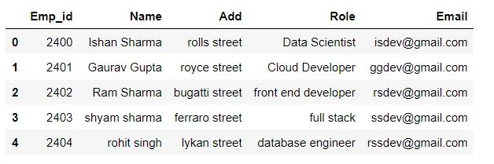

```python
emp_df.info()
```

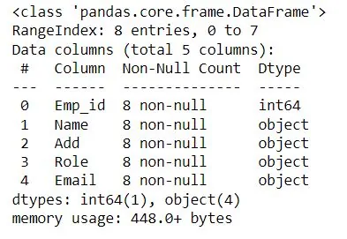

This [dataframe.info()](http://dataframe.info) method returns the data type of the dataframe columns.

### Creating pandas datframe from dictionary of list:#

```python
emps = {"Emp_name":["Ishan", "Gaurav", "ram", "Rohit"],
        "role": ["Data_science", "full stack", "front end", "ML and AI"]
        }

ddf = pd.DataFrame(emps)
ddf.head()
```

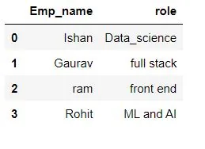

Here we created a dataframe ddf from dictionary of list using pandas.dataframe().

## Sorting Dataframe:
For sorting the data frame in pandas, function [sort_values()](https://www.geeksforgeeks.org/python-pandas-dataframe-sort_values-set-1/) is used. Pandas sort_values() can sort the data frame in Ascending or Descending order.

For demostrating example we are adding a new column to the existing dataframe.

```python
exp = pd.Series(['6', '8', '4', '3','2','7','8','9'])
emp_df['Experience_in_years'] = pd.to_numeric(exp)
emp_df.head(n=8)
```

Here we converted the object type of datframe column into integer type using pd.to_numeric() function.

#### Sorting in Ascending Order:
```python
emp_dfsorted = emp_df.sort_values(by=["Experience_in_years"],ascending=True)
emp_dfsorted.head(n=8)
```

For sorting the pandas dataframe in ascending order we assign the name of the column to the by parameter . On the basis of that column value sorting is done.We assign True to ascending parameter to sort in ascending order. If we donot assign any value to ascending parameter it is by default sorted in ascending order.

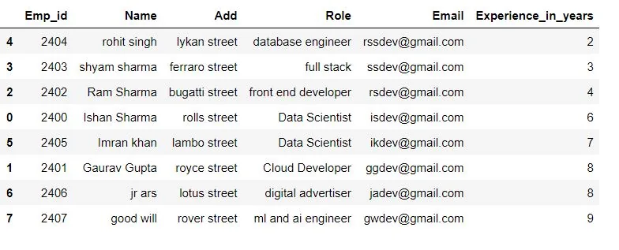

Here we sorted the dataframe in the ascending order of employees experience using **Experience_in_years** column.

#### Sorting in Descending Order:

```python
emp_dfsorted = emp_df.sort_values(by=["Experience_in_years"],ascending=False)
emp_dfsorted.head(n=8)
```

Here we sort the dataframe in descending order by assigning False value to the ascending parameter.

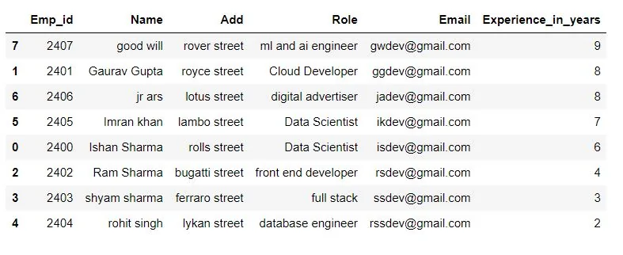

#### Sorting by multiple columns:

```python
emp_dfsorted1 = emp_df.sort_values(by=['Emp_id', 'Experience_in_years'],ascending=[True,False])
emp_dfsorted1.head()
```

For sorting the dataframe by multiple columns we pass a list of columns to by parameter and a list of boolean values to ascending parameter.

The first item of the list in ascending parameter assigns to the first column of the list and so on.

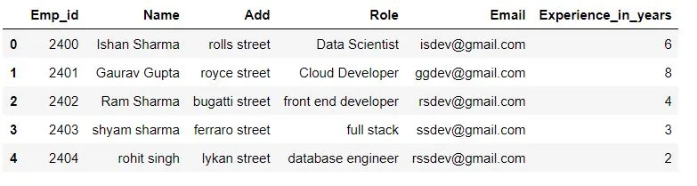

## Subsetting Dataframe:

Here are some operations by using which we can select a subset of a given dataframe:

### Selecting single column:
For selecting a single column we use square bracket [ ] .If we use single
 square bracket , the output is a pandas series .

```python
emp_exp = emp_df["Experience_in_years"]
print(emp_exp)
print(type(emp_exp))
```

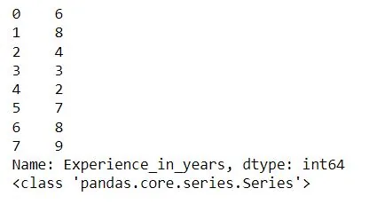

If we use two square brackets for selecting column , the resukt is a pandas dataframe.

```python
emp_expdf =emp_df[["Experience_in_years"]]
emp_expdf.head()
```

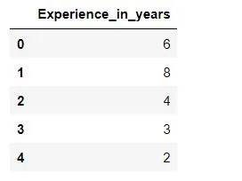

```python
print(type(emp_expdf))
```

<class 'pandas.core.frame.DataFrame'>

### Selecting Multiple columns:

For selecting multiple columns we can pass a list of column names inside the square bracket [] .

```python
name_role = emp_df[["Name","Role"]]
name_role.head()
```

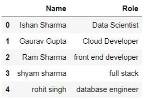

### Selecting Specific rows from a dataframe:

###### Using Condition to subset rows:

For selecting specific rows ,we can put conditions within the brackets to select specific rows depending on the condition.

```python
Experienced_employee = emp_df[emp_df['Experience_in_years'] > 4]
Experienced_employee.head()
```

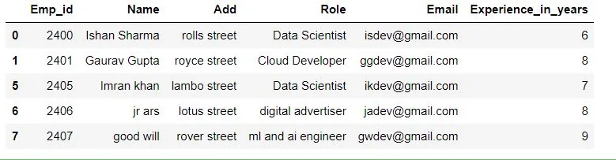

Here we only get the rows having the **Experience_in_years** value greater than 4.

For this we can use plenty of other operators like **<,=,<=, >= ,!=** etc..

###### Using **Square brackets to subset rows:**

We can only select rows using square brackets if we specify a slice, like 1:4. Here we are using the integer indexes of the rows .

```python
print(emp_df[1:4])
```

Here the integer before colon is inclusive and that after the colon is exclusive.

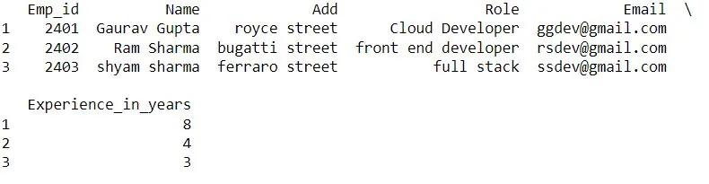

### Selecting Both rows and columns:

In above methods , it was not possible to select specific rows and columns combined so the loc and iloc operators are needed. The portion before the comma specifies the rows we would like to choose and the part after the comma specifies the columns we like to choose.

##### Using loc operator:
```python
data_scientist_df = emp_df.loc[emp_df["Role"] == "Data Scientist", "Name"]
data_scientist_df.head()
```

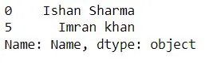

Here we select the rows having **role** value equal to **Data Scientist** and

select the **Name** column.

#### Using iloc operator:
The iloc operator allows us to subset pandas DataFrames based on their position or index.

```python
any_two = emp_df.iloc[[1, 2], [0, 1]]
any_two.head()
```

Here we are selecting the rows having rows index 1 and 2. And the columns having column index 0 and 1.

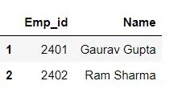

##### Selecting all rows and only some columns:
```python
all_rows = emp_df.iloc[:, [0, 1]]
all_rows.head()
```

for selecting all rows we pass **colon :** And for selecting specific columns we pass a list of column index.

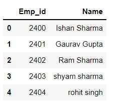

##### subsetting a regular sequence of specific rows and columns:

```python
any_rows = emp_df.iloc[0:4 , 0:2]
any_rows.head()
```

For this we specify the slice to indicate the rows and columns.The end of the slice is exclusive in both the slices.

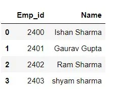

## Interating over rows of dataframe:

For iterating over rows in dataframe , we make use of the three functions iteritems(), iterrows(), itertuples().

#### Using iterrows():

Iterate over DataFrame rows as (index, Series) pairs.

To iterate over rows of a Pandas DataFrame, we use DataFrame.iterrows() function which returns an iterator yielding index and row data for each row.

In this example we are iterating through dataframe rows using [**Python For Loop**](https://pythonexamples.org/python-for-loop-example/)and **iterrows()** function.

```python
for index, row in emp_df.iterrows():
    print(index,row)
```

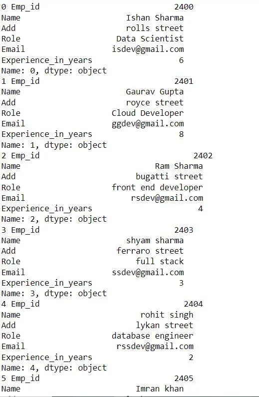

#### Using iteritems():

Iterate over (column name, Series) pairs.

This method iterates over (column name, Series) pairs. When this method applied to the DataFrame, it iterates over the DataFrame columns and returns a tuple which consists of column name and the content as a Series.

```python
for key, value in emp_df.iteritems():
    print(key, value)
    print()
```

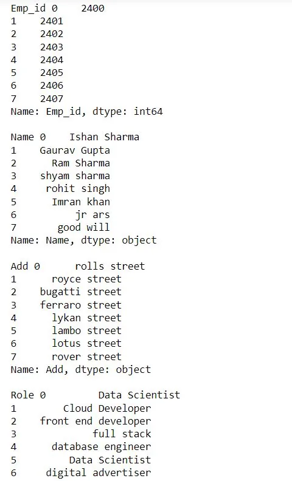

#### Using itertuples():
Iterate over DataFrame rows as namedtuples.

In order to iterate over rows, we apply a function itertuples() this function return a tuple for each row in the DataFrame. The first tuple element represents row index while other element represents row values.

```python
for t in emp_df.itertuples() :
    print(t)
    print()
```

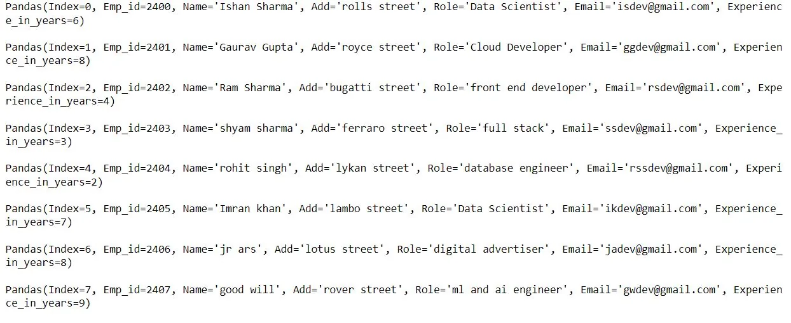

## Dropping Duplicates:

Pandas **drop_duplicates()** method helps in removing duplicates from the data frame.

For demonstrating the examples on drop_duplicates() function we created a dataframe called **games_df ,** that is about the games played by different countries in different years and no of medals won by them.

```python
games_df= pd.read_csv("C:\\Users\\DELL\\Desktop\\games.csv")
games_df.head()
```

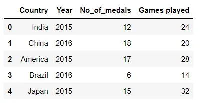

Now adding a new row that contain entire duplicate values.

```python
games_df.loc[len(games_df.index)] = ['India',2015, 12, 24]
print(games_df)
```

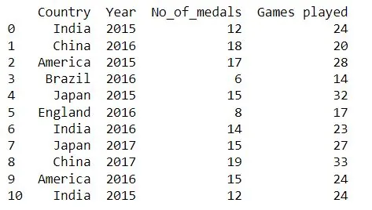

Here first and the last rows are same.

**Removing rows with all duplicate values**

```python
games_df.drop_duplicates()
```


From above result we can see that the rows having all the values same is dropped.Thus, dataframe.drop_duplicates() method is used to drop the rows having entire duplicate values.

**To remove duplicates on specific column we use subset:**

```python
games_df.drop_duplicates(subset=['Country'])
```

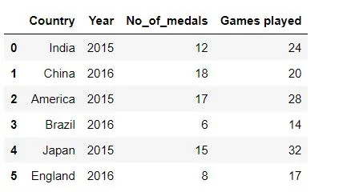

Here all the rows with repeated country names in the **Country** column are dropped.

This drops the rows having duplicate **Country** column name and **Year** column name.

```python
games_df.drop_duplicates(subset=['Country','Year'])
```


### To remove duplicates and keep first or last occurrences, we use keep.

```python
games_df.drop_duplicates(subset=['Country'], keep='last')
```

It removes duplicates in the **Country** column and kepp the last occurence.

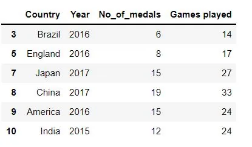

In above result the last row is kept while the first row is removed.

```python
games_df.drop_duplicates(subset=['Country'], keep='first')
```

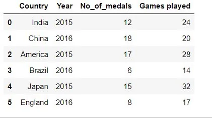

If we assign keep equal to **False.**Both the same rows with same country name are dropped.

```python
games_df.drop_duplicates(subset=['Country'], keep= False)
```

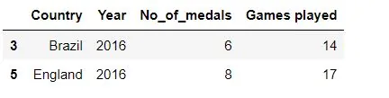

### Modifying actual dataframe:

If we assign inplace parameter to **True** the actual dataframe remains changed.

```python
games_df.drop_duplicates(subset=['Country'], keep='first',inplace= True)
games_df
```

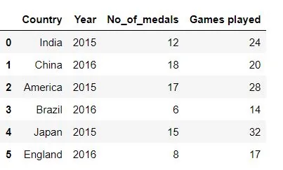

The link to the notebook in the github repo is [here](https://github.com/Techy-Ishan/Pandas-Techniques-for-data-manipulation/blob/master/Pandas%20Techniques%20for%20data%20manipulation.ipynb).
