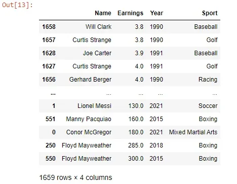
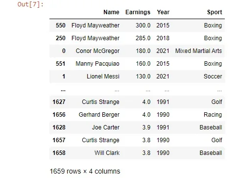
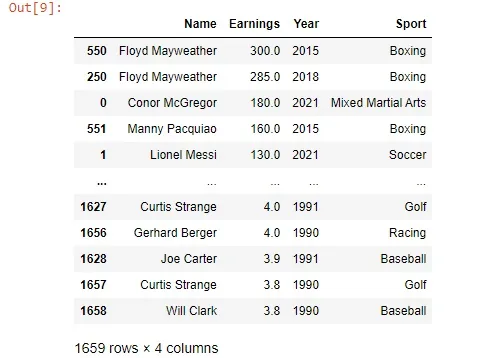
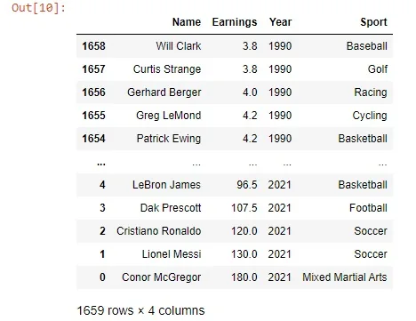
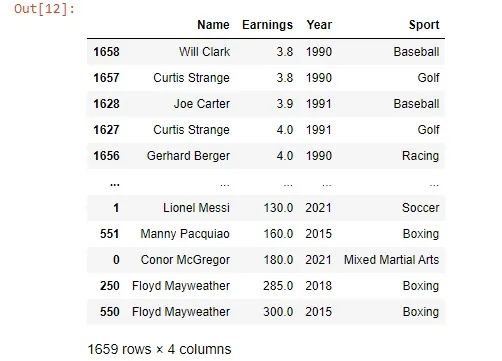

Sorting is a great way to get a handle on your data and it is very common when you are analyzing certain data especially if you want to do some summary statistics over it. We will use pandas in this tutorial as a tool to learn more about sorting and to explore the pandas’ capability to deal with data with different sorting methods and techniques.

The data that we will use here is from [Kaggle](https://www.kaggle.com/darinhawley/forbes-high-paid-athletes-19902021).

At first, We will import our data and load it as a data frame:

```python
import pandas as pd
df=pd.read_csv('forbesathletes.csv')
df.head(10)
```


Now let us explore at first the ‘sort_values()’ method, which sorts the data frame by specifying certain columns to sort by let’s see some examples as follows:

```python
df.sort_values('Earnings')
```



Here we sort the rows of the data frame by the 'Earnings' column in ascending order. But also we can sort the rows by more than one column like this:

```python
df.sort_values(by=['Earnings','Year'],ascending=False)
```



Here we sorted the values by two columns in descending order.

As we know there is a number of sorting algorithms like quicksort, mergesort, and more, if we want to specify a certain algorithm to sort by, we can do this by adding the algorithm name to the 'kind' argument:

```python
df.sort_values(
 by="Earnings",
 ascending=False,
 kind="mergesort"
 )
```



______________________________________

Sorting by the values of certain columns is not the only tool we have, we can sort by the index and this keeps the index of the data frame more organized and meaningful.

```python
df.sort_index(ascending=False)
```



In all of the previous examples, we created a sorted copy of the original data frame and that did not affect the original one. So if we want to apply our sorting to the original data at the same line of code we can use the 'inplace' parameter.

```python
df.sort_values("Earnings", inplace=True)
df
```



As we saw sorting is a great tool for you in the data analysis phase and to build more complex operations later on. To get more examples about this and more check the pandas [documentation](https://pandas.pydata.org/docs/reference/api/pandas.DataFrame.sort_index.html).

Link for GitHub repo [here](https://github.com/Abdelrahman7000/Data_insight_Data_Scientist_program_Sorting_in_pandas)

*That was part of the Data Insight's Data Scientist Program.*
