Pandas is a very powerful tool in Data Science. As it has many capabilities in analyzing the data and getting interesting insights. Also, pandas Data Frame which is used in storing the data from multiple sources has a certain structure so that it stores the data in a row-and-column format. Our focus in this article will be on one characteristic for dealing with it which is indexing.

Generally, indexing means selecting particular rows and columns of data from a data frame or as known subset selection.

At first, To make things clear let's import some data and see what is happening.

The data that we will be working with is from [Kaggle](https://www.kaggle.com/jehanbhathena/big-5-european-football-leagues-stats).

```python
df.head()
```

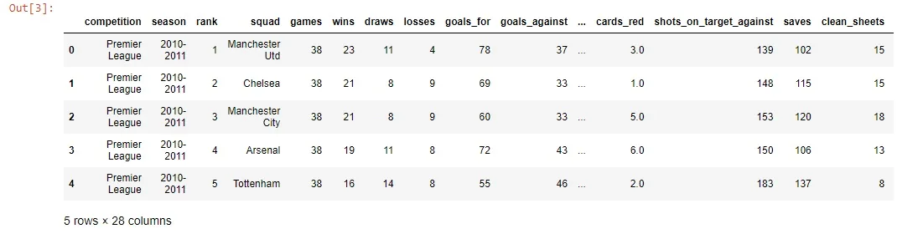

As we see here, this part of the data and from that, we notice that the data came with index by itself as we did not specify that. So if you did not specify a column to be the index, pandas will add to the data frame a new column to be the index and that starts from zero till the end. And that is what we see here:

```python
df.index
```

```python
RangeIndex(start=0, stop=1078, step=1)
```

From that, we can use the index to do some operations like selection. That means to slice some rows or to select certain range of rows to display:

```python
df[:6]
```

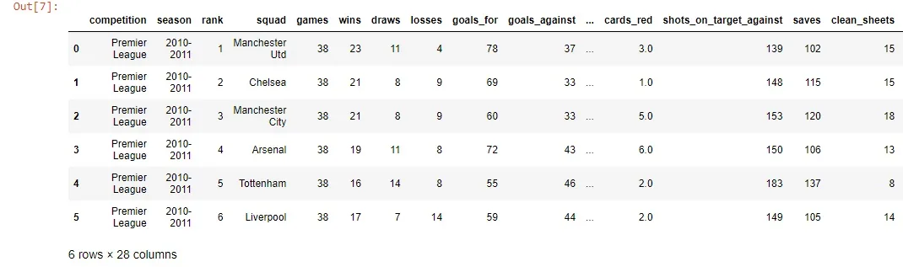

The previous code selected the first six rows. Similar to what we did in the previous code, we can do that by *loc* or *iloc* methods which are also used in selection and in subsetting the data:

```python
df.iloc[7:13,:]
```

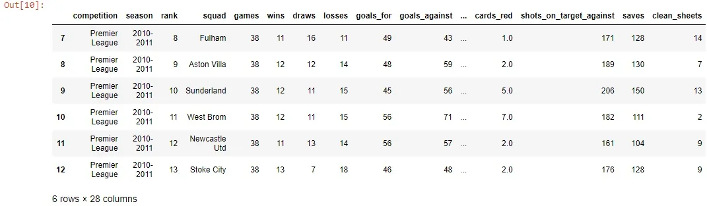

```python
df.loc[[3,33,43,66,86,90],'competition':'goals_against']
```

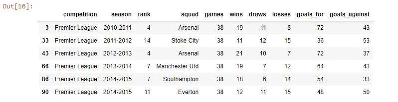

In the previous example, we used the *iloc* method to get some range of rows with all columns. At the second we used *loc* to select certain rows with certain columns to display.

That was interesting, Till now we dealt with the data frame's default index and how to select some rows using that index.

.

Now we want to make some changes to the data and make a certain column to be the index of the data:

```python
df.set_index('rank',inplace=True)
```

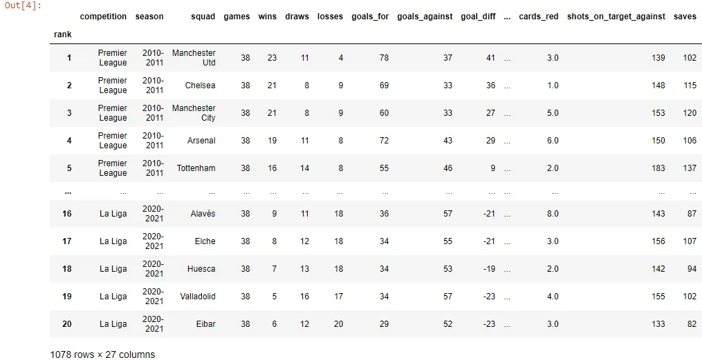

Here we chose the rank column to be the index of the data frame.

Note that the parameter *inplace* here is to tell pandas to save the changes to the original data frame, not as a copy.

So the rank column has become the index of the DataFrame.

Actually, we can get benefit from that and do the same selection techniques that we saw before with the default index.

Some examples for that:

```python
df.loc[10,:]
```

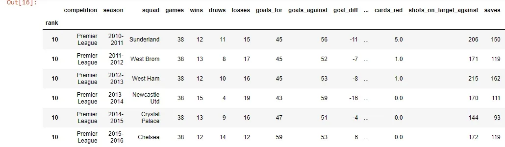

```python
df.iloc[10:17,0:6]
```

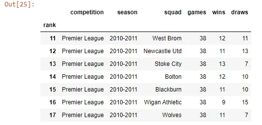

We saw that we changed our index to be the rank column. the story does not end here as we can set multiple columns to be the index.

```python
df.set_index(['rank','squad'],inplace=True)
```

```python
df.head()
```

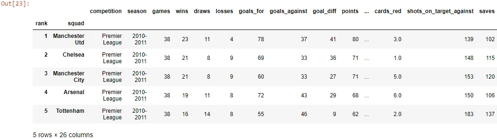

Also here we can slice the data and select certain columns but we need to sort the data before doing that.

```python
df.sort_index(inplace=True)
```

The following two examples are for illustrating how selection works but using multi-index:

```python
df.loc[(6,'Liverpool')]
```

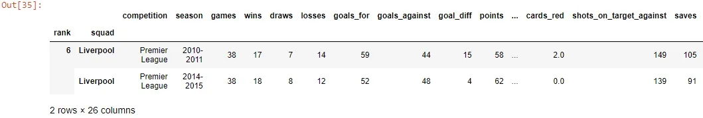

```python
s=[(1,'Barcelona'),(4,'Arsenal')]
df.loc[s]
```

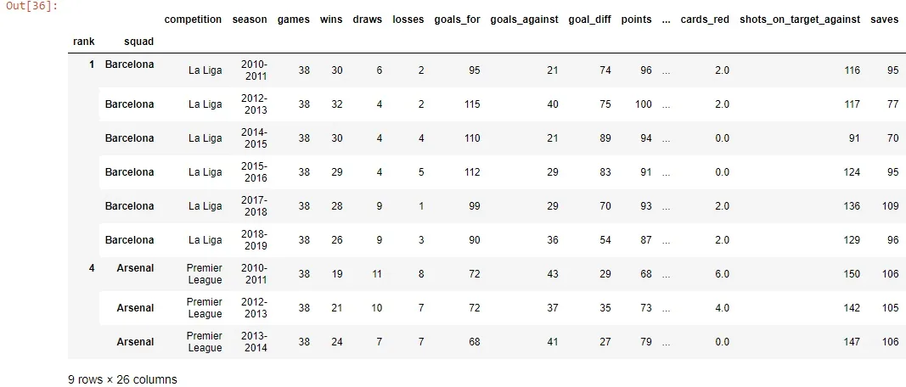

As we saw we treat the indices as levels, so in our example, there is one level for "rank" and the other is for the squad. So for example if we want to sort the data using the second index which is "squad" we will do that:

```python
df.sort_index(level="squad")
```

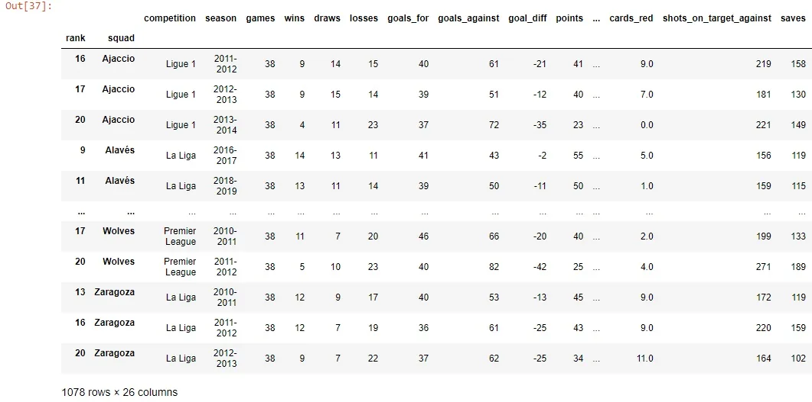

Hope that was helpful and gave an overview of indexing.

Some resources regarding this article: [here](https://www.sharpsightlabs.com/blog/pandas-index/) and [here](https://www.datacamp.com/community/tutorials/pandas-multi-index)

To get much grasp of this topic and for more examples check the [documentation](https://pandas.pydata.org/pandas-docs/stable/user_guide/indexing.html).

Link for GitHub repo [here](https://github.com/Abdelrahman7000/pandas_Techniques_for_Data_Science_Indexing/blob/main/Indexing.ipynb)

*Acknowledgment*

*That was part of Data Insight's Data Scientist program.*
