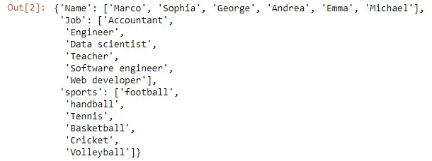
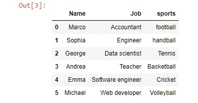
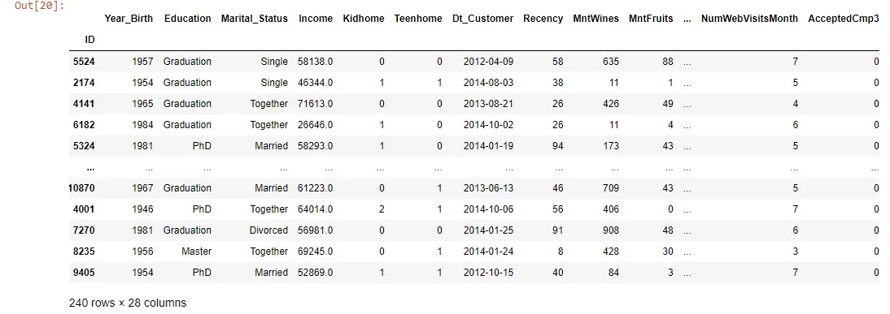
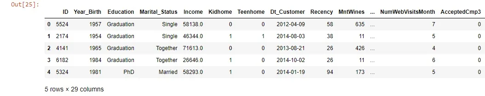

Python packages are widely used in different fields, Here we will pick one which considered crucial for any data scientist that is pandas, specifically we will focus here on dealing with different kinds of files using pandas, And this will help us in dealing with these types of files and transform them into different shapes.

At first what if we do not want to import data but create our own data frame from scratch let's see this in action:

```python
data={'Name':['Marco','Sophia','George','Andrea','Emma','Michael'],
     'Job':['Accountant','Engineer','Data scientist','Teacher','Software engineer','Web developer'],
     'sports':['football','handball','Tennis','Basketball','Cricket','Volleyball']}

data
```



Now, this is a dictionary that the values of its keys are of type lists, we will transform these data into a data frame like this:

```python
new_df=pd.DataFrame(data)
new_df
```



Ok, that was good, Most of the time we will need to get or read the data from other files and that is what we will do next:

Here we will be working on a dataset from [Kaggle](https://www.kaggle.com/imakash3011/customer-personality-analysis)

*Firstly*, We will import the data which is actually stored in a CSV(comma-separated values) file format let's how we will deal with it:

```python
df=pd.read_csv('marketing_campaign.csv', sep='\t',
                   index_col='ID',
                   parse_dates=['Dt_Customer'])
```

```python
df
```



this is a sample of the data.

What we did here is one form of reading a file specifically a CSV file, so we used the *read_csv()* function which takes the name of the file as the first argument and the separator that splits the data in the original file to load the data in the right format, The other parameter is the index_col that specifies the column from the CSV file that contains the row labels. You should determine the value of index_col when the CSV file contains the row labels.

one note that if you want to do the opposite thing that transforms the data fame into a CSV file this is done by using the: *df.to_csv()* method.

_______________________________________________

*Second*, If we want to work with Excel files, let us see how can we make an Excel file from the file that we imported before:

```python
df=df.to_excel('marketing_campaign.xlsx')
```

By this, we created a new Excel file under this name in our directory.

Now we want to read this Excel file as a data frame like what we did in the CSV file:

```python
 df3=pd.read_excel('marketing_campaign.xlsx')
```

```python
df3.head()
```



Another method in pandas for Excel files is

```python
pd.ExcelFile('marketing_campaign.xlsx')
```

which accepts the Excel file and you can get the sheet names of the file by the attribute *sheet_names**.* And you can access each sheet by its name or by its index.

Ok, that was very well that was a similar process to the case of the CSV file at first.

___________________________________________

Third, JSON files which stand for JavaScript object notation, which primarily used for transmitting data between a web application and a server and they offer a human-readable collection of data. Also, its structure is similar to the dictionary in python in addition to that python has a library that deals with them.

Like the previous types of files, For JSON files pandas has methods to deal with as *.to_json()* to transform the data from data frame to JSON file:

```python
js=df.to_json('marketing_campaign.json')
```

this will create a JSON file in our directory.

Note: We can add another optional argument for *.read_csv(),.read_json()* methods which is *chunksize.* Thisis used to deal with large datasets like this:

```python
pd.read_json('marketing_campaign.json', index_col=0, chunksize=10)
```

_________________________________________

Fourth, Pickled files, are considered file types native to python. Python has some data types like lists and dictionaries which are not obvious how to store in flat files. if you merely want to be able to import these files into Python, you can serialize them. this means that converting the object into a sequence of bytes, or a byte stream.

If we want to save a DataFrame in a pickle file, This is done by the .*to_pickle()*method.

Like what we did before, We can get the data from a pickle file with the method *.read_pickle().*

*_____________________________________________*

*Fifth**,* SAS files which are popular in statistical analysis and business analytics. SAS is a software suite that performs Multivariate analysis, Business intelligence, predictive analytics, and Data management.

SAS files have many extensions, the most common one is .*sas7bdat* which is dataset files,and *.sas7bcat* which is catalog files. As an example for importing one of them using the context manager and pandas is as follows:

```python
import pandas as pd
from sas7bdat import SAS7BDAT
with SAS7BDAT ('ex.sas7bdat') as file:
	df_sas=file.to_data_frame()
```

*Hope that was helpful, For more information and examples check the* [*documentation*](https://pandas.pydata.org/pandas-docs/stable/user_guide/io.html)*.*

*Link for GitHub repo* [*here*](https://github.com/Abdelrahman7000/Data_insight_Data_Scientist_program_Reading_files_in_pandas-)*.*

*That was part of the Data Insight's Data Scientist Program.*
