Pandas is one of the most widely used packages in Data Science. In this article, we will go through one of the most important techniques in pandas which is data filtering. Data Filtering is one of the data manipulations techniques that gives us the capability to focus on a certain subset of the data especially when dealing with big-sized datasets.

For this article, we will get our data from [Kaggle](https://www.kaggle.com/imakash3011/customer-personality-analysis).

At first, we will import our data that is stored as a CSV file like this:

```python
import pandas as pd
                   df=pd.read_csv('marketing_campaign.csv',sep='\t',
                   index_col='ID',
                   parse_dates=['Dt_Customer'])
```

let's see the first five rows of our data.

```python
df.head()
```

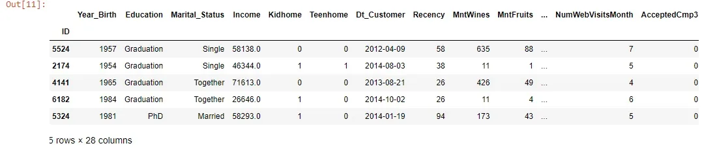

that's considered part of our data.

let's see our first way to filter the data. Now I am interested in getting the records that contain "Master" value from the Education column, we can do that by the following:

```python
df[df['Education']=='Master']
```

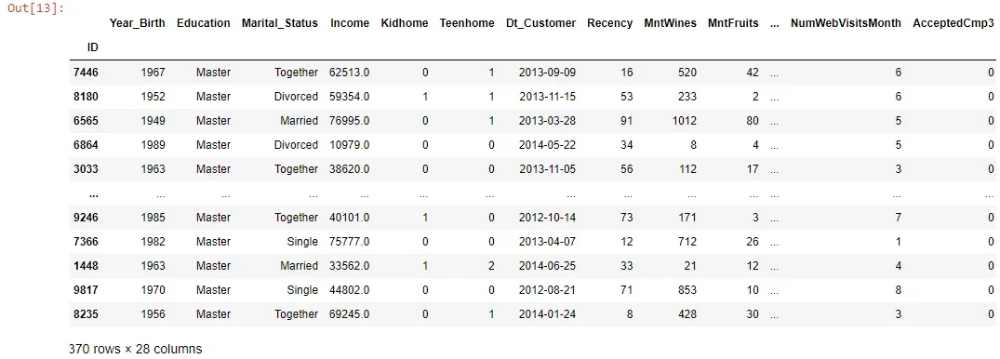

That was good but that was based on one condition. We want to filter based on two conditions:

```python
df[(df['Education']=='Master')|(df['Education']=='PhD')]
```

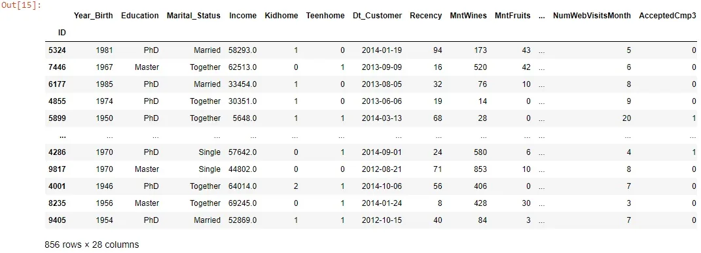

Another example:

```python
df[(df['Education']=='Master')&(df['Marital_Status']=='Married')]
```

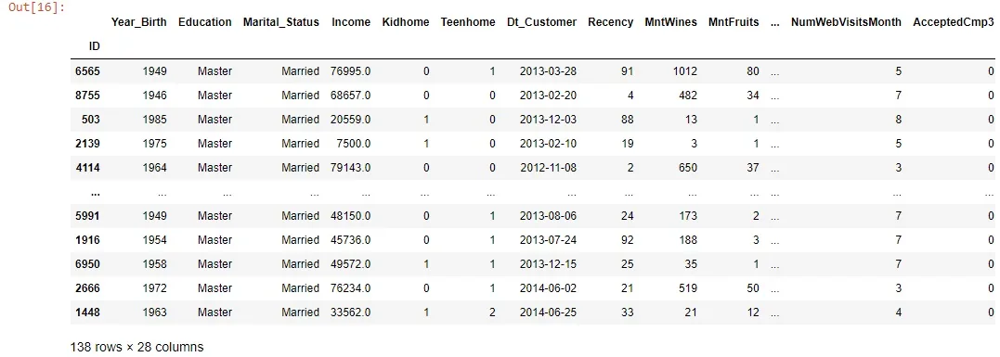

In the previous examples, we used two conditions to filter. Specifically, we used at the first example the symbol " **|** " that means or, to include both the "Master" or "PhD" values from the Education column that means that if the record has the value "PhD" or "Master" under the attribute Education so it will be included in the result but other values will not be included.

In the second example, we used the symbol **&** that means and, to view only the records that its Education attribute has the value "Master" and its Marital status attribute has the value "Married".

Another quick way to reverse the conditions that you wrote is by using Tilde **~****.**

```python
df[~(df['Education']=='Master')]
```

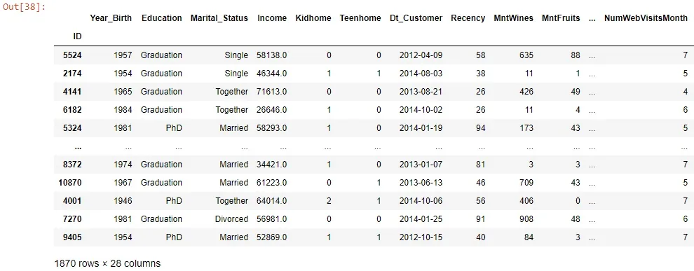

This will result in all values except the "Master" value in the Education column.

Note that what we did in the previous examples also can be applied if we add three or more conditions.

Another useful method that is used frequently is the **query** method and it is easy to use as you do not need to mention the name of the dataframe every time when you specify the columns. its syntax is like this:

```python
df.query('Education =="Master"& Marital_Status=="Single"')
```

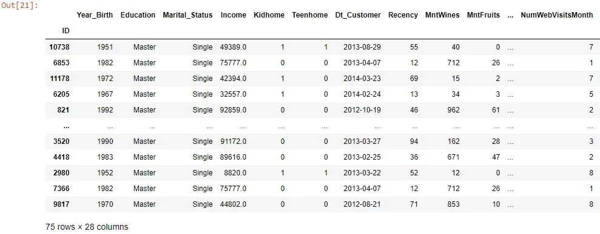

In addition to the above, there is an important method and it is easy to grasp which is **eq()** and you can use it with any columns like the following example:

```python
df[df.Year_Birth.eq(1990)]
```

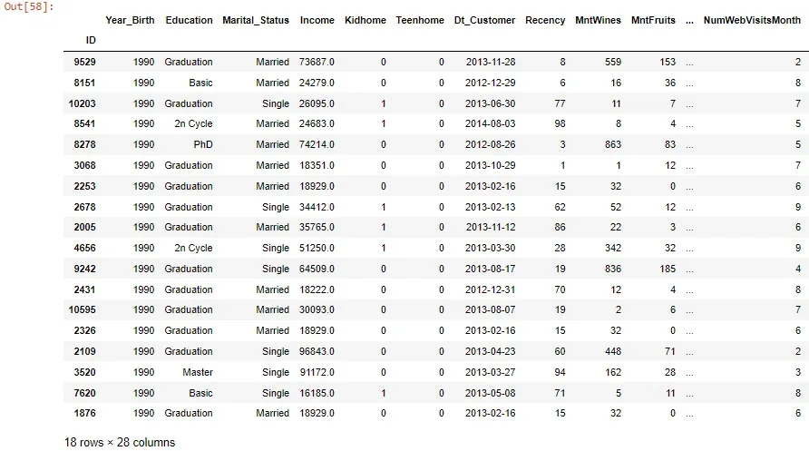

Let's see a different method to filter based on some values we provide, let's see this first in action, and then we will illustrate it:

```python
years=[1990,1985,1966,1952]
df[df.Year_Birth.isin(years)]
```

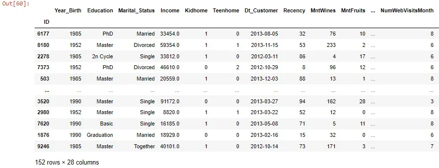

Here we created a list that contains different years and then we used the **.isin()** method to include in the final resulting dataframe in the Year Birth column only the values that are also in the years' list that we created before.

One of the most important ways that are used in the selection of a certain subset of the data and also used for filtering is **loc** and **iloc****.** we will look at some examples for how we should use them and make a brief distinction between them let's take some examples:

```python
df.loc[(df.Education=='Graduation')&(df.Marital_Status=='Single'),'Marital_Status':]
```

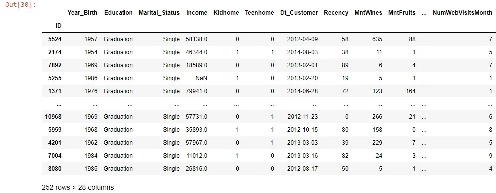

This example showed us how can we use loc to filter but this was similar to what we did in the previous ways for filtering, **loc**and **iloc**are helpful forsubsetting the data based on some conditions in addition to that it gives us the ability to slice the columns according to our findings, We want to clarify that by some examples:

```python
df.loc[(df.Education=='Graduation')&(df.Marital_Status=='Single'),'Year_Birth':'Income']
```

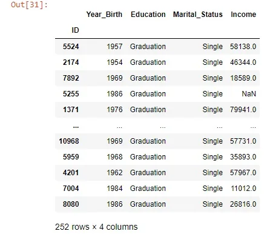

Here we filter the data based on two conditions and limit the resulting columns into just 4 columns.

```python
df.iloc[:7,0:4]
```

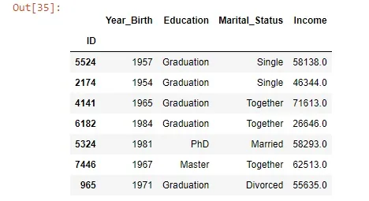

In this example, we used **iloc**which differs from **loc** in some matters. I believe that we need to make a little comparison between them.


**iloc** is integer index-based so itaccepts integers and not the name of the columns, which means that we have to specify rows and columns by their integer index. Also, the stop index in the slicing is excluded like what we saw before.

On the other hand, **loc** is label-based so it accepts the names of the columns, which means that we have to specify the name of the rows and columns, Also, if you use slicing the stop index is included.

This table summarizes some differences between them.

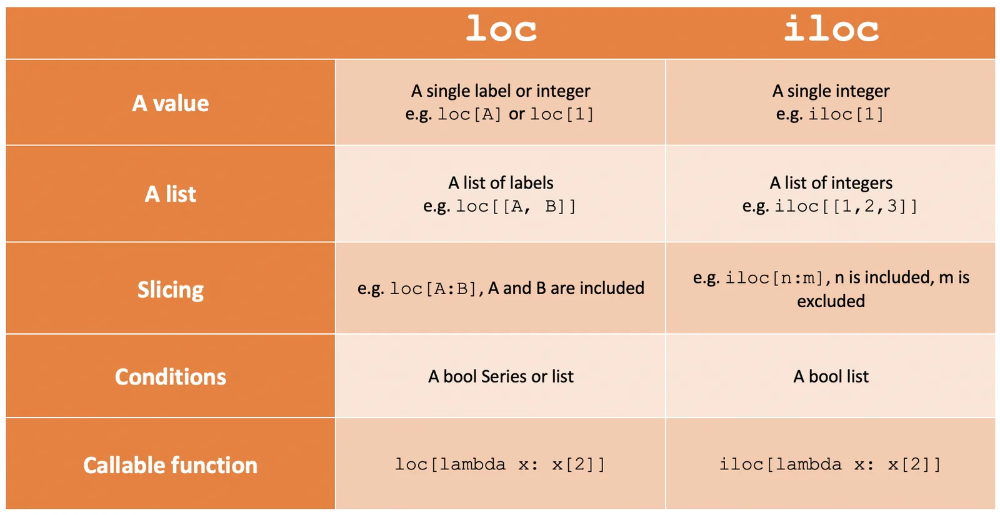

Also, you can combine string functions with pandas to give you more tools in your toolkit. An example of that is the following:

```python
df[df['Education'].str[0]=='M']
```

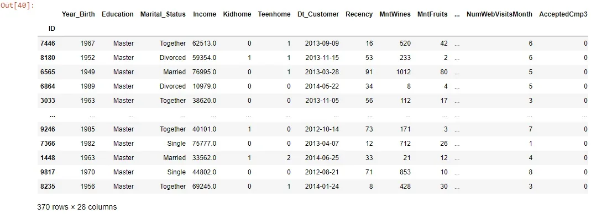

Here we used the string function to get only the records in which the Education column values start with the letter "M" which in our case it is the Master value.

You can do this with other functions like the following.

let's create small data like this:

```python
data=pd.DataFrame({'Name':['David','William','Emma','Olivia','Sophia','James','Locas','Benjamin'],
             'Job':['Data Scientist','Accountant','Doctor','Engineer','Web Developer','Project Manager','Marketing Specialist','Teacher']}
            )
```

```python
data
```

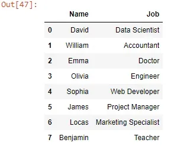

```python
data[data['Name'].str.len()>5]
```

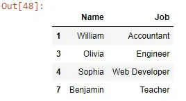

Here we got only the names that its length is greater than five elements in length.

Also, we can use contains() like this:

```python
data[data['column'].str.contains()]
```

Hope that was helpful, For more information and examples check the [documentation](https://pandas.pydata.org/pandas-docs/stable/index.html). And for other Resources regarding this article: [here](https://medium.com/m/global-identity?redirectUrl=https%3A%2F%2Ftowardsdatascience.com%2Fhow-to-use-loc-and-iloc-for-selecting-data-in-pandas-bd09cb4c3d79).

Link for GitHub repo [here](https://github.com/Abdelrahman7000/Data_insight_Data_Scientist_program_Filtering_in_pandas).

**Acknowledgment**

*That was part of Data insight's Data Scientist program.*
