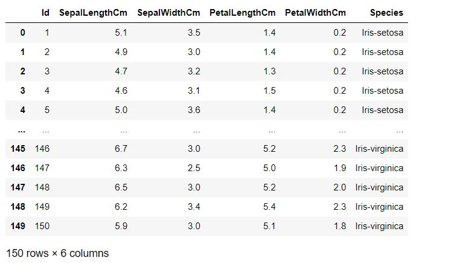
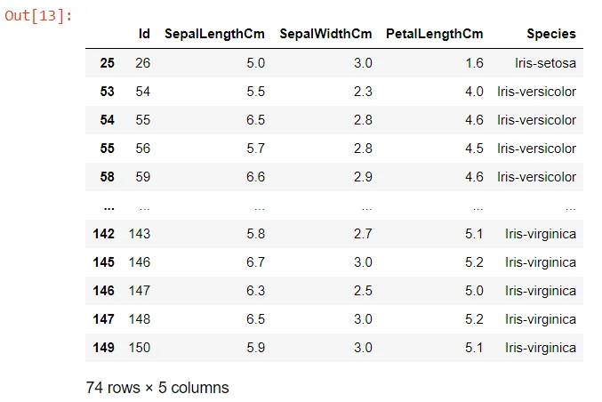
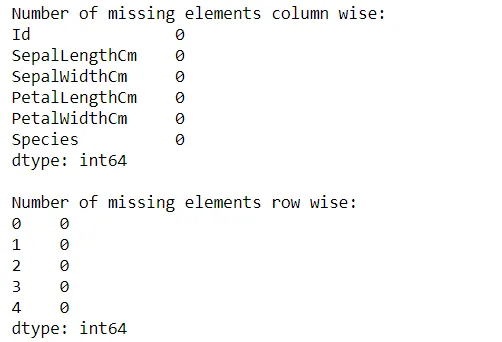
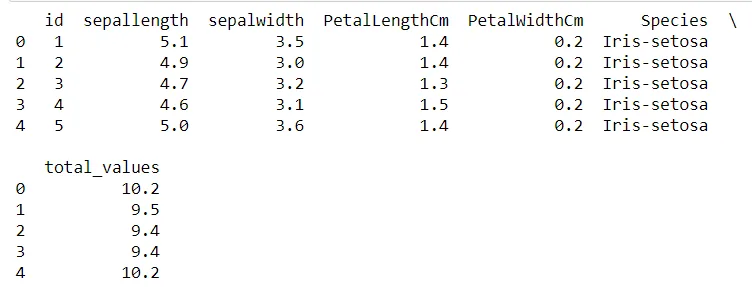
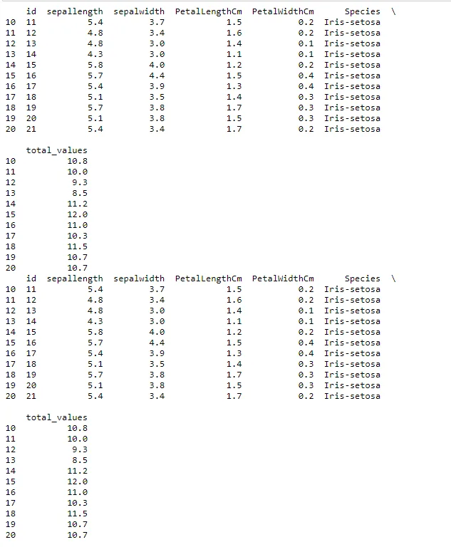
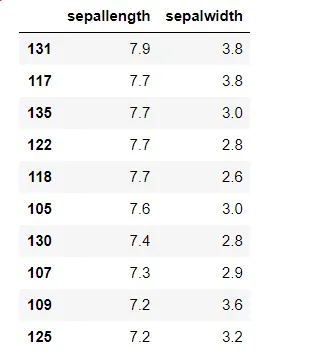
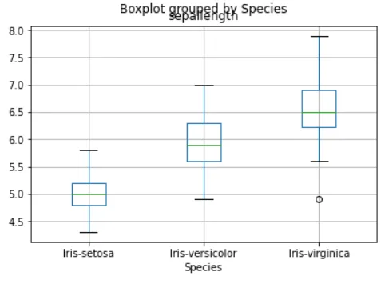
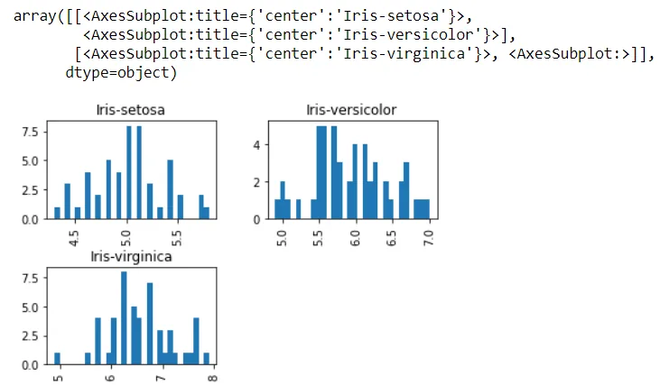

Data manipulation with python is defined as a process in the python programming language that enables users in data organization in order to make reading or interpreting the insights from the data more structured and comprises of having better design.

In this post i will explain some pandas techniques in python, Each technique will be demonstrated with a simple code.

**Filtering values on the basis of given condition**

**Apply function**

**Renaming the columns**

**Slicing the rows**

**Sorting a table**

**Plotting of boxplots and histograms**

## Getting started
The first step to start using Pandas is importing the library.

```python
import pandas as pd
```

Now to load and read the data in a DataFrame we use **read_csv.**

You can find the csv file of this "Iris_trainig" database available on Kaggle  [Kaggle](https://datahub.io/machine-learning/iris)*.*

**Iris Database:** Iris dataset contains 5 columns such as petal length, petal width, sepal length, sepal width and species type.

```python
data= pd.read_csv('iris_training.csv')
data
```

This code gives the following result:



**Filtering values on the basis of given condition**

In order to to work with specific data that meets the precise criteria, we would need to use the corresponding data manipulation to meet the conditions.

In this technique we have to use the **.loc** function, this function allows us to access a group of rows and / or columns using a boolean array or labels.

```python
data.loc[(data["SepalLengthCm"]>=5) & (data["SepalWidthCm"]<=3) & (data["PetalLengthCm"]>1.2), ["Id", "SepalLengthCm", "SepalWidthCm", "PetalLengthCm", "Species"]]
```

This code gives the following result:



**Apply function**

to manipulate columns and rows in a DataFrame we use the pandas **apply ()** function.

This function applies the corresponding declared function to the respective axis (0 for column and 1 for rows) and finally return the required variable as per the requirement.

```python
def missingValues(x):
    return sum(x.isnull())
print("Number of missing elements column wise:")
print(data.apply(missingValues, axis=0))
print("\nNumber of missing elements row wise:")
print(data.apply(missingValues, axis=1).head())
```

This code gives the following result:



**Renaming the columns**

Let's move on to the Rename function with one of the python pandas library functions.To rename a column you must use the **rename ()** function, creating a dictionary under the name "newcols" to update our new column names.

The following code illustrates that.

```python
newcols={
"Id":"id",
"SepalLengthCm":"sepallength",
"SepalWidthCm":"sepalwidth"}

data.rename(columns=newcols,inplace=True)

print(data.head())
```

This code gives the following result:



**Slicing the rows**

With Slicing we can selects a set of rows and/or columns from a DataFrame.

To slice out a set of rows, we use the following syntax: data[start:stop] .

in slicing in pandas the start bound is included in the output and the stop bound is one step BEYOND the row you want to select.

```python
print(data[10:21])
# it will print the rows from 10 to 20.

# you can also save it in a variable for further use in analysis
sliced_data=data[10:21]
print(sliced_data)
```

This code gives the following result:



**Sorting a table**

With the use of the “.sort_values” function we can sort a table on the basis of keys which will be passed as a parameter as well as we can pass a list of columns and the table would be sorted on the basis of chronological order.

```python
data_sorted = data.sort_values(['sepallength','sepalwidth'], ascending=False)
data_sorted[['sepallength','sepalwidth']].head(10)
```

This code gives the following result:



**Plotting of boxplots and histograms**

now in the The end of manipulation, to explain the dataset and to understand the different statistical parameters of the data and its inference we have to plot boxplot and histogram in order using boxlot, hist functions.

```python
import matplotlib.pyplot as plt
%matplotlib inline
data.boxplot(column="sepallength",by="Species")
```



```python
data.hist(column="sepallength",by="Species",bins=30)
```



Thank you for regarding!

You can find the complete source code here [Github](https://github.com/rabebbenothmen/Data-Insight2021/tree/main/Assignments/5-%20Pandas%20Techniques%20for%20Data%20Manipulation%20in%20Python)
