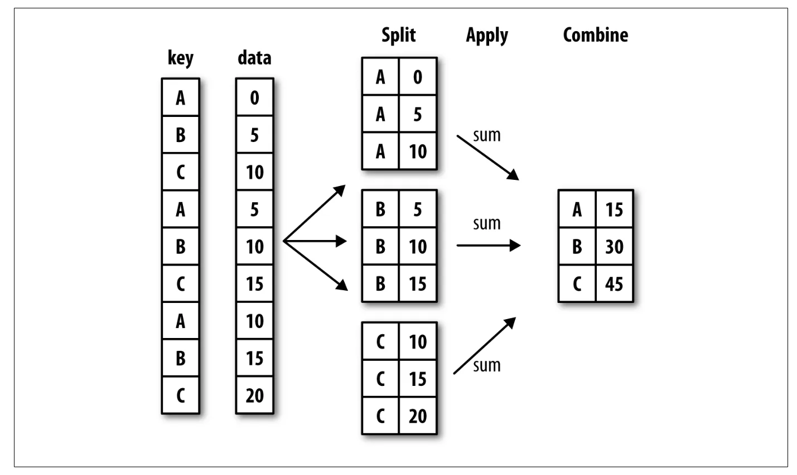

After loading, merging, and preparing a data set, the next important step is to compute group statistics and pandas provides a high-performance ***groupby*** facility, enabling to slice and dice, and summarize data sets in a natural way.

Hadley Wickham, an author of many popular packages for the R programing language, told about group operations as ***split-apply-combine***. The first stage of the process is split into groups based on one or more keys and the splitting performs on a particular axis (axis=0 for rows and axis=1 for columns) of an object. Then, a function is applied to each object and producing a new value. Finally, the results are combined into a result object. This is about ***groupby*** mechanics.



## Groupby basic operations

#### Basic syntax is
> **df.groupby(column/s_to_group)[[column/s_to_calculate]].function/s_to_compute( )**

Let's get started. Here is a very sample data frame.

```python
df = pd.DataFrame({'key1':['a','a','b','b','a','b'],
          'key2:['one','two','one','two','one','two'],
                  'val1':np.random.permutation(6),
                  'val2':np.random.permutation(6)})
df
```

```python
Out[3]:
  key1 key2  val1  val2
0    a  one     0     1
1    a  two     5     3
2    b  one     2     0
3    b  two     4     2
4    a  one     1     4
5    b  two     3     5
```

```python
grouped = df.groupby('key1')
grouped
```

```python
Out[4]:
<pandas.core.groupby.generic.DataFrameGroupBy object at 0x7f880385dee0>
```

Pandas return a GroupBy Object and at this stage, it has not computed anything. For example, to compute group means we can call the **mean** method.

```python
grouped.mean()
```

```python
Out[5]:
          val1      val2
key1
a     3.333333  3.333333
b     1.666667  1.666667
```

It calculated the average values from 'val1' and 'val2' according to its group column 'key1'.

We can group one or more columns.

```python
df.groupby(['key1','key2'])['val1'].mean()
```

It is grouped by 'key1' and 'key2' columns and calculated the average value of 'val1' column according to those groups.

```python
Out[6]:
key1  key2
a     one     4.5
      two     1.0
b     one     2.0
      two     1.5
Name: val1, dtype: float64
```

The following code will produce the same result.

```python
df['val1'].groupby(['key1','key2']).mean()
```

You can use the **unstack** method to spread as columns.

```python
df.groupby(['key1','key2'])['val1'].mean().unstack()
```

```python
Out[7]:
key2  one  two
key1
a     4.5  1.0
b     2.0  1.5
```

You can use one or more keys and one or more values to calculate.

```python
df.groupby(['key1','key2'])[['val1', 'val2']].mean()
```

```python
Out[8]:
           val1  val2
key1 key2
a    one    4.5   2.5
     two    1.0   5.0
b    one    2.0   1.0
     two    1.5   2.0
```

The following statistical methods can be used as 'Optimized groupby methods'.

|  |  |
| --- | --- |
| Function Name | Description |
| count | Number of non-NA values in the group |
| sum | Sum of non-NA values |
| mean | Mean of non-NA values |
| median | Median of non-NA values |
| std, var | Sample standard deviation and variance of non-NA values |
| min, max | Minimum and maximum of non-NA values |
| prod | Product of non-NA values |
| first, last | First and last non-NA values |

## Groupby with agg method

You can also use statistical methods with **agg** method but this is much slower than the optimized functions. In agg method, you can add any statistical computation method from build-in, from NumPy, or custom functions. For example,

```python
df.groupby(['key1','key2']).agg('mean')
```

It is the same as the above method for computing the average values. You can use one or more functions to calculate with agg method.

```python
df.groupby(['key1'])['val1'].agg(['mean','sum'])
```

It is grouped by the 'key1' column to calculate the average and sum of the 'val1' column.

```python
Out[9]:
          mean  sum
key1
a     3.333333   10
b     1.666667    5
```

One thing to be aware of is to use parenthesis for build-in functions and no need to use it for NumPy functions and custom functions. Here's create a new function to calculate the range of the data.

```python
def range_(arr):
    return max(arr) - min(arr)
```

```python
df.groupby(['key1'])[['val1']].agg(['mean',
                                   'std',range_])
```

```python
Out[11]:
          val1
          mean       std range_
key1
a     3.333333  2.081666      4
b     1.666667  1.527525      3
```

You can change the column names of the result table by adding a list of tuples with custom names.

```python
df.groupby(['key1'])[['val1']].agg([('Average','mean'),
                         ('Standard Deviation',np.std),
                         ('Range',range_)])
```

```python
Out[13]:
          val1
       Average Standard Deviation Range
key1
a     3.333333                 10     4
b     1.666667                  5     3
```

If you want to apply different functions to one or more of the columns, you can pass a dict to agg that contains a mapping of column names to any of the function specifications.

```python
df.groupby(['key1','key2'])[['val1','val2']]
                    .agg({'val1':['min','max','mean'],
                          'val2':['std','sum']})
```

It is grouped by both 'key1' and 'key2' columns and minimum, maximum, and average values are calculated for the 'val1' column and standard deviation and summation are calculated for the 'val2' column.

```python
Out[14]:
          val1               val2
           min max mean       std sum
key1 key2
a    one     4   5  4.5  0.707107   5
     two     1   1  1.0       NaN   5
b    one     2   2  2.0       NaN   1
     two     0   3  1.5  2.828427   4
```

In all of the examples above, the aggregated data comes back with an index, and if you do not want this index, you can disable it by passing **as_index=False** to **groupby**:

```python
df.groupby(['key1','key2'], as_index=False).mean()
```

```python
Out[15]:
  key1 key2  val1  val2
0    a  one   4.5   2.5
1    a  two   1.0   5.0
2    b  one   2.0   1.0
3    b  two   1.5   2.0
```

Aggregation is only one kind of group operation. It reduces a one-dimensional array to a scalar value. There are other kinds of group operations.

## Groupby with transform( )
The **transform** method applies a function to each group, then places the results in the appropriate locations. Let's see it with an example.

Review the data frame.

```python
Out[16]:
  key1 key2  val1  val2
0    a  one     5     2
1    a  two     1     5
2    b  one     2     1
3    b  two     0     4
4    a  one     4     3
5    b  two     3     0
```

Let's say we want to calculate the summation of 'val1' and 'val2' grouped by 'key1'.

```python
df.groupby(['key1'])[['val1','val2']].sum()
```

```python
Out[17]:
      val1  val2
key1
a       10    10
b        5     5
```

If we use the transform method, these values will be broadcasted to the appropriate locations.

```python
df.groupby(['key1'])[['val1','val2']].transform(np.sum)
```

```python
Out[18]:
   val1  val2
0    10    10
1    10    10
2     5     5
3     5     5
4    10    10
5     5     5
```

## Groupby with Apply( )

Like aggregate, transform, the apply method splits the object into pieces, applies the passed function on each piece, and then combines these pieces together again. Let's create a new data frame.

```python
 df = pd.DataFrame({'data1':np.random.randn(1000),
                  'data2':np.random.randn(1000)})
category = pd.cut(df['data1'], 4)
```

The data frame contains two columns and 1000 rows of random numbers. The category variable contains category type data of 4 categories according to the column 'data1'.

```python
category.head()
```

```python
Out[20]:
0    (-1.542, -0.111]
1    (-1.542, -0.111]
2    (-1.542, -0.111]
3    (-1.542, -0.111]
4     (-0.111, 1.321]
Name: data1, dtype: category
Categories (4, interval[float64]): [(-2.979, -1.542] < (-1.542, -0.111] < (-0.111, 1.321] < (1.321, 2.752]]
```

First, define the statistical functions to apply.

```python
def get_stats(arr):
    return {'Minimum':arr.min(),'Maximum':arr.max(),
           'Average':arr.mean(),'Count':arr.count()}
```

You can easily pass this function inside the **apply** method.

```python
df['data1'].groupby([category]).apply(get_stats)
                                       .unstack()
```

```python
Out[22]:
                   Minimum   Maximum   Average  Count
data1
(-2.979, -1.542] -2.973551 -1.553749 -1.919661   61.0
(-1.542, -0.111] -1.542005 -0.113647 -0.680796  388.0
(-0.111, 1.321]  -0.110328  1.307575  0.518177  463.0
(1.321, 2.752]    1.329699  2.752306  1.797560   88.0
```

You can use the **qcut** method for cutting with the same number of observations in each group. Here is an example to create 4 groups.

```python
category = pd.qcut(df['data1'], 4, labels=False)
category.head()
```

```python
Out[23]:
0    1
1    0
2    1
3    0
4    3
Name: data1, dtype: int64
```

```python
df['data1'].groupby([category]).apply(get_stats)
                                       .unstack()
```

```python
Out[24]:
        Minimum   Maximum   Average  Count
data1
0     -2.973551 -0.630337 -1.234221  250.0
1     -0.629076  0.034398 -0.297647  250.0
2      0.037742  0.684484  0.341830  250.0
3      0.687052  2.752306  1.257450  250.0
```

When cleaning up missing data, you can impute the missing values using a fixed value or some value you define. Let's create a data frame with missing values.

```python
df = pd.DataFrame({'key': ['a','a','b','b','a','b'],
                  'value':[3,np.nan,4,np.nan,1,2]})
df
```

```python
Out[25]:
  key  value
0   a    3.0
1   a    NaN
2   b    4.0
3   b    NaN
4   a    1.0
5   b    2.0
```

Suppose you want to fill the missing values with the average value of each group according to the 'key' column.

```python
df.groupby(['key']).mean()
```

```python
Out[26]:
     value
key
a      2.0
b      3.0
```

They are the average values. If you want to fill in the missing values with the average values, you can use the **lambda** function inside the **apply** method.

```python
df.groupby(['key'], as_index=False).apply(lambda x:
                                 x.fillna(x.mean()))
```

```python
Out[27]:
    key  value
0 0   a    3.0
  1   a    2.0
  4   a    1.0
1 2   b    4.0
  3   b    3.0
  5   b    2.0
```

You can also fill the missing values with the values you define.

```python
fill_values = {'a':10,'b':20}
df.groupby(['key'], as_index=False).apply(lambda x:
                      x.fillna(fill_values[x.name]))
```

```python
Out[28]:
  key  value
0   a    3.0
1   a   10.0
2   b    4.0
3   b   20.0
4   a    1.0
5   b    2.0
```

There are many ways left you can use with **groupby** method. You have to remember the groupby operation is ***split-apply-combine*** and the basic syntax is

> **df.groupby(column/s_to_group)[[column/s_to_calculate]].function/s_to_compute( )**

## Pivot-table

A pivot table is a data summarization tool most commonly found in spreadsheet programs. The main idea of the pivot-table is same as groupby method.

Its most commonly used parameters are as follow:

**index** - column/s to group

**values** - column/s to calculate

**columns** - same as the index but these results will show as column values in the result table

**aggfunc** - function/s to compute

**margins** - add row/columns ( e.g for grand totals )

First, create a data set.

```python
In [30]: np.random.seed(42)
    ...: df = pd.DataFrame({
           'sex': np.random.choice(['M','F'], size=10),
    ...:   'day':['Mon','Tue','Wed','Thu','Fri']*2,
    ...:   'size':np.random.choice(['S','M','L'],
                                        size=10),
    ...:   'value1': np.arange(10,101,10),
    ...:   value2': np.random.randint(10,20,size=10)})

    ...: df
Out[30]:
  sex  day size  value1  value2
0   M  Mon    L      10      15
1   F  Tue    L      20      11
2   M  Wed    L      30      14
3   M  Thu    L      40      10
4   M  Fri    S      50      19
5   F  Mon    L      60      15
6   M  Tue    M      70      18
7   M  Wed    S      80      10
8   M  Thu    M      90      19
9   F  Fri    M     100      12
```

```python
In [31]: df.pivot_table(index=['sex'],
                        values=['value2'])
Out[31]:
        value2
sex
F    12.666667
M    15.000000
```

It is grouped by sex columns and calculated the average value of value2 columns.

We can use more than one column.

```python
In [32]: df.pivot_table(index=['sex', 'size'],
                        values = ['value1','value2'])
Out[32]:
              value1  value2
sex size
F   L      40.000000    13.0
    M     100.000000    12.0
M   L      26.666667    13.0
    M      80.000000    18.5
    S      65.000000    14.5
```

We can specify the function by the **aggfunc** parameter.

```python
In [33]: df.pivot_table(index=['sex', 'size'],
                        values = ['value1','value2'],
                        aggfunc=np.sum)
Out[33]:
          value1  value2
sex size
F   L         80      26
    M        100      12
M   L         80      39
    M        160      37
    S        130      29
```

For adding grand total value, we can use the margins parameter with boolean values.

```python
In [34]: df.pivot_table(index=['sex', 'size'],
                        values = ['value1','value2'],
    ...:                aggfunc=np.sum, margins=True)
Out[34]:
          value1  value2
sex size
F   L         80      26
    M        100      12
M   L         80      39
    M        160      37
    S        130      29
All          550     143
```

We can specify the custom functions according to the value columns.

```python
In [35]: df.pivot_table(index=['sex', 'size'],
                values = ['value1','value2'],
    ...:        aggfunc = {'value1':[np.mean, np.min],
    ...:                   'value2':[np.max, np.std]})
Out[35]:
         value1             value2
           amin        mean   amax       std
sex size
F   L      20.0   40.000000   15.0  2.828427
    M     100.0  100.000000   12.0       NaN
M   L      10.0   26.666667   15.0  2.645751
    M      70.0   80.000000   19.0  0.707107
    S      50.0   65.000000   19.0  6.363961
```

For the values that become missing values, while spreading the data, we can specify these missing values by the fill_value parameter. For example,

```python
In [36]: df.pivot_table(index=['sex', 'size'],
                        values = ['value2'],
                        columns=['day'])
Out[36]:
         value2
day         Fri   Mon   Thu   Tue   Wed
sex size
F   L       NaN  15.0   NaN  11.0   NaN
    M      12.0   NaN   NaN   NaN   NaN
M   L       NaN  15.0  10.0   NaN  14.0
    M       NaN   NaN  19.0  18.0   NaN
    S      19.0   NaN   NaN   NaN  10.0
```

```python
We can fill these values with any scalar value we want.
In [37]: df.pivot_table(index=['sex', 'size'],
                        values = ['value2'],
                        columns=['day'],
                        fill_value='miss')
Out[37]:
         value2
day         Fri   Mon   Thu   Tue   Wed
sex size
F   L      miss  15.0  miss  11.0  miss
    M      12.0  miss  miss  miss  miss
M   L      miss  15.0  10.0  miss  14.0
    M      miss  miss  19.0  18.0  miss
    S      19.0  miss  miss  miss  10.0
```

I think these methods will be useful for you. Thanks a lot for your time.
