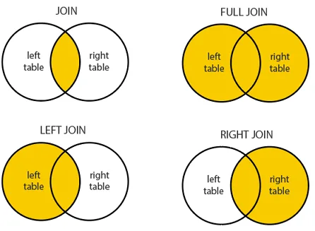

Due to the development of the relational database management system (RDMS), combining and merging data has become an essential programming work in data analysis.

What is the relational database management system?

It is a common type of database that stores data in separate tables, and it can be used in relation to other stored datasets. For example, suppose a database for a company may contain information about the employees, salaries, departments, dates of each employee, the rank of each employee, and so on. This table will have too many columns and will have difficult to access, slow speed, low accuracy. Here RDMS comes into play. It separates into tables with columns of the same types. For example, employee table, department table, salary table. Each table has a primary key and may or may not have foreign keys. The primary key is a specific column for that table and it contains a unique value for each row and represents that table. A foreign key is a primary key from another table. For example, employee ID is the primary key for the employee table and department ID is the primary key for the department table but department ID is a foreign key for the employee table. We can use those keys to connect between tables. I am just talking about the concepts of RDMS and I will not focus on those keys. I will show the idea of how we can merge tables in python with Pandas.

## Merging DataFrames

The main idea of merging tables is how to merge.



Suppose we want to combine two tables, the key columns from both tables serve as the pivot column. Depends on the values from these columns, the two tables will merge. There are four types of joins in general.

**Join/Inner join** - only the same values from each key columns

**Full/Outer join** - all the values from each key column

**Left join** - all the values from the left table

**Right join** - all the values from the right table

Let's see in action in Pandas.

### Inner Join
```python
df1 = pd.DataFrame({'key':['a','a','b','b','f','f'],
                   'data':[1,2,3,4,5,6]})
df2 = pd.DataFrame({'key':['a','b','c','d','e'],
                   'data':[10,20,30,40,50]})
df1
```

```python
Out[2]:
  key  data
0   a     1
1   a     2
2   b     3
3   b     4
4   f     5
5   f     6
```

```python
In [3]: df2
Out[3]:
  key  data
0   a    10
1   b    20
2   c    30
3   d    40
4   e    50
```

We can use the merge method to combine, the default is the inner join.

```python
In [4]: pd.merge(df1, df2, on='key')
Out[4]:
  key  data_x  data_y
0   a       1      10
1   a       2      10
2   b       3      20
3   b       4      20
```

Look at the key column and compare it with the tables before combining. It is combined with the key values that are contained in both tables.

### Left join

```python
In [6]: df1 = pd.DataFrame({'key':['a','a','b','b','f','f'],
   ...:                    'data':[1,2,3,4,5,6]})
   ...: df2 = pd.DataFrame({'key':['a','b','c','d','e'],
   ...:                    'data':[10,20,30,40,50]})
   ...: df1
Out[6]:
  key  data
0   a     1
1   a     2
2   b     3
3   b     4
4   f     5
5   f     6
In [7]: df2
Out[7]:
  key  data
0   a    10
1   b    20
2   c    30
3   d    40
4   e    50
```

For left join, we can pass the parameter, **how** with **left.**

```python
In [8]: pd.merge(df1, df2, on='key', how='left')
Out[8]:
  key  data_x  data_y
0   a       1    10.0
1   a       2    10.0
2   b       3    20.0
3   b       4    20.0
4   f       5     NaN
5   f       6     NaN
```

It focuses on the key value of table 1 and so, the values from table 2 become missing values as table 2 does not contain key values of '**f**'.

The Right join is the same as the left join. It will get the same result if you pass the parameters **df2** first and **df1** second.

### Outer Join

The outer join will combine all the key values from both tables.

```python
In [9]: pd.merge(df1, df2, on='key', how='outer')
Out[9]:
  key  data_x  data_y
0   a     1.0    10.0
1   a     2.0    10.0
2   b     3.0    20.0
3   b     4.0    20.0
4   f     5.0     NaN
5   f     6.0     NaN
6   c     NaN    30.0
7   d     NaN    40.0
8   e     NaN    50.0
```

### Different key column names

If the two tables have different key column names, you can use the parameters **left_on** and **right_on** to merge.

```python
In [10]: df1 = pd.DataFrame(
              {'key1':['a','a','b','b','f','f'],
               'data':[1,2,3,4,5,6]})
    ...: df2 = pd.DataFrame(
              {'key2':['a','b','c','d','e'],
    ...:       'data':[10,20,30,40,50]})
    ...: pd.merge(df1, df2, left_on='key1',
                  right_on='key2')

Out[10]:
  key1  data_x key2  data_y
0    a       1    a      10
1    a       2    a      10
2    b       3    b      20
3    b       4    b      20
```

### More than one key column

If the two tables have more than one key column, you can pass the **on** parameter with a list of key column names.

```python
In [11]: df1 = pd.DataFrame(
                      {'key1':['aaa','aaa','bbb'],
    ...:               'key2':['one','three','one'],
    ...:               'lval':[1,2,3]})
    ...: df2 = pd.DataFrame(
                   {'key1':['aaa','bbb','aaa','bbb'],
    ...:            'key2':['one','one','two','three'],
    ...:            'rval':[10,20,30,40]})
    ...: df1
Out[11]:
  key1   key2  lval
0  aaa    one     1
1  aaa  three     2
2  bbb    one     3

In [12]: df2
Out[12]:
  key1   key2  rval
0  aaa    one    10
1  bbb    one    20
2  aaa    two    30
3  bbb  three    40
```

```python
In [13]: pd.merge(df1, df2, on=['key1','key2'],
                                   how='outer')
Out[13]:
  key1   key2  lval  rval
0  aaa    one   1.0  10.0
1  aaa  three   2.0   NaN
2  bbb    one   3.0  20.0
3  aaa    two   NaN  30.0
4  bbb  three   NaN  40.0
```

### Using Suffixes

You can use suffixes for defining custom column names after merging the two tables. For example, the default name is x and y.

```python
In [14]: pd.merge(df1, df2, on='key1')
Out[14]:
  key1 key2_x  lval key2_y  rval
0  aaa    one     1    one    10
1  aaa    one     1    two    30
2  aaa  three     2    one    10
3  aaa  three     2    two    30
4  bbb    one     3    one    20
5  bbb    one     3  three    40
```

You can pass the suffixes parameter to define the column names.

```python
In [15]: pd.merge(df1, df2, on='key1', suffixes=
                              ('_left','_right'))
Out[15]:
  key1 key2_left  lval key2_right  rval
0  aaa       one     1        one    10
1  aaa       one     1        two    30
2  aaa     three     2        one    10
3  aaa     three     2        two    30
4  bbb       one     3        one    20
5  bbb       one     3      three    40
```

### Merging on Index

You can also merge on the index by passing right_index or left_index with boolean values.

```python
In [16]: df1 = pd.DataFrame(
                   {'key':['a','b','c','a','b','f'],
    ...:            'value':range(6)})
    ...: df2 = pd.DataFrame({'value':[10,20]},
                              index=['a','b'])
    ...: df1
Out[16]:
  key  value
0   a      0
1   b      1
2   c      2
3   a      3
4   b      4
5   f      5

In [17]: df2
Out[17]:
   value
a     10
b     20

In [18]: pd.merge(df1, df2, left_on='key',right_index=True)
Out[18]:
  key  value_x  value_y
0   a        0       10
3   a        3       10
1   b        1       20
4   b        4       20
```

### Hierarchically-index data

We can also use Hierarchically-index data to join with the same methods.

```python
In [19]: df1 = pd.DataFrame(
          {'key1':['A','A','B','B','D','D'],
    ...:  'key2':['aaa','bbb','aaa','bbb','ddd','eee'],
    ...:  'data':np.arange(6)})
    ...: df2 = pd.DataFrame(np.arange(12)
                              .reshape((6,2)),
    ...:            index=[['A','A','B','B','B','B'],
    ...:        ['aaa','ccc','aaa','bbb','ccc','ddd']],
    ...:            columns=['val1','val2'])
    ...: df
Out[19]:
  key1 key2  data
0    A  aaa     0
1    A  bbb     1
2    B  aaa     2
3    B  bbb     3
4    D  ddd     4
5    D  eee     5

In [20]: df2
Out[20]:
       val1  val2
A aaa     0     1
  ccc     2     3
B aaa     4     5
  bbb     6     7
  ccc     8     9
  ddd    10    11

In [21]: pd.merge(df1, df2, left_on=['key1','key2'],
                                 right_index=True)
Out[21]:
  key1 key2  data  val1  val2
0    A  aaa     0     0     1
2    B  aaa     2     4     5
3    B  bbb     3     6     7
```

### Concatenation tables

Not same as above merging methods, table concatenation is just to combine rows and columns without using key columns. We can use **pd.concat** method and passing the list of tables that want to be combined and specify the **axis** ( 0 for bind rows, and 1 for bind columns ).

```python
In [22]: df1 = pd.DataFrame({'Name':['A','B','C','D'],
    ...:                    'Value':np.arange(4)})
    ...: df2 = pd.DataFrame({'Name':['E','F','G'],
    ...:                    'Value':np.arange(3)})
    ...: df1
Out[22]:
  Name  Value
0    A      0
1    B      1
2    C      2
3    D      3

In [23]: df2
Out[23]:
  Name  Value
0    E      0
1    F      1
2    G      2

In [24]: pd.concat([df1,df2],axis=0)
Out[24]:
  Name  Value
0    A      0
1    B      1
2    C      2
3    D      3
0    E      0
1    F      1
2    G      2

In [25]: pd.concat([df1,df2],axis=1)
Out[25]:
  Name  Value Name  Value
0    A      0    E    0.0
1    B      1    F    1.0
2    C      2    G    2.0
3    D      3  NaN    NaN
```

### Combining data with Overlapping

Start with an example.

```python
In [26]: df1 = pd.DataFrame({'a':[1,np.nan,3,4,np.nan],
    ...:                    'b':[6,7,np.nan,8,9],
    ...:                    'c':[10,11,12,np.nan,14]})
    ...: df2 = pd.DataFrame({'a':[10,20,30,np.nan,50],
    ...:            'b':[60,70,80,np.nan, np.nan],
    ...:            'c':[100,np.nan, 130,np.nan, 150]})
    ...: df1
Out[26]:
     a    b     c
0  1.0  6.0  10.0
1  NaN  7.0  11.0
2  3.0  NaN  12.0
3  4.0  8.0   NaN
4  NaN  9.0  14.0

In [27]: df2
Out[27]:
      a     b      c
0  10.0  60.0  100.0
1  20.0  70.0    NaN
2  30.0  80.0  130.0
3   NaN   NaN    NaN
4  50.0   NaN  150.0
```

Look at the NaN values. The idea is to get all the values from table 1 and if there are missing values in table 1, take that value from table 2. We can use the **combine_first** method.

```python
In [28]: df1.combine_first(df2)
Out[28]:
      a     b     c
0   1.0   6.0  10.0
1  20.0   7.0  11.0
2   3.0  80.0  12.0
3   4.0   8.0   NaN
4  50.0   9.0  14.0
```

To be clear you can use the **where** method from NumPy.

```python
In [29]: np.where(pd.isna(df1),df2,df1)
Out[29]:
array([[ 1.,  6., 10.],
       [20.,  7., 11.],
       [ 3., 80., 12.],
       [ 4.,  8., nan],
       [50.,  9., 14.]])
```

If there is a missing value in df1, then take from df2, and if not missing, take the value from df1.

This is an introduction to how to combine and merge data frames in Pandas. Only one important idea is how they merge and join; **inner, outer, left, and right.**
