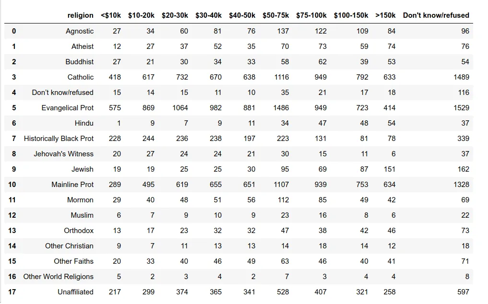
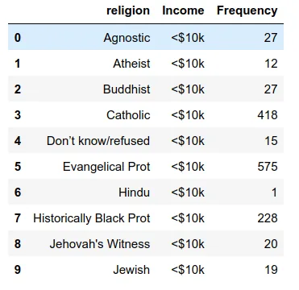
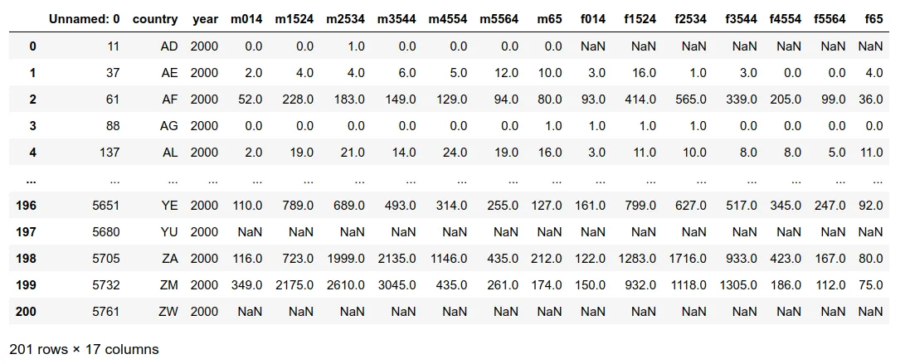
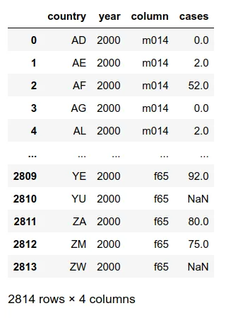
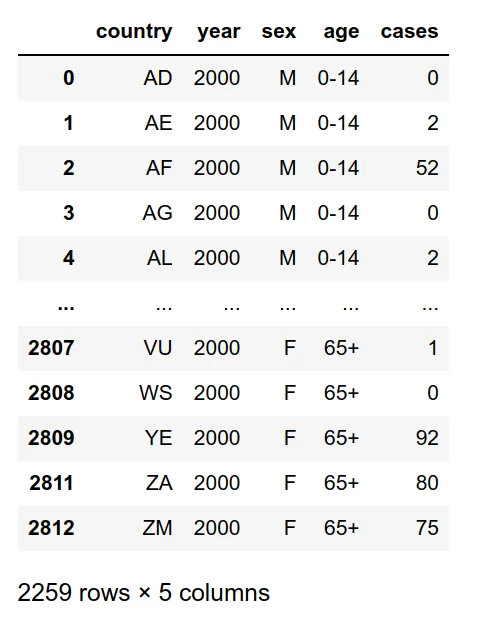
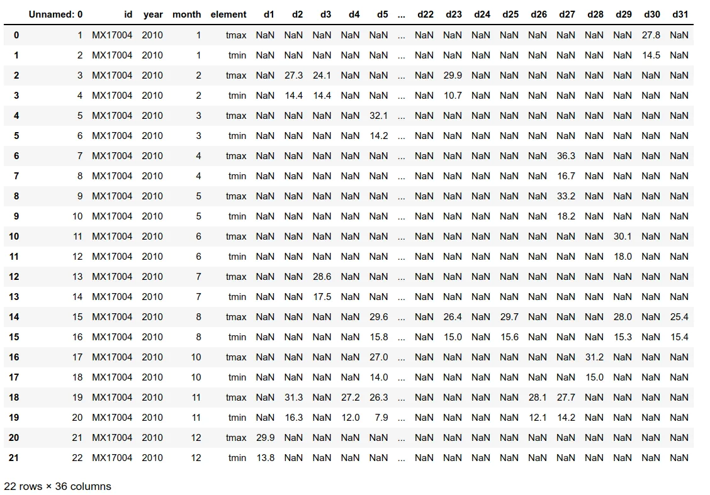
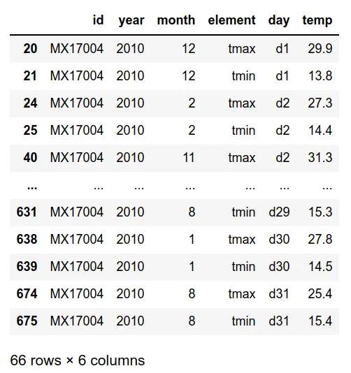
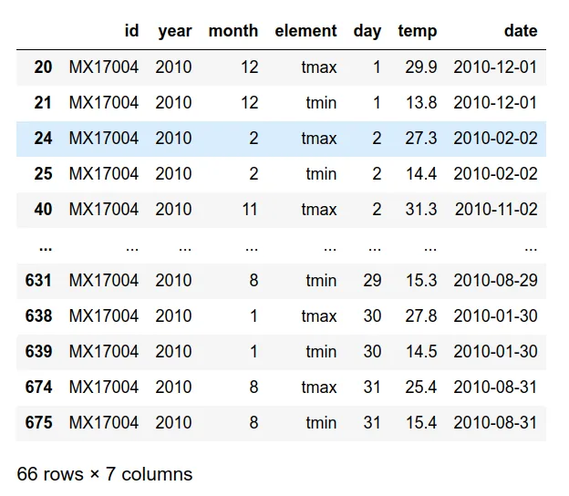
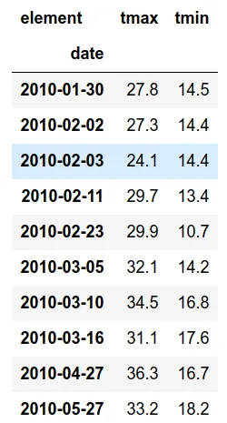

> Happy families are all alike; every unhappy family is unhappy in its own way. ( Leo Tolstoy )

> Tidy datasets are all alike but every messy dataset is messy in its own way. ( Hadley Wickham )

You can read about tidy data from the [Journal of Statistical Software](https://www.jstatsoft.org/article/view/v059i10) written by Hadley Wickham which described data cleaning, data tidying, relational databases and he coined the term '**tidy data**' and he explained when tidy data should be used and how to implement that type of data.

In general, a dataset is called tidy data if

1. Each variable forms a column.
2. Each observation forms a row.
3. Each type of observational unit forms a table.

The five most common problems with messy datasets are

1. Column headers are values, not variable names.
2. Multiple variables are stored in one column.
3. Variables are stored in both rows and columns.
4. Multiple types of observational units are stored in the same table.
5. A single observational unit is stored in multiple tables.

In that article, he used R language, and here I want to implement them by using Python. The Pandas techniques I want to focus on in this post are **melt** and **pivot**. ( not **pivot-table** )

### First dataset

This dataset will look like this.



It does not follow the rule of tidy data as the column headers should be the values. In Pandas, we can use the melt method for this kind of operation. First, see it in action.

The tidy data set looks like this.



The melt method received

- **data frame**

- **id_vars** - column/s to use as identifier variables (means columns that you want to pivot)

- **value_vars** - column/s to unpivot ( columns that you want to become rows variables, in this case, I used as raw.columns[1:] means all columns without the first column from the data frame.)

- **var_name** - Name to use for the variable column

- **value_name** - Name to use for the value column

### Second Dataset



This dataset is about TB patients. The column names that contain 'm' are male patients and 'f' are female patients and the following numbers after 'm' and 'f' represent the age range. The values inside the table are case numbers. Let's clean the dataset.



The melt method is used and the 'column' contains both sex and age range, and this column needs to separate into 2 columns; 'sex' and 'age'. The cases column should be an integer type.

```python
array(['014', '1524', '2534', '3544', '4554', '5564', '65'], dtype=object)
```

The age column contains 7 unique values and I want to use the format with '-', for example '0-14','15-24'. So, I used the if-else loop to create that type of column. Then select the columns that are wanted.



### Third Dataset



It is a weather dataset. There is a column for each possible day in the month. I used the melt method to gather the day column.

The first line from the code above is I want to use the data frame omitted from the first column and melt it into 'id', 'year', 'month', 'element', 'day', and 'temp' columns and then removed the missing values.



For the day column, the first alphabet 'd' is removed. To be clear, year, month, and day columns are combined into the date column. From above code, the **zfill** method with 2 will fill with values with zero if the number from month or day has only one digit as I want to create the date format of 'YYYY/mm/dd'. Then changes into a date data type.

To that stage, the data frame looks like this.



I want to spread the values of the element columns into two columns; tmax and tmin. Here comes the **pivot** method.

- **index** - column to use to make new frame's index

- **columns** - column to use to make new frame's columns

- **values** - column/s to use for populating new frame's values.

The final result looks as following.



Compared with the original raw data frame, there is a lot of improvement.

I think you will get the idea about tidy data and how to gather and separate the data. Thanks a lot for your time.

Here are my previous Pandas techniques articles:

- [read_csv](https://www.datainsightonline.com/post/pandas-techniques-part-1-read_csv)

- [groupby](https://www.datainsightonline.com/post/pandas-techniques-part-2-groupby)

- [merging dataframes](https://www.datainsightonline.com/post/pandas-techniques-part-3-merging-data-frames)
