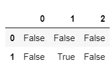
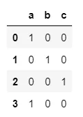
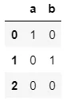
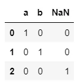

## 1) Apply function
### Pandas.apply allow the users to pass a function and apply it on every single value of the Pandas series. It comes as a huge improvement for the pandas library as this function helps to segregate data according to the conditions required due to which it is efficiently used in data science and machine learning..

### Objects passed to the function are Series objects whose index is either the DataFrame’s index (axis=0) or the DataFrame’s columns (axis=1). By default (result_type=None)

##### first we add the needed libraries , this is the first step when using pandas functions

```python
import pandas as pd
import numpy as np
```

##### creating a dataframe

```python
df = pd.DataFrame([[1,2,3]]*5 , columns = ['A','B','C'])
print(df)
```

###### output:

```python
   A  B  C
0  1  2  3
1  1  2  3
2  1  2  3
3  1  2  3
4  1  2  3
```

##### applying apply function per column

```python
df.apply(np.sum , axis =0)
```

###### output:

```python
A     5
B    10
C    15
dtype: int64
```

##### applying apply function per row

```python
df.apply(np.sum , axis =1)
```

###### output:

```python
0    6
1    6
2    6
3    6
4    6
dtype: int64
```

## 2) Boolean indexing
### Boolean Indexing is used if user wants to filter the values of a column based on conditions from another set of columns. For instance, we want a list of all students who are not scholars and got a loan. Boolean indexing can support here.

##### in python 0 is false , 1 is true and vice versa

```python
0==False
```

###### output:

```python
True
```

```python
c = 10
(c > 1) + (c<20) +(c == 12)
```

###### output:

```python
2
```

##### A boolean test can be used as an index for an index for an array or tuple

```python
state = True
state = (True , False)[state]
state
```

###### output:

```python
False
```

## 3) Is null function
### Detect missing values for an array-like object.

### This function takes a scalar or array-like object and indicates whether values are missing .

```python
import pandas as pd
import numpy as np
```

```python
pd.isna('dog')
```

###### output:

```python
False
```

##### Is pd.na a null value?

```python
pd.isna(pd.NA)
```

##### output:

```python
True
```

##### Is np.nan a null value?

```python
pd.isna(np.nan)
```

##### output:

```python
True
```

##### construct an array with null values , and pass it to isna function

```python
array = np.array([[1, np.nan, 3], [4, 5, np.nan]])
pd.isna(array)
```

###### output:

```python
array([[False,  True, False],
       [False, False,  True]])
```

##### construct a dataframe , and pass it to isna function

```python
df = pd.DataFrame([['ant', 'bee', 'cat'], ['dog', None, 'fly']])
pd.isna(df)
```

###### output:



```python
pd.isna(df[1])
```

###### output:

```python
0    False
1     True
Name: 1, dtype: bool
```

## 4) Get dummies
### Convert categorical variable into dummy/indicator variables.

##### convert the list into dummy variables

```python
import pandas as pd
import numpy as np
s = pd.Series(list('abca'))
pd.get_dummies(s)
```

###### output:



##### convert the list into dummy variables

```python
s1 = ['a', 'b', np.nan]
pd.get_dummies(s1)
```

###### output:



##### it includes the null values when converting to dummy varaibles

```python
pd.get_dummies(s1, dummy_na=True)
```

###### output:



## 5) Cut function
### Use cut when you need to segment and sort data values into bins. This function is also useful for going from a continuous variable to a categorical variable. For example, cut could convert ages to groups of age ranges. Supports binning into an equal number of bins, or a pre-specified array of bins.

### The input array to be binned. Must be 1-dimensional.

##### Discretize into three equal-sized bins.

```python
import pandas as pd
import numpy as np
pd.cut(np.array([1, 7, 5, 4, 6, 3]), 3)
```

###### output:

```python
[(0.994, 3.0], (5.0, 7.0], (3.0, 5.0], (3.0, 5.0], (5.0, 7.0], (0.994, 3.0]]
Categories (3, interval[float64, right]): [(0.994, 3.0] < (3.0, 5.0] < (5.0, 7.0]]
```

##### Discretize into three equal-sized bins ,

```python
pd.cut(np.array([1, 7, 5, 4, 6, 3]), 3, retbins=True)
```

###### output:

```python
([(0.994, 3.0], (5.0, 7.0], (3.0, 5.0], (3.0, 5.0], (5.0, 7.0], (0.994, 3.0]]
 Categories (3, interval[float64, right]): [(0.994, 3.0] < (3.0, 5.0] < (5.0, 7.0]],
 array([0.994, 3.   , 5.   , 7.   ]))
```

```python
pd.cut(np.array([1, 7, 5, 4, 6, 3]),
       3, labels=["bad", "medium", "good"])
```

###### output:

```python
['bad', 'good', 'medium', 'medium', 'good', 'bad']
Categories (3, object): ['bad' < 'medium' < 'good']
```
