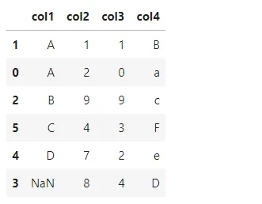
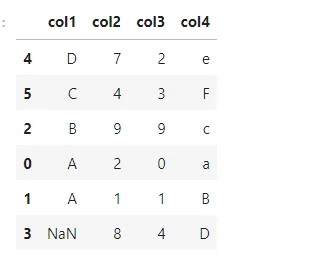
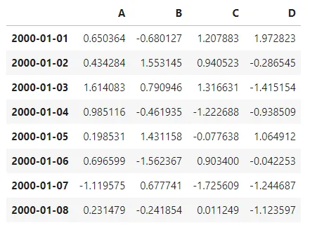
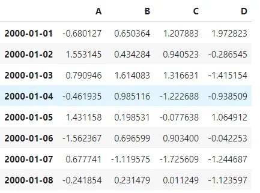
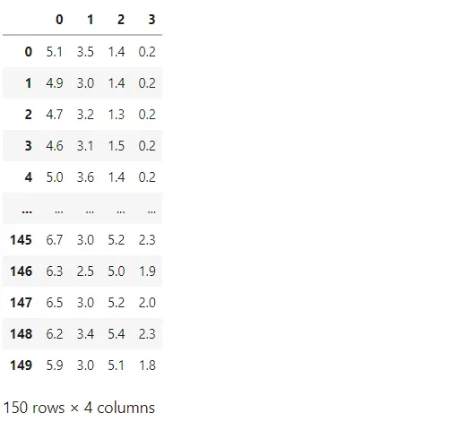
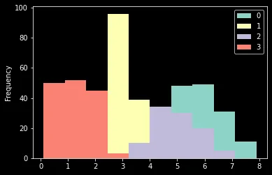

## INTRODUCTION
pandas is a Python package providing fast, flexible, and expressive data structures designed to make working with “relational” or “labelled” data both easy and intuitive. It aims to be the fundamental high-level building block for doing practical, **real-world** data analysis in Python. Additionally, it has the broader goal of becoming **the most powerful and flexible** open-source **data analysis/manipulation tool available in any language**. It is already well on its way toward this goal.

pandas are well suited for many different kinds of data:

- Tabular data with heterogeneously-typed columns, as in an SQL table or Excel spreadsheet

- Ordered and unordered (not necessarily fixed-frequency) time-series data.

- Arbitrary matrix data (homogeneously typed or heterogeneous) with row and column labels

- Any other form of observational/statistical data sets. The data need not be labelled at all to be placed into a pandas data structure

The two primary data structures of pandas, Series (1-dimensional) and DataFrame (2-dimensional), handle the vast majority of typical use cases in finance, statistics, social science, and many areas of engineering. For R users, DataFrame provides everything that R’s data. the frame provides and much more. pandas are built on top of NumPy and are intended to integrate well within a scientific computing environment with many other 3rd party libraries.

Here is about some techniques in pandas,

## 1. Pivot table

pandas.**pivot_table**(*data*, *values=None*, *index=None*, *columns=None*, *aggfunc='mean'*, *fill_value=None*, *margins=False*, *dropna=True*, *margins_name='All'*, *observed=False*, *sort=True)*

It creates a spreadsheet-style pivot table as a DataFrame.

The levels in the pivot table will be stored in MultiIndex objects (hierarchical indexes) on the index and columns of the result DataFrame.

For example, first we insert the data frame, then set the pivot table

```python
df = pd.DataFrame({"A": ["foo", "foo", "foo", "foo", "foo","bar", "bar", "bar", "bar"],"B": ["one", "one", "one", "two", "two","one", "one", "two", "two"],"C": ["small", "large", "large", "small","small", "large", "small", "small","large"],"D": [1, 2, 2, 3, 3, 4, 5, 6, 7],"E": [2, 4,
5, 5, 6, 6, 8, 9, 9]})

table = pd.pivot_table(df, values='D', index=['A', 'B'],columns=['C'], aggfunc=np.sum)

table
```


More example are in the jupyter notebook. you can refer that using below github link.

## 2. Sorting DataFrames
When we want to sort the data frame in Pandas in a specific way. When a user wants to sort a pandas data frame by the values of one or more columns, or by the contents of the pandas data frame's row index or row names. The data frame in Pandas contains two useful functionalities.

1 sort values(): sort a pandas data frame by one or more columns with this command.

2 sort index() is a pandas command that sorts a data frame by row index.

The aforementioned functions include a variety of choices, such as sorting the data frame in a given order, placing it in a specific location, sorting with missing values, sorting using a specific algorithm, and so on.

```python
df = pd.DataFrame({'col1': ['A', 'A', 'B', np.nan, 'D', 'C'],'col2': [2, 1, 9, 8, 7, 4],'col3': [0, 1, 9, 4, 2, 3],'col4': ['a', 'B', 'c', 'D', 'e', 'F']})

df.sort_values(by=['col1'])
```



```python
df.sort_values(by='col1', ascending=False)
```



## 3. Indexing and Selecting Data
The axis labelling information in pandas objects serves many purposes:

- Identifies data (i.e. provides *metadata*) using known indicators, important for analysis, visualization, and interactive console display.
- Enables automatic and explicit data alignment.
- Allows intuitive getting and setting of subsets of the data set.

In this section, we will focus on the final point: namely, how to slice, dice, and generally get and set subsets of pandas objects. The primary focus will be on Series and DataFrame as they have received more development attention in this area.

```python
dates = pd.date_range('1/1/2000', periods=8)
df = pd.DataFrame(np.random.randn(8, 4),index=dates, columns=['A', 'B', 'C', 'D'])
df
```



when we are indexing and selecting data,

```python
df[['B', 'A']] = df[['A', 'B']]
df
```



## 4. Impute Missing Values
Imputing is the process of using a model to replace missing values.

When replacing a missing value, users have numerous options to consider, for example:

- A domain-specific fixed value, such as 0, that is separate from all other values.

- A value from another record, picked at random.

- For the column, a mean, median, or mode value was substituted.

- A value calculated by a different forecasting model.

When predictions from the finished model are needed, any imputing done on the training dataset will have to be repeated on new data. This must be considered while deciding how to infer the missing data.

If one decides to impute with mean column values, for example, the mean column values must be saved to a file so that new data with missing values can be exercised later.

Pandas provide the fillna() function for returning values with a specific value.

For example,

```python
df = load_iris()
df = pd.DataFrame(df['data'])
df.fillna(1)
```



## 5. Plotting

Analyzing data from different columns can be very illuminating. Pandas make doing so simple with multi-column DataFrames. By default, calling df.plot() will make pandas to over-plot all column data, with each column as a single line.

```python
df = load_iris()
df = pd.DataFrame(df['data'])
df.plot(kind='hist')
```



More details are in [here](https://github.com/arunanuwantha97/Datacamp-Assignment/blob/main/pandas_techniques/panda_tech.ipynb)(github link)
