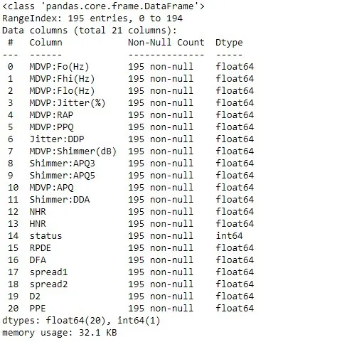
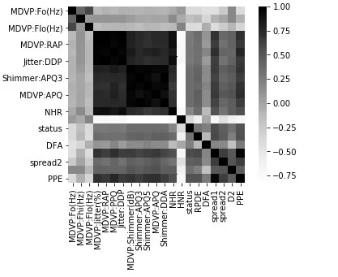
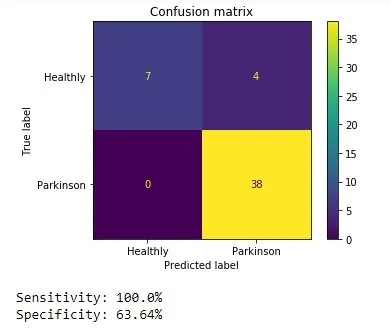

**Parkinson's disease** (**PD**), or simply **Parkinson's** is a long-term [degenerative disorder](https://en.wikipedia.org/wiki/Neurodegeneration) of the [central nervous system](https://en.wikipedia.org/wiki/Central_nervous_system) that mainly affects the [motor system](https://en.wikipedia.org/wiki/Motor_system). The symptoms usually emerge slowly and, as the disease worsens, non-motor symptoms become more common.The most obvious early symptoms are [tremor](https://en.wikipedia.org/wiki/Tremor). Source: [Wikipedia](https://en.wikipedia.org/wiki/Parkinson%27s_disease)

For our analysis, we'll the parkinsons dataset from [UCI Machine Learning Repository](https://archive.ics.uci.edu/ml/datasets/Parkinsons). For more details take a look at my [analysis notebook](https://github.com/Donutson/Parkinson-dataset-analysis/blob/master/Parkinson's%20dataset%20analysis.ipynb)

First let's get a look at our data:

```python
#data loaded
file = "parkinsons.csv"
data = pd.read_csv(file)

#drop of unuseful and repeat column
data.drop(["name", "MDVP:Jitter(Abs)", "MDVP:Shimmer"], axis=1, inplace=True)

#data inspection
display(data.info())
```



The data we'll use for our work have 195 rows and 21 columns, each row is a voice measurement of a patient. The description of the columns are as below:

We'll work with 20 feature to make a model for predicting the status (target) of a patient. Let's see how the features are correlate between them and the status.

```python
# Vizualisation of correlations between each features and status

# target
target = "status"

# features names
features = list(data.columns)
features.remove("status")

# correlations matrix
corr = data.corr()

# heatmat plot of the correlations
sns.heatmap(corr, square=True, cmap="Greys")
```



This heatmap shows us that MDVP:RAP, jitter:DDP, Shimmer APQ3, Shimmer APQ5, MDVP:APQ and NHR have very high correlation score, if we make some computation we can obtain the following result:

```python
corr(MDVP:Jitter(%),MDVP:RAP) = 99.03%
corr(MDVP:Jitter(%),MDVP:PPQ) = 97.43%
corr(MDVP:Jitter(%),Jitter:DDP) = 99.03%
corr(MDVP:Jitter(%),NHR) = 90.7%
corr(MDVP:RAP,MDVP:PPQ) = 95.73%
corr(MDVP:RAP,Jitter:DDP) = 100.0%
corr(MDVP:RAP,NHR) = 91.95%
corr(MDVP:PPQ,Jitter:DDP) = 95.73%
corr(Jitter:DDP,NHR) = 91.95%
corr(MDVP:Shimmer(dB),Shimmer:APQ3) = 96.32%
corr(MDVP:Shimmer(dB),Shimmer:APQ5) = 97.38%
corr(MDVP:Shimmer(dB),MDVP:APQ) = 96.1%
corr(MDVP:Shimmer(dB),Shimmer:DDA) = 96.32%
corr(Shimmer:APQ3,Shimmer:APQ5) = 96.01%
corr(Shimmer:APQ3,Shimmer:DDA) = 100.0%
corr(Shimmer:APQ5,MDVP:APQ) = 94.91%
corr(Shimmer:APQ5,Shimmer:DDA) = 96.01%
corr(spread1,PPE) = 96.24%
```

And see that spread1 has the highest correlation score of 56.48% with the status target. We remark that there are too much features with high correlation score and this can lead to redundant; we'll base on that to select the best features for our prediction.

I let you get a look at my notebook analysis.I'd use five features selection and test the five machine learning classifier on them:

- Logistic regression
- K-Nearest Neighbors (KNN)
- Support Vector Classifier (SVC)
- AdaBoost
- XgBoost

For the first selection i'd use all the features but it didn't give us the best score, so we don't need all the features to make the best prediction but just a part of them. The second features selection had give us the best score of 91.681% with the XgBoost classifier and the 12 features: MDVP:Fo(Hz), MDVP:Fhi(Hz), MDVP:Flo(Hz), MDVP:APQ, Shimmer:DDA, NHR, HNR, RPDE, DFA, spread2, D2, PPE.

Let's build our model:

```python
# model
import xgboost as xgb

# data to build our models
X = get_X(data, features_selected1)

X_train, X_test, y_train, y_test = train_test_split(X, y, random_state=42)

clf_xgb = xgb.XGBClassifier(objective="binary:logistic", missing=None, seed=42)
clf_xgb.fit(X_train,
       y_train,
       eval_metric='auc',
        early_stopping_rounds=10,
       eval_set=[(X_test, y_test)])
```

NB: the metric used here is not the same as for the tests.

```python
[0]	validation_0-auc:0.83493
Will train until validation_0-auc hasn't improved in 10 rounds.
[1]	validation_0-auc:0.94139
[2]	validation_0-auc:0.93541
[3]	validation_0-auc:0.92703
[4]	validation_0-auc:0.92584
[5]	validation_0-auc:0.95096
[6]	validation_0-auc:0.95096
[7]	validation_0-auc:0.94856
[8]	validation_0-auc:0.94139
[9]	validation_0-auc:0.92943
[10]	validation_0-auc:0.94019
[11]	validation_0-auc:0.94737
[12]	validation_0-auc:0.96890
[13]	validation_0-auc:0.96890
[14]	validation_0-auc:0.96172
[15]	validation_0-auc:0.96412
[16]	validation_0-auc:0.96412
[17]	validation_0-auc:0.96890
[18]	validation_0-auc:0.96890
[19]	validation_0-auc:0.96890
[20]	validation_0-auc:0.96651
[21]	validation_0-auc:0.96172
[22]	validation_0-auc:0.95694
Stopping. Best iteration:
[12]	validation_0-auc:0.96890
```

Let's plot the confusion matrix for more insight



Wow it's great, we got a sentivity of 100%, this mean that our model make no mistake at predicting someone who has parkinson however it fail at predicting someone who doesn"t have parkinson with a probability around 37%.

## Conclusion
We can effectively predict weither someone has parkinson or not without a full test and for that we only the 12 features MDVP:Fo(Hz), MDVP:Fhi(Hz), MDVP:Flo(Hz), MDVP:APQ, Shimmer:DDA, NHR, HNR, RPDE, DFA, spread2, D2, PPE.

For remind you can find my notebook analysis [here](https://github.com/Donutson/Parkinson-dataset-analysis/blob/master/Parkinson's%20dataset%20analysis.ipynb).

Thank for reading, say me in comment what you think of my blog and give me some advices for future if you got somr.
