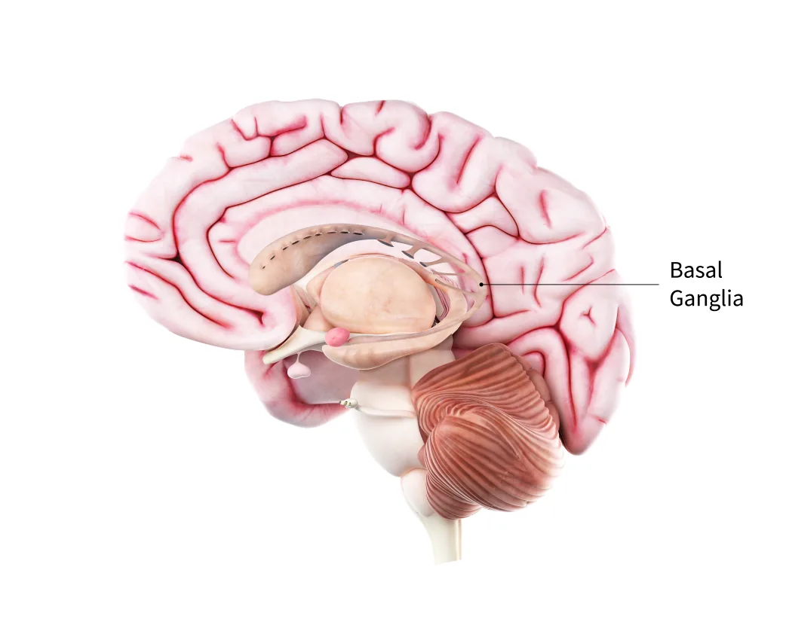
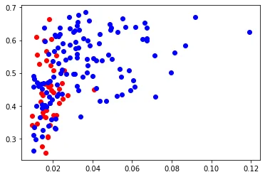
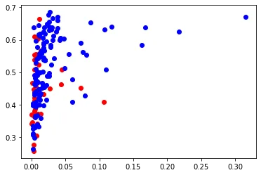
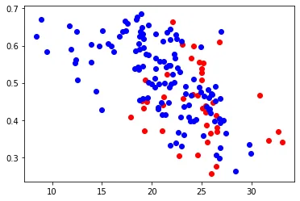

### Introduction

Let's first get a brief intro to our problem about Parkinson. This disease is a brain disorder that causes unintended or uncontrollable movements, such as shaking, stiffness, and difficulty with balance and coordination. Symptoms usually begin gradually and worsen over time. As the disease progresses, people may have difficulty walking and talking. Symptoms usually begin gradually and worsen over time. As the disease progresses, people may have difficulty walking and talking. They may also have mental and behavioral changes, sleep problems, depression, memory difficulties, and fatigue.

While virtually anyone could be at risk for developing Parkinson’s, some research studies suggest this disease affects more men than women. It’s unclear why, but studies are underway to understand factors that may increase a person’s risk. One clear risk is age: Although most people with Parkinson’s first develop the disease after age 60, about 5% to 10% experience onset before the age of 50. Early-onset forms of Parkinson’s are often, but not always, inherited, and some forms have been linked to specific gene mutations. As it's clear it's a crucial subject to be discussed and we will get dip into our tabular dataset trying to get some insights from data.

For more info checkout the Github repo in the following link: [Link](https://github.com/omarmohamed2011/ParkinsonDiseaseDataAnalysis)



### Data importing

Let's start by importing the required libraries;

```python
import numpy as np
import pandas as pd
import matplotlib.pyplot as plt
import seaborn as sns
import os

# Data source: https://www.kaggle.com/code/nvssrkameswar/parkinsons-disease-detection/data
```

Data can be found on the given source, once downloaded it can be easily unzipped.

```python
!unzip /content/archive.zip
```

Data can be searched in the directory 'New' and found using the 'os' library;

```python
for dirname, _, filenames in os.walk('/content/New'):
    for filename in filenames:
        print(os.path.join(dirname, filename))
```

Reading the dataset;

```python
df = pd.read_csv('/content/New/parkinsons.data')
```

Let's get some info from data;

```python
# overview of the dataset
# Given that we have 195 image examples, it only contains 22 features to classify the status
print("\n Overview of the dataset")
print(df.info())
>>>
Overview of the dataset
<class 'pandas.core.frame.DataFrame'>
RangeIndex: 195 entries, 0 to 194
Data columns (total 24 columns):
 #   Column            Non-Null Count  Dtype
---  ------            --------------  -----
 0   name              195 non-null    object
 1   MDVP:Fo(Hz)       195 non-null    float64
 2   MDVP:Fhi(Hz)      195 non-null    float64
 3   MDVP:Flo(Hz)      195 non-null    float64
 4   MDVP:Jitter(%)    195 non-null    float64
 5   MDVP:Jitter(Abs)  195 non-null    float64
 6   MDVP:RAP          195 non-null    float64
 7   MDVP:PPQ          195 non-null    float64
 8   Jitter:DDP        195 non-null    float64
 9   MDVP:Shimmer      195 non-null    float64
 10  MDVP:Shimmer(dB)  195 non-null    float64
 11  Shimmer:APQ3      195 non-null    float64
 12  Shimmer:APQ5      195 non-null    float64
 13  MDVP:APQ          195 non-null    float64
 14  Shimmer:DDA       195 non-null    float64
 15  NHR               195 non-null    float64
 16  HNR               195 non-null    float64
 17  status            195 non-null    int64
 18  RPDE              195 non-null    float64
 19  DFA               195 non-null    float64
 20  spread1           195 non-null    float64
 21  spread2           195 non-null    float64
 22  D2                195 non-null    float64
 23  PPE               195 non-null    float64
```

Checking out data target values;

```python
# Data has 75% parkinson cases, and the remaining 25% are normal.
df.value_counts('status')
>>>
status
1    147
0     48
dtype: int64
```

Splitting data into training, and testing data;

```python
# splitting the features in X and traget variable in y
X = df.drop(columns=['name','status']).values
y = df.status.values

# splitting the data into train and test datasets
from sklearn.model_selection import train_test_split
X_train, X_test, y_train, y_test = train_test_split(X, y, test_size=0.15, stratify=y, random_state=41)
```

### Data Understanding

We can see the training data first and second features;

```python
X_train[1,:]
X_train[0,:]
>>>
array([ 1.835200e+02,  2.168140e+02,  1.613400e+02,  1.466000e-02,
        8.000000e-05,  8.490000e-03,  8.190000e-03,  2.546000e-02,
        6.050000e-02,  6.180000e-01,  2.865000e-02,  4.101000e-02,
        6.359000e-02,  8.595000e-02,  6.057000e-02,  1.436700e+01,
        4.780240e-01,  7.689740e-01, -4.276605e+00,  3.557360e-01,
        3.142364e+00,  3.360850e-01])


array([ 1.797110e+02,  2.259300e+02,  1.448780e+02,  7.090000e-03,
        4.000000e-05,  3.910000e-03,  4.190000e-03,  1.172000e-02,
        4.313000e-02,  4.420000e-01,  2.297000e-02,  2.768000e-02,
        3.455000e-02,  6.892000e-02,  7.223000e-02,  1.186600e+01,
        5.909510e-01,  7.455260e-01, -4.379411e+00,  3.755310e-01,
        3.671155e+00,  3.320860e-01])
```

First question to ask about Parkinson's disease; Can we determine the status of the case using the rpde and vocal analysis -- MDVP:Shimmer - RPDE

```python
# First question; Can we determine the status of the case using the rpde and vocal analysis -- MDVP:Shimmer - RPDE
plt.scatter(X_train[:,8][y_train ==0], X_train[:,16][y_train ==0], c='r')
plt.scatter(X_train[:,8][y_train ==1], X_train[:,16][y_train ==1], c='b')

plt.show()
```



Second question is that if we can determine the status of the case using the RPDE and NHR;

```python
# Second question; Can we determine the status of the case using the RPDE and NHR
plt.scatter(X_train[:,14][y_train ==0], X_train[:,16][y_train ==0], c='r')
plt.scatter(X_train[:,14][y_train ==1], X_train[:,16][y_train ==1], c='b')

plt.show()
```



Third question if we can determine the status of the case using the RPDE and DDA;

```python
# Third question; Can we determine the status of the case using the RPDE and DDA
plt.scatter(X_train[:,15][y_train ==0], X_train[:,16][y_train ==0], c='r')
plt.scatter(X_train[:,15][y_train ==1], X_train[:,16][y_train ==1], c='b')

plt.show()
```



We can also discuss some medical information related.

## What causes Parkinson’s disease?

The most prominent signs and symptoms of Parkinson’s disease occur when nerve cells in the basal ganglia, an area of the brain that controls movement, become impaired and/or die. Normally, these nerve cells, or neurons, produce an important brain chemical known as dopamine. When the neurons die or become impaired, they produce less dopamine, which causes the movement problems associated with the disease. Scientists still do not know what causes the neurons to die.

People with Parkinson’s disease also lose the nerve endings that produce norepinephrine, the main chemical messenger of the sympathetic nervous system, which controls many functions of the body, such as heart rate and blood pressure. The loss of norepinephrine might help explain some of the non-movement features of Parkinson’s, such as fatigue, irregular blood pressure, decreased movement of food through the digestive tract, and sudden drop in blood pressure when a person stands up from a sitting or lying position.
Many brain cells of people with Parkinson’s disease contain Lewy bodies, unusual clumps of the protein alpha-synuclein. Scientists are trying to better understand the normal and abnormal functions of alpha-synuclein and its relationship to genetic mutations that impact Parkinson’s and Lewy body dementia.
Some cases of Parkinson’s disease appear to be hereditary, and a few cases can be traced to specific genetic mutations. While genetics is thought to play a role in Parkinson’s, in most cases the disease does not seem to run in families. Many researchers now believe that Parkinson’s results from a combination of genetic and environmental factors, such as exposure to toxins.
Symptoms of Parkinson’s disease
Parkinson’s has four main symptoms:
Tremor in hands, arms, legs, jaw, or head
Muscle stiffness, where muscle remains contracted for a long time
Slowness of movement
Impaired balance and coordination, sometimes leading to falls
Other symptoms may include:
Depression and other emotional changes
Difficulty swallowing, chewing, and speaking
Urinary problems or constipation
Skin problems
The symptoms of Parkinson’s and the rate of progression differ among individuals. Early symptoms of this disease are subtle and occur gradually. For example, people may feel mild tremors or have difficulty getting out of a chair. They may notice that they speak too softly, or that their handwriting is slow and looks cramped or small. Friends or family members may be the first to notice changes in someone with early Parkinson’s. They may see that the person’s face lacks expression and animation, or that the person does not move an arm or leg normally.
People with Parkinson's disease often develop a parkinsonian gait that includes a tendency to lean forward; take small, quick steps; and reduce swinging their arms. They also may have trouble initiating or continuing movement.
Symptoms often begin on one side of the body or even in one limb on one side of the body. As the disease progresses, it eventually affects both sides. However, the symptoms may still be more severe on one side than on the other.
Many people with Parkinson’s disease note that prior to experiencing stiffness and tremor, they had sleep problems, constipation, loss of smell, and restless legs. While some of these symptoms may also occur with normal aging, talk with your doctor if these symptoms worsen or begin to interfere with daily living.

## Diagnosis of Parkinson’s disease

There are currently no blood or laboratory tests to diagnose non-genetic cases of Parkinson’s. Doctors usually diagnose the disease by taking a person’s medical history and performing a neurological examination. If symptoms improve after starting to take medication, it’s another indicator that the person has Parkinson’s.

A number of disorders can cause symptoms similar to those of Parkinson’s disease. People with Parkinson’s-like symptoms that result from other causes, such as multiple system atrophy and dementia with Lewy bodies, are sometimes said to have parkinsonism. While these disorders initially may be misdiagnosed as Parkinson’s, certain medical tests, as well as response to drug treatment, may help to better evaluate the cause. Many other diseases have similar features but require different treatments, so it is important to get an accurate diagnosis as soon as possible.

## Treatments for Parkinson’s disease

Although there is no cure for Parkinson’s disease, medicines, surgical treatment, and other therapies can often relieve some symptoms.

### Medicines for Parkinson’s disease

Medicines can help treat the symptoms of Parkinson’s by:

- Increasing the level of dopamine in the brain
- Having an effect on other brain chemicals, such as neurotransmitters, which transfer information between brain cells
- Helping control non-movement symptoms

The main therapy for Parkinson’s is levodopa. Nerve cells use levodopa to make dopamine to replenish the brain’s dwindling supply. Usually, people take levodopa along with another medication called carbidopa. Carbidopa prevents or reduces some of the side effects of levodopa therapy — such as nausea, vomiting, low blood pressure, and restlessness — and reduces the amount of levodopa needed to improve symptoms.

People living with Parkinson’s disease should never stop taking levodopa without telling their doctor. Suddenly stopping the drug may have serious side effects, like being unable to move or having difficulty breathing.

The doctor may prescribe other medicines to treat Parkinson’s symptoms, including:

- Dopamine agonists to stimulate the production of dopamine in the brain
- Enzyme inhibitors (e.g., MAO-B inhibitors, COMT inhibitors) to increase the amount of dopamine by slowing down the enzymes that break down dopamine in the brain
- Amantadine to help reduce involuntary movements
- Anticholinergic drugs to reduce tremors and muscle rigidity

### Modeling phase

Predictive analytics is driven by predictive modelling. It’s more of an approach than a process. Predictive analytics and machine learning go hand-in-hand, as predictive models typically include a machine learning algorithm. These models can be trained over time to respond to new data or values, delivering the results the business needs. Predictive modelling largely overlaps with the field of machine learning.
There are two types of predictive models. They are Classification models, that predict class membership, and Regression models that predict a number. These models are then made up of algorithms. The algorithms perform the data mining and statistical analysis, determining trends and patterns in data. Predictive analytics software solutions will have built in algorithms that can be used to make predictive models. The algorithms are defined as ‘classifiers’, identifying which set of categories data belongs to.

The most widely used predictive models are:
Decision trees:
 Decision trees are a simple, but powerful form of multiple variable analysis. They are produced by algorithms that identify various ways of splitting data into branch-like segments. Decision trees partition data into subsets based on categories of input variables, helping you to understand someone’s path of decisions.
Regression (linear and logistic)
 Regression is one of the most popular methods in statistics. Regression analysis estimates relationships among variables, finding key patterns in large and diverse data sets and how they relate to each other.

Neural networks
 Patterned after the operation of neuronsin the human brain, neural networks (also called artificial neural networks) are a variety of deep learning technologies. They’re typically used to solve complex pattern recognition problems – and are incredibly useful for analyzing large data sets. They are great at handling nonlinear relationships in data – and work well when certain variables are unknown
Other classifiers:
Time Series Algorithms: Time series algorithms sequentially plot data and are useful for forecasting continuous values over time.
Clustering Algorithms: Clustering algorithms organize data into groups whose members are similar.
 - Outlier Detection Algorithms: Outlier detection algorithms focus on anomaly detection, identifying items, events or observations that do not conform to an expected pattern or standard within a data set.
 - Ensemble Models: Ensemble models use multiple machine learning algorithms to obtain better predictive performance than what could be obtained from one algorithm alone.
 - Factor Analysis: Factor analysis is a method used to describe variability and aims to find independent latent variables.
 - Naïve Bayes: The Naïve Bayes classifier allows us to predict a class/category based on a given set of features, using probability.
 - Support vector machines: Support vector machines are supervised machine learning techniques that use associated learning algorithms to analyze data and recognize patterns.

Each classifier approaches data in a different way, therefore for organizations to get the results they need, they need to choose the right classifiers and models. We have experimented several models here; Ada Boost Classifier, Decision Tree Classifier, Random Forest Classifier, Gradient Boost, Hist Gradient Boosting, and XGBoost which has scored the best score.

```python
from sklearn.ensemble import GradientBoostingClassifier
from sklearn.metrics import confusion_matrix

clf = GradientBoostingClassifier(n_estimators=100, learning_rate=1.0, max_depth=1, random_state=0)
clf.fit(X_train, y_train)

y_pred = clf.predict(X_test)

from sklearn.metrics import precision_recall_fscore_support

pre,rec,f1,a = precision_recall_fscore_support(y_test, y_pred, average='macro')

acc = clf.score(X_test, y_test)

print('The accuracy is {0}, precision is {1}, recall is {2}, and f1-score is {3}'.format(acc,pre,rec,f1))

>>>
The accuracy is 0.9666666666666667, precision is 0.9791666666666667, recall is 0.9285714285714286, and f1-score is 0.9509001636661211
```

The model has well scored and evaluated using the well-known metrics.

### Conclusion

While the progression of Parkinson’s is usually slow, eventually a person’s daily routines may be affected. Activities such as working, taking care of a home, and participating in social activities with friends may become challenging. Experiencing these changes can be difficult, but support groups can help people cope. These groups can provide information, advice, and connections to resources for those living with Parkinson’s disease, their families, and caregivers. The organizations listed below can help people find local support groups and other resources in their communities. The article has tried to discuss the disease, some data analysis and answering some questions, data understanding, disease symptoms, data modeling and prediction. Hopefully it was an insightful and a useful article.

Data source: [Link](https://www.kaggle.com/code/nvssrkameswar/parkinsons-disease-detection/data)
