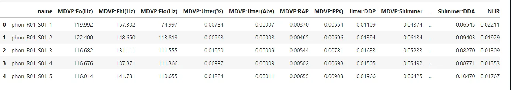
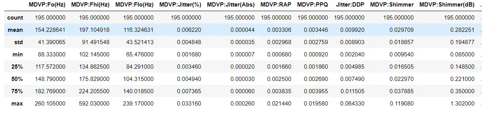
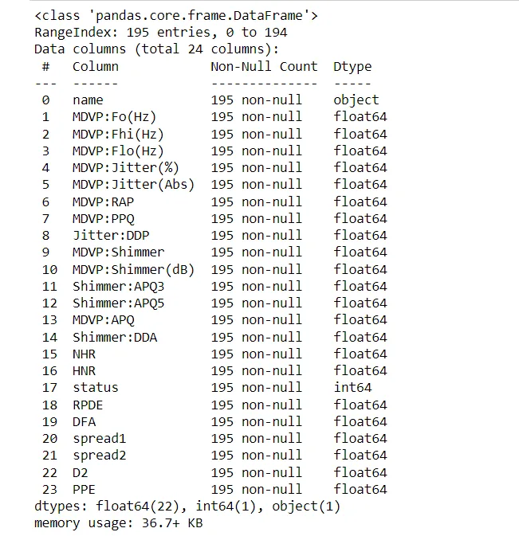
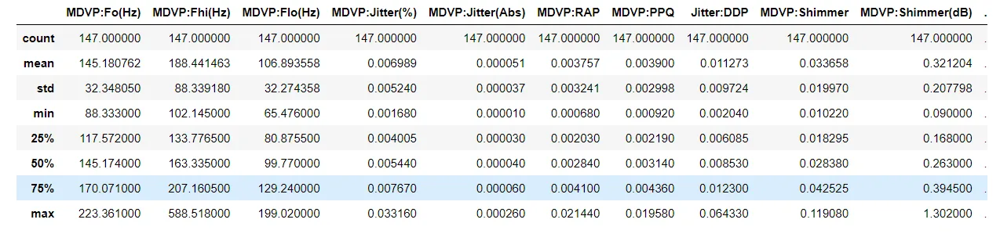
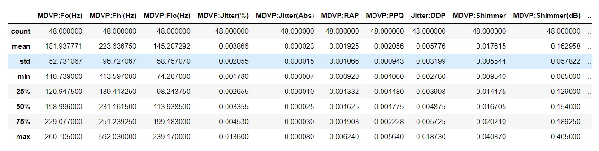
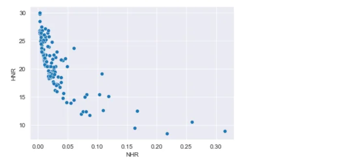
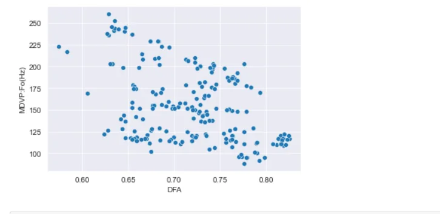
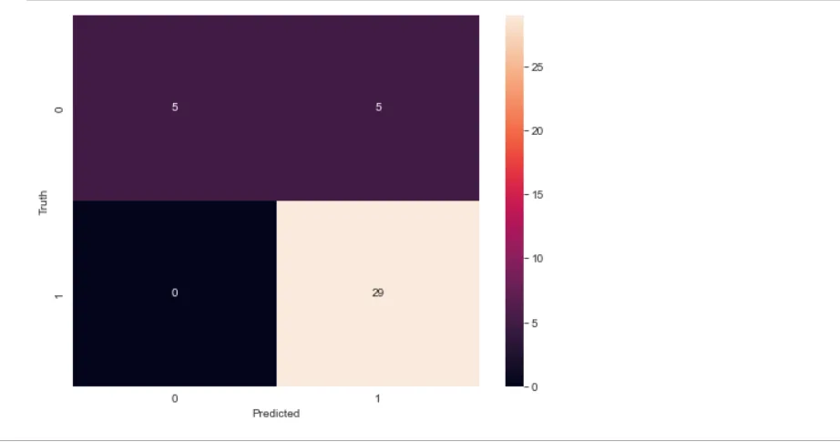

[#MachineLearning](https://www.datainsightonline.com/blog/hashtags/MachineLearning)


**Neurodegenerative disease**

When nerve cells in the brain or peripheral nervous system begin to lose their functionality over time and eventually die, this is known as a neurodegenerative illness.

Although some neurodegenerative disease symptoms can be alleviated with particular medications, there is presently no cure and just a slowing of the disease's progression.

Alzheimer’s disease and Parkinson’s disease are the most common neurodegenerative diseases.

Scientists are aware that a person's chance of getting a neurodegenerative disease is influenced by both their genes and environment.

For instance, even if a person has a genotype that predisposes them to Parkinson's disease, their exposure to the environment can still influence whether, when, and how severely they are impacted.

This article explains a predictive model of Parkinson's disease.

The dataset for this model was obtained from UCI ML Parkinson's dataset.

The dataset is composed of a range of biomedical voice measurements.

195 observations were made and each feature is a particular voice measure.

The aim of the data is to discriminate healthy people from those with Parkinson's disease.

**Modules used**

```python
import pandas as pd
import numpy as np
import matplotlib.pyplot as plt
import seaborn as sns

from sklearn import svm
from sklearn.preprocessing import StandardScaler
from sklearn.model_selection import train_test_split
from sklearn.metrics import accuracy_score, confusion_matrix
```

**Preprocessing**

```python
parkinson_data = pd.read_excel("parkinsons.xlsx")
parkinson_data.head()
```



```python
parkinson_data.describe()
```



As seen above, 50% of respondents have an average vocal fundamental frequency greater than 148.79.

these and other statistical information helps in other analysis and also building a predictive model

```python
parkinson_data.info()
```



This dataset does not have any missing values, which is a good thing.

we notice also that, the features are of float data type which is friendly for algorithms to learn.

To further gain insight from this data, we can ask some questions.

1. How different is a PD patient's voice from that of a healthy person?
2. How do the HNR and NHR of a respondent with Parkinson's disease relate to one another?
3. Does an increase in Signal fractal scaling exponent affect average vocal fundamental frequency?

To answer the first question,

we need to separate the dataset in terms of the status column

```python
PD_patient = parkinson_data[parkinson_data['status'] == 1]
healthy_patient = parkinson_data[parkinson_data['status'] == 0]
```

```python
PD_patient.describe()
```



```python
healthy_patient.describe()
```



from the above images, there's a wide difference between the average vocal fundamental frequency of a Parkinson's patient as compared to a healthy. This indicates the difference in the quality of voices.

The first sign of Parkinson's disease is a change in the quality of voice, a reduced volume, a monotone pitch, etc.

Question 2;

How do the HNR and NHR of a respondent with Parkinson's disease relate to one another?

HNR and NHR are the ratios of noise to tonal components in the voice of a patient

we will visualize these two features and find out about the correlation between them.

```python
sns.scatterplot(x=PD_patient['NHR'], y=PD_patient['HNR'])
plt.show()
```



from the above graph, NHR (noise/harmonic ratio) and HNR (harmonic/noise ratio) measures are inversely proportional values.

They assess the presence of noise in a voice signal;

and they are directly related to voice quality.

A lower NHR and a higher HNR indicate superior voice quality.

```python
PD_patient['NHR'].corr(PD_patient['HNR'])
# -0.7279896930040246
```

Question 3;

Does an increase in Signal fractal scaling exponent affect average vocal fundamental frequency?

Another way we can frame this question is;

Is there a relationship between the signal fractal scaling exponent and average vocal fundamental frequency?

```python
sns.scatterplot(x=parkinson_data['DFA'], y=parkinson_data['MDVP:Fo(Hz)'])
plt.show()
```



```python
parkinson_data['DFA'].corr(parkinson_data['MDVP:Fo(Hz)'])
# -0.4460132918988155
```

The plot above shows there's a strong negative relationship between the two variables with a correlations coefficient of -0.44

These are the analysis that was performed on the dataset.

**Preparing the data for model training**

When we printed the first five rows of the dataset previously, we saw that there was a name column in the dataset.

This name column is unique for each observation hence it's not relevant for model training.

we will drop this column, and make our feature matrix along with our target column

```python
X = parkinson_data.drop(columns=['name', 'status'])
y = parkinson_data['status']
```

we also need to split our data into train and test sets.

```python
X_train, X_test, y_train , y_test = train_test_split(X, y, test_size=0.2, random_state=133, stratify = y)
```

the random state is for reproducibility and the argument stratify is to ensure that we have the same proportions of class labels as the input dataset.

Also, the dataset has to be scaled.

```python
scaler = StandardScaler()
X_train = scaler.fit_transform(X_train)
X_test = scaler.transform(X_test)
```

We only need to fit and transform the train dataset whiles the test set need to be transformed only.

**Model training and evaluation**

A support vector machine algorithm is used in this predictive model.

```python
model = svm.SVC(kernel='poly', C= 8)
model.fit(X_train, y_train)

# train accuracy
y_train_pred = model.predict(X_train)
accuracy = accuracy_score(y_train, y_train_pred)
print(f"Train accuracy: {accuracy}")

#test accuracy
y_pred = model.predict(X_test)
accuracy = accuracy_score(y_test, y_pred)
print(f"Test accuracy: {accuracy}")

#output
Train accuracy: 0.8974358974358975
Test accuracy: 0.8717948717948718
```

we instantiate a support vector classifier with a nonlinear kernel, the classifier is then fit to the training data set and evaluated.

We observe that the model did not overfit as the test and train accuracies are close.

Let's plot a confusion matrix to better understand the performance of the model.

```python
cm = confusion_matrix(y_test, y_pred)
plt.figure(figsize=(8,6))
sns.heatmap(cm , annot=True)
plt.xlabel("Predicted")
plt.ylabel("Truth")
plt.show()
```



The confusion matrix tells us how well the model performed.

For class 1, the model was able to predict as 1 (True positive)

29 times and it predicted a class of 0 as 1 five times

Overall, the model performed well.

**Making a predictive system**

In the last part of this article, we will learn about how to use our model to make predictions of other data.

we will create a function that will take in a dataset and use the model to produce predictions.

```python
def make_prediction(data):
    """
       Funtion to produce predictions based on input data
        Args:
            data - input data
        Return:
            None
    """
    data = np.asarray(input_data)
    data = data.reshape(1, -1)
    data = scaler.transform(data)

    prediction = model.predict(data)


    if prediction[0] == 1:
        print("Patient has parkinson")
    else:
        print("Patient is healthy")
```

The reshape argument is used to transform the data into one observation for the model to understand and make predictions on it.

**Test**

```python
input_data = (120.552, 131.162, 113.787, 0.00968, 0.00008, 0.00463, 0.0075, 0.01388, 0.04701, 0.456, 0.02328, 0.03526, 0.03243, 0.06985, 0.01222, 21.378, 0.415564, 0.825069, -4.242867, 0.299111, 2.18756, 0.357775)
```

```python
make_prediction(input_data)

# Patient has parkinson
```

Thank you !

link to github : https://github.com/bismarkb609/Parkinson-Disease-Prediction
