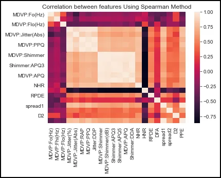
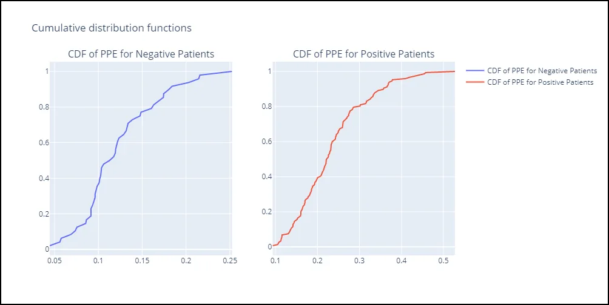
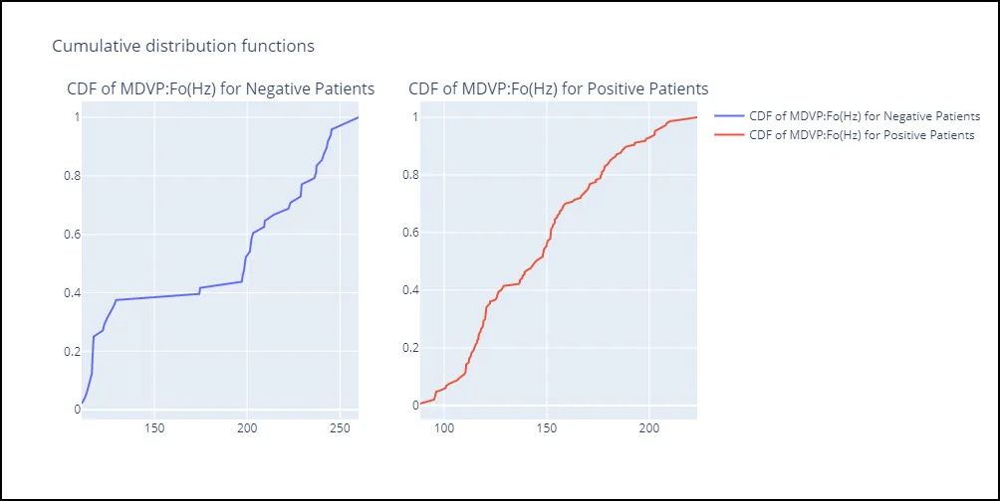
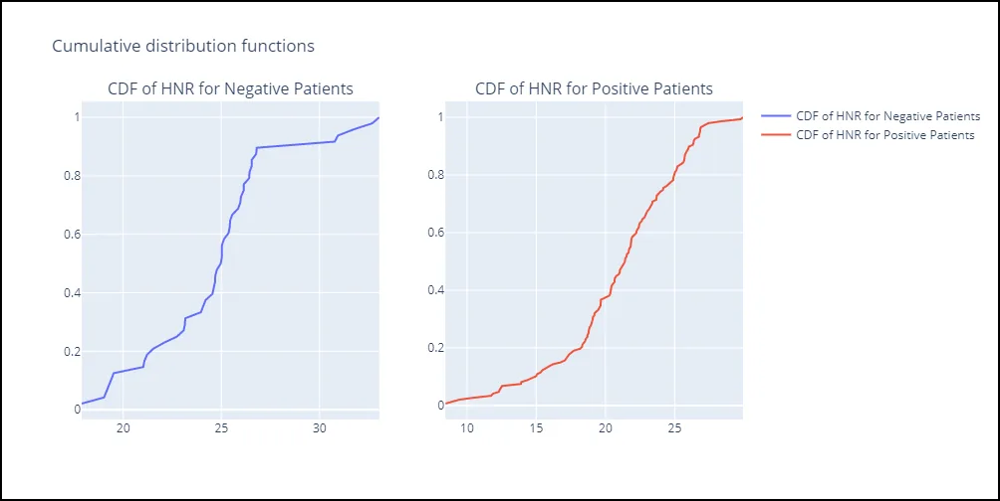
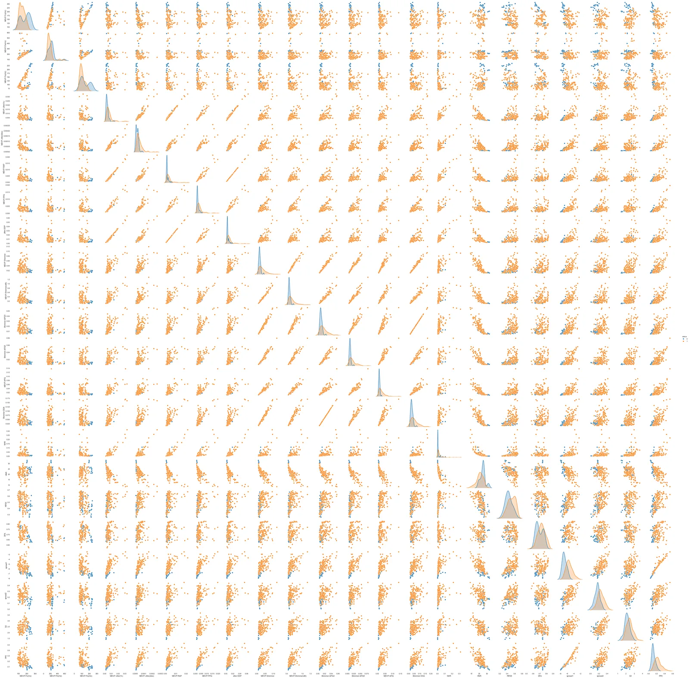
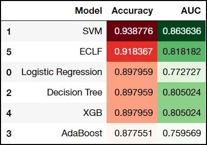

## A comprehensive analysis and ML of [#Parkinsons](https://www.datainsightonline.com/blog/hashtags/Parkinsons)


*Image by myhealthappsblog via their website*

**Parkinson's disease**, or simply Parkinson's, is a long-term degenerative disorder of the central nervous system that mainly affects the motor system. As the disease worsens, non-motor symptoms become more common. The symptoms usually emerge slowly.

## Introduction to Parkinson's


*Source from jaipurneuro.com*

# Introduction to Parkinson's

Early in the disease, the most obvious symptoms are shaking, rigidity, slowness of movement, and difficulty with walking.Thinking and behavioral problems may also occur.

Dementia becomes common in the advanced stages of the disease.Depression and anxiety are also common, occurring in more than a third of people with PD.

Other symptoms include sensory, sleep, and emotional problems. The main motor symptoms are collectively called "parkinsonism", or a "parkinsonian syndrome".

The cause of Parkinson's disease is unknown, but is believed to involve both genetic and environmental factors. Those with a family member affected are more likely to get the disease themselves.There is also an increased risk in people exposed to certain pesticides and among those who have had prior head injuries, while there is a reduced risk in tobacco smokers and those who drink coffee or tea.

The motor symptoms of the disease result from the death of cells in the substantia nigra, a region of the midbrain. This results in not enough dopamine in this region of the brain.The cause of this cell death is poorly understood, but it involves the build-up of proteins into Lewy bodies in the neurons. Diagnosis of typical cases is mainly based on symptoms, with tests such as neuroimaging used to rule out other diseases.

There is no cure for Parkinson's disease

### SOURCES:
- [Wikipedia](https://en.wikipedia.org/wiki/Parkinson%27s_disease)
- [Parkinson.org](https://www.parkinson.org/understanding-parkinsons/what-is-parkinsons)
- [WHO](https://www.who.int/mental_health/neurology/neurodiso/en/)
- [Hopkins Medicine](https://www.hopkinsmedicine.org/health/conditions-and-diseases/parkinsons-disease/parkinsons-disease-risk-factors-and-causes)

### Dataset
- Parkinsons Data Set [Data Repository](https://archive.ics.uci.edu/ml/datasets/Parkinsons) by UC Irvine Machine Learning Repository

  - This dataset is updated by UC Irvine Machine Learning Repository

## A Statistical Peek

After importing, cleaning, and merging data files -using pandas library- we started calculating some statistical inference to explore the data and its relationships.

Firstly, exploring the correlation between the data columns.We used the '.corr()' function using spearman correlation in the pandas library to explore that.

```python
ax = sns.heatmap(df.corr(method='spearman'))
plt.title('Correlation between features Using Spearman Method');
```

Where 'df' is the cleaned DataFrame.



#### General Observations:
- A quick look through the correlation matrix suggests a high correlation between several columns with same product of measurement.
- The Kay Pentax multidimensional voice program (MDVP) and their componants of measurements are highly correlated which is to be expected.
- Harmonics to Noise Ratio (HNR) is negatively correlated with MDVP componants.
- status is most correlated with spread 1 and spread 2 as well as MDVP APQ.

Correlation rasied a few questions to explore during analysis.

### Questions Raised:
- From previous analysis and visually exploring data some questions arised:-
  1- Which of the 22 features are the most contributing to the status of the patient?
  2- Which relationship between two features would produce a distinction between status 1 and 0?

### Exploring most contributing features to status.

Correlation diagram suggests thet PPE and MDVP:Fo and HNR are the most contributing features to status with either negative or positive correlation value.

**Exploring PPE feature**

```python
PPE_1 = df[df.status == 1]['PPE']
PPE_0 = df[df.status == 0]['PPE']

ecdf_plot(PPE_0,PPE_1,'PPE for Negative Patients','PPE for Positive Patients')
```



##### *Observations:*
- CDF shows distribution of values throughout the feature with respect to the status of the patient which shows significant difference between both distributions.
- Histogram shows another perspective of the distribution of the feature with PPE higher than 0.3 signifies positive status.
- Box plot shows a clearer picture of the feature at question showing values higher than 0.21 are most probable to be positive.

**Exploring MDVP:Fo feature**

```python
MDVP1 = df[df.status == 1]['MDVP:Fo(Hz)']
MDVP0 = df[df.status == 0]['MDVP:Fo(Hz)']

ecdf_plot(MDVP0,MDVP1,'MDVP:Fo(Hz) for Negative Patients','MDVP:Fo(Hz) for Positive Patients')
```



##### *Observations:*
- CDF shows distribution of values throughout the feature with respect to the status of the patient which shows significant difference between both distributions specially in values lower than 110 Hz.
- Histogram shows another perspective of the distribution of the feature with Fo (Hz) higher than 220 Hz signifies Negative status.
- Box plot shows a clearer picture of the feature at question showing values lower than 120 Hz are most probable to be positive.

**Exploring HNR feature**

```python
HNR1 = df[df.status == 1]['HNR']
HNR0 = df[df.status == 0]['HNR']

ecdf_plot(HNR0,HNR1,'HNR for Negative Patients','HNR for Positive Patients')
```



##### *Observations:*
- CDF shows High difference between the two variables at higher percentiles and lower ones, with mid range having similarities.
- Histogram shows overlapping statuses in midrange 17 and 30 yet significant difference between both status at values lower than 18.
- Box plot shows a clearer picture of the feature at question showing values higher than 30 are most probable to be negative while values lower than 17 are most probably positive.

### Exploring Relationships that produce the most differentiable status.

Plotting a scatter plot matrix between all features to visually distinct which features could produce the most clear differentiable statuses.

Also taking into account correlation matrix as deduced above and their EDA.



*Click on Image to enlarge*

Deduced from the above figure that MDVP:Fo(HZ) has the most differentiable measurement more over when correlated with HNR and PPE results are very interesting.

## Exploring Relationships
**MDVP :Fo(Hz) Vs HNR**

```python
px.scatter(df, x ='HNR',y = 'MDVP:Fo(Hz)', color = 'status', title = 'Relationship between MDVP:Fo & HNR wrt Status')
```

***Observations:***[***¶***](http://localhost:8888/notebooks/Project%203/Parkinson's-Omar%20Ossama%20Mahmoud_ID_87.ipynb#Observations:)

- High values of Fo (Hz) - > 223 Hz - correlates with negative status.
- HNR values lower than 17 correlates with positive status regardless of Fo.
- Midrange Fo between 174.1 and 129 correlates with positive status regardless of HNR value.

**MDVP :Fo(Hz) Vs PPE**

```python
px.scatter(df, x ='PPE',y = 'MDVP:Fo(Hz)', color = 'status', title = 'Relationship between MDVP:Fo & PPE wrt Status')
```

##### *Observations:*
- PPE values higher than 0.25 correlates with positive status.
- Positive status PPE values lies between 0.09 and 0.5 with values higher than 0.25 correlates with positive status.
- Both statuses are very distinct in this relationship.

## Exploring Machine Learning Approach to Predict Paitent Status

## Importing Libraries used
```python
from sklearn.model_selection import train_test_split
from sklearn import preprocessing
from sklearn.preprocessing import MinMaxScaler
from sklearn.model_selection import cross_val_score
from sklearn.linear_model import LogisticRegression
from sklearn.svm import SVC
from sklearn.tree import DecisionTreeClassifier
from sklearn.ensemble import RandomForestClassifier
from sklearn.ensemble import AdaBoostClassifier
from sklearn.model_selection import StratifiedKFold
from sklearn.metrics import confusion_matrix, accuracy_score, recall_score, roc_curve, auc
import xgboost as xgb
```

**Preprocessing Data**

Defining Target for the model and features

```python
Y = df['status'].values # Target for the model
X = df[['MDVP:Fo(Hz)', 'MDVP:Fhi(Hz)', 'MDVP:Flo(Hz)', 'MDVP:Jitter(%)','MDVP:Jitter(Abs)', 'MDVP:RAP', 'MDVP:PPQ', 'Jitter:DDP','MDVP:Shimmer', 'MDVP:Shimmer(dB)', 'Shimmer:APQ3', 'Shimmer:APQ5','MDVP:APQ', 'Shimmer:DDA', 'NHR', 'HNR', 'RPDE', 'DFA','spread1', 'spread2', 'D2', 'PPE']]
```

Spliting data to test and train sets

```python
# Spliting data to test and train sets
X_train, X_test, Y_train, Y_test = train_test_split(X, Y, test_size = 0.25 ,random_state=42)
```

Normalizing Data using MinMaxScaler

```python
scaler = MinMaxScaler().fit(X_train)

X_train_scaled = scaler.transform(X_train)
X_test_scaled = scaler.transform(X_test)
```

Defining list to store Performance Metrics

```python
performance = [] # list to store all performance metric
```

**Logistic Regression Model**

*Logistic Regression (aka logit, MaxEnt) classifier.*

In the multiclass case, the training algorithm uses the one-vs-rest (OvR) scheme if the ‘multi_class’ option is set to ‘ovr’, and uses the cross-entropy loss if the ‘multi_class’ option is set to ‘multinomial’. (Currently the ‘multinomial’ option is supported only by the ‘lbfgs’, ‘sag’, ‘saga’ and ‘newton-cg’ solvers.)

This class implements regularized logistic regression using the ‘liblinear’ library, ‘newton-cg’, ‘sag’, ‘saga’ and ‘lbfgs’ solvers. **Note that regularization is applied by default**. It can handle both dense and sparse input.

Model Implementation:

```python
lr_best_score = 0
lr_kfolds = 5 # set the number of folds

# Finding the Best lr Model
for c in [0.001, 0.1, 1, 4, 10, 100]:
    logRegModel = LogisticRegression(C=c)

    # perform cross-validation
    scores = cross_val_score(logRegModel, X_train, Y_train, cv = lr_kfolds, scoring = 'accuracy') # Get recall for each parameter setting

    # compute mean cross-validation accuracy
    score = np.mean(scores)

    # Find the best parameters and score
    if score > lr_best_score:
        lr_best_score = score
        lr_best_parameters = c

# rebuild a model on the combined training and validation set
SelectedLogRegModel = LogisticRegression(C = lr_best_parameters).fit(X_train_scaled, Y_train)

# Model Test
lr_test_score = SelectedLogRegModel.score(X_test_scaled, Y_test)

# Predicted Output of Model
PredictedOutput = SelectedLogRegModel.predict(X_test_scaled)

# Extracting sensitivity & specificity from ROC curve to measure Performance of the model
lr_fpr, lr_tpr, lr_thresholds = roc_curve(Y_test, PredictedOutput, pos_label=1)

# Using AUC of ROC to validate models based on a single score
lr_test_auc = auc(lr_fpr, lr_tpr)

# Output Printing Scores
print("Best accuracy on validation set is:", lr_best_score)

print("Best parameter for regularization (C) is: ", lr_best_parameters)

print("Test accuracy with best C parameter is", lr_test_score)
print("Test AUC with the best C parameter is", lr_test_auc)

# Appending results to performance list
m = 'Logistic Regression'
performance.append([m, lr_test_score, lr_test_auc, lr_fpr, lr_tpr, lr_thresholds])
```

Best accuracy on validation set is: 0.8427586206896553

Best parameter for regularization (C) is: 4

Test accuracy with best C parameter is 0.8979591836734694

Test AUC with the best C parameter is 0.7727272727272727

**SVM Model**

C-Support Vector Classification.

The implementation is based on libsvm. The fit time scales at least quadratically with the number of samples and may be impractical beyond tens of thousands of samples.

Model Implementation:

```python
svm_best_score = 0
svm_kfolds = 5

for c_paramter in [0.001, 0.01, 0.1,6, 10, 100, 1000]: #iterate over the values we need to try for the parameter C
    for gamma_paramter in [0.001, 0.01, 0.1,5, 10, 100, 1000]: #iterate over the values we need to try for the parameter gamma
        for k_parameter in ['rbf', 'linear', 'poly', 'sigmoid']: # iterate over the values we need to try for the kernel parameter

            svmModel = SVC(kernel=k_parameter, C=c_paramter, gamma=gamma_paramter) #define the model
            # perform cross-validation

            scores = cross_val_score(svmModel, X_train_scaled, Y_train, cv = svm_kfolds, scoring='accuracy')
            # the training set will be split internally into training and cross validation

            # compute mean cross-validation accuracy
            score = np.mean(scores)

            # if we got a better score, store the score and parameters
            if score > svm_best_score:
                svm_best_score = score #store the score
                svm_best_parameter_c = c_paramter #store the parameter c
                svm_best_parameter_gamma = gamma_paramter #store the parameter gamma
                svm_best_parameter_k = k_parameter


# rebuild a model with best parameters to get score
SelectedSVMmodel = SVC(C = svm_best_parameter_c, gamma = svm_best_parameter_gamma, kernel = svm_best_parameter_k).fit(X_train_scaled, Y_train)

# Model Test
svm_test_score = SelectedSVMmodel.score(X_test_scaled, Y_test)

# Predicted Output of Model
PredictedOutput = SelectedSVMmodel.predict(X_test_scaled)

# Extracting sensitivity & specificity from ROC curve to measure Performance of the model
svm_fpr, svm_tpr, svm_thresholds = roc_curve(Y_test, PredictedOutput, pos_label=1)

# Using AUC of ROC to validate models based on a single score
svm_test_auc = auc(svm_fpr, svm_tpr)

# Output Printing Scores
print("Best accuracy on cross validation set is:", svm_best_score)

print("Best parameter for c is: ", svm_best_parameter_c)
print("Best parameter for gamma is: ", svm_best_parameter_gamma)
print("Best parameter for kernel is: ", svm_best_parameter_k)

print("Test accuracy with the best parameters is", svm_test_score)
print("Test AUC with the best parameter is", svm_test_auc)

# Appending results to performance list
m = 'SVM'
performance.append([m, svm_test_score, svm_test_auc, svm_fpr, svm_tpr, svm_thresholds])
```

Best accuracy on cross validation set is: 0.9448275862068967

Best parameter for c is: 6

Best parameter for gamma is: 5

Best parameter for kernel is: rbf

Test accuracy with the best parameters is 0.9387755102040817

Test AUC with the best parameter is 0.8636363636363636

**DecisionTreeClassifier Model**

Model Implementation:

```python
dt_best_score = 0
dt_kfolds = 10

for md in range(1, 9): # iterate different maximum depth values
    # train the model
    treeModel = DecisionTreeClassifier(random_state=0, max_depth=md, criterion='gini')

    # perform cross-validation
    scores = cross_val_score(treeModel, X_train_scaled, Y_train, cv = dt_kfolds, scoring='accuracy')

    # compute mean cross-validation accuracy
    score = np.mean(scores)

    # if we got a better score, store the score and parameters
    if score > dt_best_score:
        dt_best_score = score
        dt_best_parameter = md


# Rebuild a model on the combined training and validation set
SelectedDTModel = DecisionTreeClassifier(max_depth = dt_best_parameter).fit(X_train_scaled, Y_train )

# Model Test
dt_test_score = SelectedDTModel.score(X_test_scaled, Y_test)

# Predicted Output of Model
PredictedOutput = SelectedDTModel.predict(X_test_scaled)

# Extracting sensitivity & specificity from ROC curve to measure Performance of the model
dt_fpr, dt_tpr, dt_thresholds = roc_curve(Y_test, PredictedOutput, pos_label=1)

# Using AUC of ROC to validate models based on a single score
dt_test_auc = auc(dt_fpr, dt_tpr)

# Output Printing Scores
print("Best accuracy on validation set is:", dt_best_score)

print("Best parameter for the maximum depth is: ", dt_best_parameter)

print("Test accuracy with best parameter is ", dt_test_score)
print("Test AUC with the best parameter is ", dt_test_auc)

# Appending results to performance list
m = 'Decision Tree'
performance.append([m, dt_test_score, dt_test_auc, dt_fpr, dt_tpr, dt_thresholds])
```

Best accuracy on validation set is: 0.8642857142857144
Best parameter for the maximum depth is: 5
Test accuracy with best parameter is 0.8979591836734694
Test AUC with the best parameter is 0.8050239234449762

**Features Importance**

```python
print("Feature importance: ")
features = np.array([X.columns.values.tolist(), list(SelectedDTModel.feature_importances_)]).T

for i in features:
    print(f'{i[0]} : {i[1]}')
```

Feature importance:

MDVP:Fo(Hz) : 0.2789793597522502

MDVP:Fhi(Hz) : 0.0

MDVP:Flo(Hz) : 0.0

MDVP:Jitter(%) : 0.0

MDVP:Jitter(Abs) : 0.06478134339071083

MDVP:RAP : 0.07963422307864516

MDVP:PPQ : 0.0

Jitter:DDP : 0.0

MDVP:Shimmer : 0.0

MDVP:Shimmer(dB) : 0.0

Shimmer:APQ3 : 0.0

Shimmer:APQ5 : 0.0

MDVP:APQ : 0.0

Shimmer:DDA : 0.0

NHR : 0.0

HNR : 0.13032482023307707

RPDE : 0.05792214232581203

DFA : 0.0

spread1 : 0.03439127200595089

spread2 : 0.0

D2 : 0.0

PPE : 0.3539668392135539

**Random Forest Classifier Model**

A random forest is a meta estimator that fits a number of decision tree classifiers on various sub-samples of the dataset and uses averaging to improve the predictive accuracy and control over-fitting. The sub-sample size is controlled with the max_samples parameter if bootstrap=True (default), otherwise the whole dataset is used to build each tree.

Model Implementation:

```python
rf_best_score = 0
rf_kfolds = 5

for M in range(2, 15, 2): # combines M trees
    for d in range(1, 9): # maximum number of features considered at each split
        for m in range(1, 9): # maximum depth of the tree
            # train the model
            # n_jobs(4) is the number of parallel computing
            forestModel = RandomForestClassifier(n_estimators = M, max_features = d, n_jobs = 4,max_depth = m, random_state = 0)

            # perform cross-validation
            scores = cross_val_score(forestModel, X_train_scaled, Y_train, cv = rf_kfolds, scoring = 'accuracy')

            # compute mean cross-validation accuracy
            score = np.mean(scores)

            # if we got a better score, store the score and parameters
            if score > rf_best_score:
                rf_best_score = score
                rf_best_M = M
                rf_best_d = d
                rf_best_m = m

# Rebuild a model on the combined training and validation set
SelectedRFModel = RandomForestClassifier(n_estimators=rf_best_M, max_features=rf_best_d,max_depth=rf_best_m, random_state=0).fit(X_train_scaled, Y_train )

# Model Test
rf_test_score = SelectedRFModel.score(X_test_scaled, Y_test)

# Predicted Output of Model
PredictedOutput = SelectedRFModel.predict(X_test_scaled)

# Extracting sensitivity & specificity from ROC curve to measure Performance of the model
rf_fpr, rf_tpr, rf_thresholds = roc_curve(Y_test, PredictedOutput, pos_label=1)

# Using AUC of ROC to validate models based on a single score
rf_test_auc = auc(rf_fpr, rf_tpr)

# Output Printing Scores
print("Best accuracy on validation set is:", rf_best_score)

print("Best parameters of M, d, m are: ", rf_best_M, rf_best_d, rf_best_m)

print("Test accuracy with the best parameters is", rf_test_score)
print("Test AUC with the best parameters is:", rf_test_auc)

# Appending results to performance list
m = 'Random Forest'
performance.append([m, rf_test_score, rf_test_auc, rf_fpr, rf_tpr, rf_thresholds])
```

Best accuracy on validation set is: 0.9317241379310346
Best parameters of M, d, m are: 10, 7, 7
Test accuracy with the best parameters is 0.8775510204081632
Test AUC with the best parameters is: 0.7918660287081339

**AdaBoost Classifier Model**

An AdaBoost classifier is a meta-estimator that begins by fitting a classifier on the original dataset and then fits additional copies of the classifier on the same dataset but where the weights of incorrectly classified instances are adjusted such that subsequent classifiers focus more on difficult cases.

This class implements the algorithm known as AdaBoost-SAMME .

Model Implementation:

```python
ada_best_score = 0
ada_kfolds = 5

for M in range(2, 15, 2): # combines M trees
    for lr in [0.0001, 0.001, 0.01, 0.1, 1,2,3]:
        # train the model
        boostModel = AdaBoostClassifier(n_estimators=M, learning_rate=lr, random_state=0)

        # perform cross-validation
        scores = cross_val_score(boostModel, X_train_scaled, Y_train, cv = ada_kfolds, scoring = 'accuracy')

        # compute mean cross-validation accuracy
        score = np.mean(scores)

        # if we got a better score, store the score and parameters
        if score > ada_best_score:
            ada_best_score = score
            ada_best_M = M
            ada_best_lr = lr

# Rebuild a model on the combined training and validation set
SelectedBoostModel = AdaBoostClassifier(n_estimators=ada_best_M, learning_rate=ada_best_lr, random_state=0).fit(X_train_scaled, Y_train )

# Model Test
ada_test_score = SelectedRFModel.score(X_test_scaled, Y_test)

# Predicted Output of Model
PredictedOutput = SelectedBoostModel.predict(X_test_scaled)

# Extracting sensitivity & specificity from ROC curve to measure Performance of the model
ada_fpr, ada_tpr, ada_thresholds = roc_curve(Y_test, PredictedOutput, pos_label=1)

# Using AUC of ROC to validate models based on a single score
ada_test_auc = auc(ada_fpr, ada_tpr)

# Output Printing Scores
print("Best accuracy on validation set is:", ada_best_score)

print("Best parameter of M is: ", ada_best_M)
print("best parameter of LR is: ", ada_best_lr)

print("Test accuracy with the best parameter is", ada_test_score)
print("Test AUC with the best parameters is:", ada_test_auc)

# Appending results to performance list
m = 'AdaBoost'
performance.append([m, ada_test_score, ada_test_auc, ada_fpr, ada_tpr, ada_thresholds])
```

Best accuracy on validation set is: 0.9039080459770116
Best parameter of M is: 10
best parameter of LR is: 1
Test accuracy with the best parameter is 0.8775510204081632
Test AUC with the best parameters is: 0.7595693779904306

**XGBoost Classifier Model**

**XGBoost** is an optimized distributed gradient boosting library designed to be highly **efficient**, **flexible** and **portable**. It implements machine learning algorithms under the [Gradient Boosting](https://en.wikipedia.org/wiki/Gradient_boosting) framework. XGBoost provides a parallel tree boosting (also known as GBDT, GBM) that solve many data science problems in a fast and accurate way. The same code runs on major distributed environment (Hadoop, SGE, MPI) and can solve problems beyond billions of examples.

Model Implementation:

```python
xgb_best_score = 0
xgb_kfolds = 5

for n in [2,4,6,8,10]: #iterate over the values we need to try for the parameter n_estimators
    for lr in [1.1,1.2,1.22,1.23,1.3]: #iterate over the values we need to try for the learning rate parameter
        for depth in [2,4,6,8,10]: # iterate over the values we need to try for the depth parameter
            XGB = xgb.XGBClassifier(objective = 'binary:logistic', max_depth=depth, n_estimators=n, learning_rate = lr) #define the model

            # perform cross-validation
            scores = cross_val_score(XGB, X_train_scaled, Y_train, cv = xgb_kfolds, scoring='accuracy')
            # the training set will be split internally into training and cross validation

            # compute mean cross-validation accuracy
            score = np.mean(scores)

            # if we got a better score, store the score and parameters
            if score > xgb_best_score:
                xgb_best_score = score #store the score
                xgb_best_md = depth #store the parameter maximum depth
                xgb_best_ne = n #store the parameter n_estimators
                xgb_best_lr = lr #store the parameter learning rate

# rebuild a model with best parameters to get score
XGB_selected = xgb.XGBClassifier(objective = 'binary:logistic',max_depth=xgb_best_md, n_estimators=xgb_best_ne, learning_rate = xgb_best_lr).fit(X_train_scaled, Y_train)

# Model Test
xgb_test_score = XGB_selected.score(X_test_scaled, Y_test)

# Predicted Output of Model
PredictedOutput = XGB_selected.predict(X_test_scaled)

# Extracting sensitivity & specificity from ROC curve to measure Performance of the model
xgb_fpr, xgb_tpr, xgb_thresholds = roc_curve(Y_test, PredictedOutput, pos_label=1)

# Using AUC of ROC to validate models based on a single score
xgb_test_auc = auc(xgb_fpr, xgb_tpr)

# Output Printing Scores
print("Best accuracy on cross validation set is:", xgb_best_score)

print("Best parameter for maximum depth is: ", xgb_best_md)
print("Best parameter for n_estimators is: ", xgb_best_ne)
print("Best parameter for learning rate is: ", xgb_best_lr)

print("Test accuracy with the best parameters is", xgb_test_score)
print("Test AUC with the best parameters is:", xgb_test_auc)

# Appending results to performance list
m = 'XGB'
performance.append([m, xgb_test_score, xgb_test_auc, xgb_fpr, xgb_tpr, xgb_thresholds])
```

Best accuracy on cross validation set is: 0.93816091954023
Best parameter for maximum depth is: 2
Best parameter for n_estimators is: 10
Best parameter for learning rate is: 1.2
Test accuracy with the best parameters is 0.8979591836734694
Test AUC with the best parameters is: 0.8050239234449762

**Ensemble Voting Classifier Model**

Model Implementation:

```python
from sklearn.ensemble import VotingClassifier

# Logistic regression model
clf1 = LogisticRegression(C=lr_best_parameters).fit(X_train_scaled, Y_train)

# SVC Model
clf2 = SVC(C=svm_best_parameter_c, gamma=svm_best_parameter_gamma, kernel=svm_best_parameter_k,probability=True)

# DecisionTreeClassifier model
clf3 = DecisionTreeClassifier(max_depth=dt_best_parameter)

# Random Forest Classifier Model
clf4 = RandomForestClassifier(n_estimators=rf_best_M, max_features=rf_best_d,max_depth=rf_best_m, random_state=42)

# AdaBoostClassifier Model
clf5 = AdaBoostClassifier(n_estimators=ada_best_M, learning_rate=ada_best_lr, random_state=42)

# XGBoost Classifier Model
clf6 = xgb.XGBClassifier(objective = 'binary:logistic',max_depth=xgb_best_md, n_estimators=xgb_best_ne ,learning_rate = xgb_best_lr)

# Defining VotingClassifier
eclf1 = VotingClassifier(estimators=[ ('LogisticRegression', clf1), ('SVC', clf2),('DecisionTree',clf3),('Random Forest', clf4),('ADABoost',clf5),('XGBoost',clf6)], voting='hard')

# Fitting VotingClassifier
eclf1 = eclf1.fit(X_train_scaled, Y_train)

# Model Test
eclf_test_score = eclf1.score(X_test_scaled, Y_test)

# Predicted Output of Model
PredictedOutput = eclf1.predict(X_test_scaled)

# Extracting sensitivity & specificity from ROC curve to measure Performance of the model
eclf_fpr, eclf_tpr, eclf_thresholds = roc_curve(Y_test, PredictedOutput, pos_label=1)

# Using AUC of ROC to validate models based on a single score
eclf_test_auc = auc(eclf_fpr, eclf_tpr)

# Output Printing Scores
print("Test accuracy with the best parameters is", eclf_test_score)
print("Test AUC with the best parameters is:", eclf_test_auc)

# Appending results to performance list
m = 'ECLF'
performance.append([m, eclf_test_score, eclf_test_auc, eclf_fpr, eclf_tpr, eclf_thresholds])
```

Test accuracy with the best parameters is 0.9183673469387755

Test AUC with the best parameters is: 0.8181818181818181

## Model Results for Top performing models
```python
result = pd.DataFrame(performance, columns=['Model', 'Accuracy', 'AUC', 'FPR', 'TPR', 'TH'])
df = result[['Model', 'Accuracy', 'AUC']]
results = df.sort_values('Accuracy',ascending = False)
display(results)
```



## Final Thoughts
**After a lengthy analysis of the mentioned data, and several conclusions from various sections of this project, we could safely assume the following:-**

- Best Model Accuracy is SVM Classifier at ~94% accuracy.
- Best AUC is SVM Classifier at 86% area.
- Ensemble Voting is at ~92% accuracy and 81% area.
- Most contributing features are PPE at 35% followed by MDVP:Fo(Hz) at 28% and HNR at 13%.
- Machine Learning Findings align with EDA.

***And Finally, Thank you for reading.***

***Please feel free to check the full analysis*** [***here***](https://github.com/osos96/Parkinsons-ML)***.***
