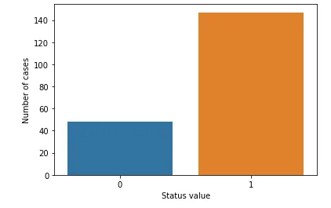
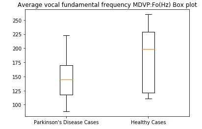
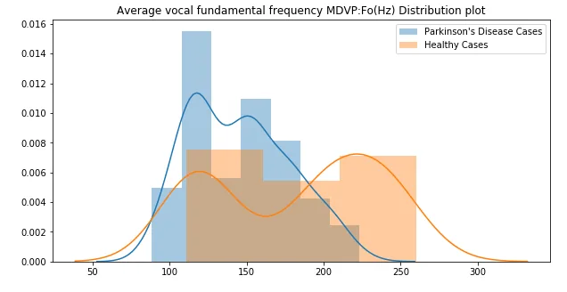
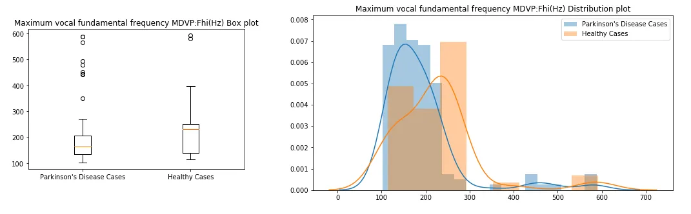
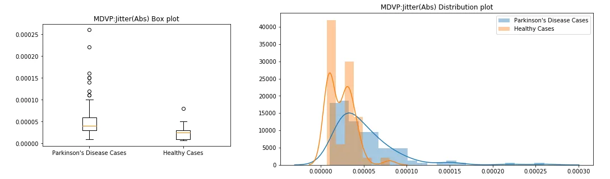
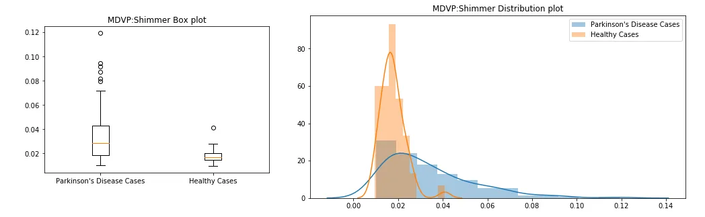
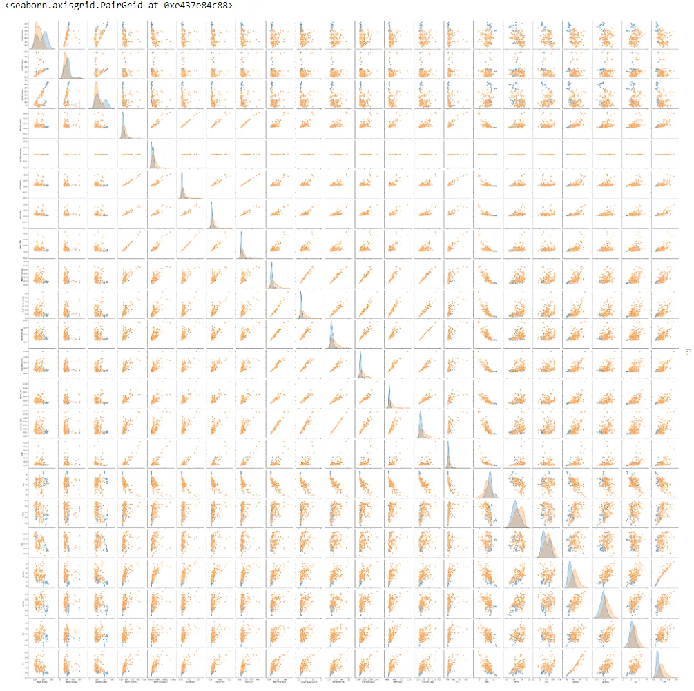

Neurodegenerative diseases are a heterogeneous group of disorders that are characterized by the progressive degeneration of the structure and function of the nervous system. They are incurable and debilitating conditions that cause problems with mental functioning also called dementias. Alzheimer’s disease and Parkinson’s disease are the most common neurodegenerative diseases.

I performed Exploratory Data analysis and then predicted the Parkinson's Disease using the data set from [UCI ML Parkinson’s dataset](https://archive.ics.uci.edu/ml/machine-learning-databases/parkinsons/).

The data set has 195 samples. Each row of the data set consists of voice recording of individuals with name and 23 attributes of biomedical voice measurements. The main aim of the data is to discriminate healthy people from those with Parkinson's Disease, according to "status" column which is set to `0` for healthy and `1` for individual affected with Parkinson's Disease.

**Loading the data:**

```python
import pandas as pd
parkinsons_data = pd.read_csv('parkinsons.data')
status_value_counts = parkinsons_data['status'].value_counts()

print("Number of Parkinson's Disease patients: {} ({:.2f}%)".format(status_value_counts[1], status_value_counts[1] / parkinsons_data.shape[0] * 100))
print("Number of Healthy patients: {} ({:.2f}%)".format(status_value_counts[0], status_value_counts[0] / parkinsons_data.shape[0] * 100))
```

Number of Parkinson's Disease patients: 147 (75.38%)
Number of Healthy patients: 48 (24.62%)

```python
%matplotlib inline
import seaborn as sns
import matplotlib.pyplot as plt

sns.countplot(parkinsons_data['status'].values)
plt.xlabel("Status value")
plt.ylabel("Number of cases")
plt.show()
```



## Univariate Analysis:
I used box plots and Distribution plots on every input for the EDA on healthy cases and Parkinson's disease affected cases.

```python
# Creating a box plot for the attribute 'Average vocal fundamental frequency MDVP:Fo(Hz)'
diseased_freq_avg = parkinsons_data[parkinsons_data["status"] == 1]["MDVP:Fo(Hz)"].values
healthy_freq_avg = parkinsons_data[parkinsons_data["status"] == 0]["MDVP:Fo(Hz)"].values

plt.boxplot([diseased_freq_avg, healthy_freq_avg])
plt.title("Average vocal fundamental frequency MDVP:Fo(Hz) Box plot")
plt.xticks([1, 2], ["Parkinson's Disease Cases", "Healthy Cases"])
plt.show()
```



```python
# Creating a distribution plot with histograms for the attribute 'Average vocal fundamental frequency MDVP:Fo(Hz)'
plt.figure(figsize=(10,5))
sns.distplot(diseased_freq_avg, hist=True, label="Parkinson's Disease Cases")
sns.distplot(healthy_freq_avg, hist=True, label="Healthy Cases")
plt.title("Average vocal fundamental frequency MDVP:Fo(Hz) Distribution plot")
plt.legend()
plt.show()
```



I also performed exploratory data analysis on all attributes such as Jitter, Shimmer, Non-linear measures etc.,. Some of the plots are:







## Bivariate Analysis:
Also I used `sns.pairplot` to find out the pairwise relationship of the attributes. This plot gives the relationship of the attributes and will help in creating a model and selection of the attributes which really useful in the decision making.

```python
# creating pairplot of the attributes
sns.pairplot(parkinsons_data, hue="status", diag_kind='kde')
```



## Parkinson's Disease Prediction using Logistic Regression:
Using "Pipeline" we can combine all the feature engineering, pre-processing and model steps into a single object. "GridSearchCV" used to fine tune the hyperparameters to find out the model's best output and accuracy.

The data set from [UCI ML Parkinson’s dataset](https://archive.ics.uci.edu/ml/machine-learning-databases/parkinsons/) is clean and all the rows have the values for all columns, so there is no need of data pre-cleaning. We can use "StandardScaler" to scale the dataset. Here I have used "Logistic Regression" model for the classification.

```python
from sklearn.model_selection import train_test_split, GridSearchCV
from sklearn.linear_model import LogisticRegression
from sklearn.metrics import classification_report
from sklearn.preprocessing import StandardScaler
from sklearn.pipeline import Pipeline

# Create data set
y = parkinsons_data["status"]
X = parkinsons_data.drop(["name", "status"], axis=1)

# Setup the pipeline
steps = [('scaler', StandardScaler()),
         ('logreg', LogisticRegression())]

pipeline = Pipeline(steps)

# Create the hyperparameter grid
parameters = {'logreg__C': np.logspace(-2, 8, 15)}

# Creating train and test sets
X_train, X_test, y_train, y_test = train_test_split(X, y, test_size=0.3, random_state=102)

# Instantiate the GridSearchCV object: cv
cv = GridSearchCV(pipeline, parameters)

# Fit to the training set
cv.fit(X_train, y_train)

# Predict the labels of the test set: y_pred
y_pred = cv.predict(X_test)

# Compute and print metrics
print("Accuracy: {}".format(cv.score(X_test, y_test)))
print(classification_report(y_test, y_pred))
print("Tuned Model Parameters: {}".format(cv.best_params_))
```

Output:

Accuracy: 0.8983050847457628
 precision recall f1-score support
 0 0.80 0.80 0.80 15
 1 0.93 0.93 0.93 44

 accuracy 0.90 59
 macro avg 0.87 0.87 0.87 59
weighted avg 0.90 0.90 0.90 59

Tuned Model Parameters: {'logreg__C': 7.196856730011521}

The best accuracy achieved is **89.83%** with the parameter `C = 7.196856730011521`

For more details on this project view my [github repository](https://github.com/govind-savara/Parkinsons-disease-Exploratory-Data-Analysis-and-Prediction).
