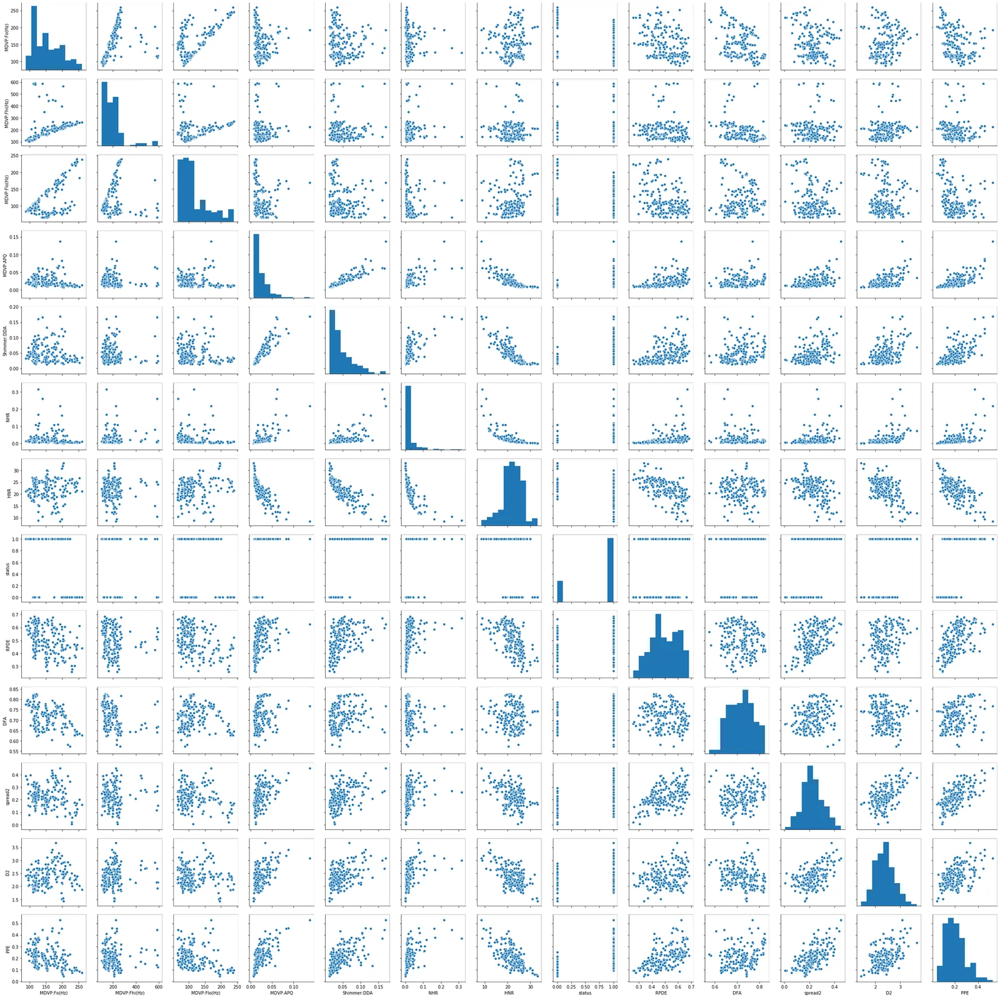

Parkinson's disease is a brain disorder that leads to shaking, stiffness, and difficulty with walking, balance, and coordination.

Parkinson's symptoms usually begin gradually and get worse over time. As the disease progresses, people may have difficulty walking and talking. They may also have mental and behavioral changes, sleep problems, depression, memory difficulties, and fatigue.

Both men and women can have Parkinson’s disease. However, the disease affects about 50 percent more men than women.

One clear risk factor for Parkinson's is age. Although most people with Parkinson’s first develop the disease at about age 60, about 5 to 10 percent of people with Parkinson's have "early-onset" disease, which begins before the age of 50. Early-onset forms of Parkinson's are often, but not always, inherited, and some forms have been linked to specific gene mutations.

In this article, I have tried to build a model that accurately predicts the presence of Parkinson's disease in a person from a dataset from the machine learning repository of UCI <https://archive.ics.uci.edu/ml/datasets/Parkinsons>.

**Exploratory Data Analysis**

The first and most important part before doing any sort of attempt to build a model is performing an Exploratory Data Analysis on the dataset undertaken for the process.

Exploratory Data Analysis is an approach to analyzing data sets to summarize their main characteristics, often with visual methods. It helps you get a better understanding of your data.

There many objectives of EDA but the prominent ones are Discovering Patterns, Spotting Anomalies, Framing Hypothesis and Checking assumptions.

In this analysis, we are going to use the different features in the dataset to predict the 'status' target feature which has a value of '0' for negative and '1' positive of the presence of the disease for the subject.

Let's import the required python libraries and our data, and start exploring it. The pandas dataframe method df.describe() allows you to get basic statistical information like count, sum, variance, percentiles and more. The df.shape() method gives information about the number of rows and columns.

```python
import pandas as pd
df = pd.read_csv('parkinsons.data')
pd.set_option('display.max_rows', None)
import warnings
warnings.filterwarnings('ignore')
print(df.shape)
df.describe()
```

Output

```python
(195, 24)
```

**Dimensionality reduction**

Dimensionality reduction is the transformation of data from a high-dimensional space into a low-dimensional space so that the low-dimensional representation retains some meaningful properties of the original data, ideally close to its intrinsic **dimension**.

There are two methods we can implement this technique. They are **Feature Selection** and Feature Extraction. The following snippet illustrates Feature Selection that are highly correlated and removing one of them as their variance will more or less be linearly proportional.

```python
 # Create a positive correlation matrix
corr_df = df.corr().abs()
# Create and apply mask
mask = np.triu(np.ones_like(corr_df, dtype=bool))
tri_df = corr.mask(mask)

# Find columns that meet threshold
to_drop = [c for c in tri_df.columns if any(tri_df[c] > 0.90)]

print(to_drop)
reduced_df = df.drop(to_drop, axis=1)

Output:
['MDVP:Jitter(%)', 'MDVP:Jitter(Abs)', 'MDVP:RAP', 'MDVP:PPQ', 'Jitter:DDP', 'MDVP:Shimmer', 'MDVP:Shimmer(dB)', 'Shimmer:APQ3', 'Shimmer:APQ5', 'spread1']
```

Univariate and Bivariate Analysis

In Exploratory Data Analysis, Univariate analysis involves analysis of a single variable. The above table that is the output of Pandas df.describe() is a typical example of this type. On the other hand, Bivariate Analysis focuses on analyzing the relationship between two features. For example, correlation between two features.

Seaborn's pairplot() function allows us to generate a figure that contains a plot for each type of feature in the dataset. It gives a good information about relationship between each pair of feature. The following snipped does both the Feature Selection and Bivariate Analysis for our dataset.

```python
import seaborn as sns
sns.pairplot(reduced_df)
```

output:



**Machine Learning Modeling**

Lets first split our data into train and test subsets. We use the train subset to train our models on and then we predict on the test set and evaluate the performance of our models.

Standardization is another vital activity in Machine Learning. Data standardization is the process of rescaling one or more attributes so that they have a mean value of 0 and a standard deviation of 1.

from sklearn.model_selection import train_test_split

from sklearn.preprocessing import StandardScaler

```python
X_train, X_test, y_train, y_test = train_test_split(X, y, test_size=0.3, random_state=42)
scaler = StandardScaler()
X_train_std = scaler.fit_transform(X_train)
X_test_std = scaler.fit_transform(X_test)
```

**Recursive Feature Elimination**

Recursive feature elimination (RFE) is a feature selection method that fits a model and removes the weakest feature (or features) until the specified number of features is reached.

In this project, we have implemented RFE along with different Machine Learning algorithms to reduce the bias level of the models which is at large caused by having too many features when training your models. I have used a Logistic Classifier to demonstrate this as follow.

```python
from sklearn.feature_selection import RFE
from sklearn.linear_model import LogisticRegression
from sklearn.metrics import accuracy_score
import sklearn.model_selection as ms

X = df.drop(columns=['status'])
rfe_lr = RFE(estimator=LogisticRegression(), n_features_to_select=4)
rfe_lr.fit(X_train_std, y_train)
print(X.columns[rfe_lr.support_])

from sklearn.model_selection import cross_val_score
#print(dict(zip(X.columns, rfe_lr.ranking_)))
#y_pred = rfe_lr.predict(X_test_std)

y_pred = rfe_lr.predict(X_test_std)

#cv_scores = cross_val_score(rfe_lr, X, y, cv=5)
#print(cv_scores.mean())
#print(accuracy_score(y_test, y_pred))

cv_scores = cross_val_score(rfe_lr, X, y, cv = ms.StratifiedKFold(shuffle = True))
print(cv_scores.mean())
```

Output:

```python
['MDVP:Fo(Hz)', 'spread1', 'D2', 'PPE']
0.8307692307692308
```

Every learning algorithm tends to suit some problem types better than others, and typically has many different parameters and configurations to adjust before it achieves optimal performance on a dataset.

Adaptive Boosting, AdaBoost (with decision trees as the weak learners) is often referred to as the best out-of-the-box classifier.When used with decision tree learning, information gathered at each stage of the AdaBoost algorithm about the relative 'hardness' of each training sample is fed into the tree growing algorithm such that later trees tend to focus on harder-to-classify examples.

**Model Performance evaluation**

I have used cross validation for evaluating the various learning models applied and compare their performance to select the best one.

**Cross****-****validation** is a technique for evaluating ML models by training several ML models on subsets of the available input data and evaluating them on the complementary subset of the data.

There are also a wide range of scoring that can be set for a Cross-validation technique but the two most commonly used are the 'roc-auc' and 'accuracy' scores.

In an imbalanced dataset, the Receiver Operating Characteristic curve is mostly used.

Accuracy just tells us the proportion of true positive and false positive results from the total prediction and is not the best scoring technique for imbalanced datasets.

```python
 # Import models and utility functions
from sklearn.ensemble import AdaBoostClassifier
from sklearn.metrics import roc_auc_score
# Set seed for reproducibility
SEED = 1
# Split data into 70% train and 30% test
X_train, X_test, y_train, y_test = train_test_split(X, y, test_size=0.3,stratify=y,random_state=SEED)

# Instantiate a classification-tree 'dt'
dt = DecisionTreeClassifier(max_depth=2, random_state=SEED)
# Instantiate an AdaBoost classifier 'adab_clf'
adb_clf = AdaBoostClassifier(base_estimator=dt, n_estimators=300, random_state=SEED)
# Fit 'adb_clf' to the training set
adb_clf.fit(X_train, y_train)
# Predict the test set probabilities of positive class
y_pred_proba = adb_clf.predict_proba(X_test)[:,1]
# Evaluate test-set roc_auc_score
adb_clf_roc_auc_score = roc_auc_score(y_test, y_pred_proba)

# Print adb_clf_roc_auc_score
print('ROC AUC score: {:.2f}'.format(adb_clf_roc_auc_score))

cv_scores = cross_val_score(adb_clf, X, y, cv = ms.StratifiedKFold(shuffle = True, n_splits=5, random_state=1), scoring='roc_auc')
print(cv_scores.mean())
models_performance.append(('Adaptive Boosting Classifier with DT base estimator', cv_scores.mean().round(2)))
#models_performance[5] = ('Adaptive Boosting Classifier with DT base estimator', cv_scores.mean().round(2))
```

Output:

```python
ROC AUC score: 1.00
0.9697164750957855
```

As you see, we have built a model that has an accuracy of about 97%.
