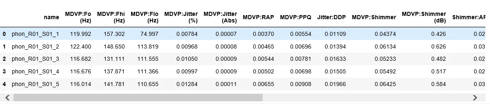
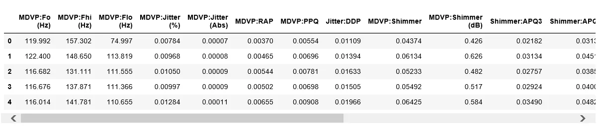
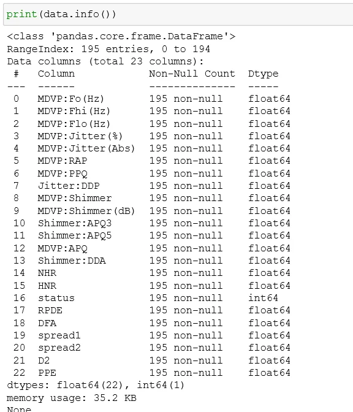
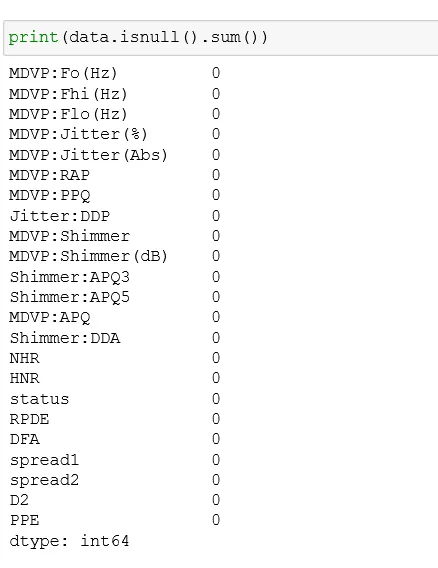
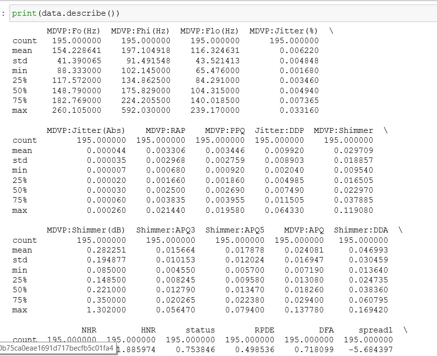
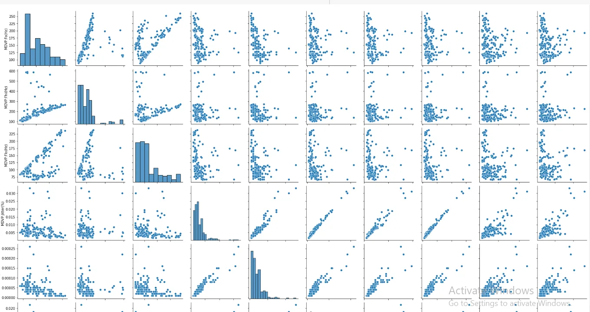
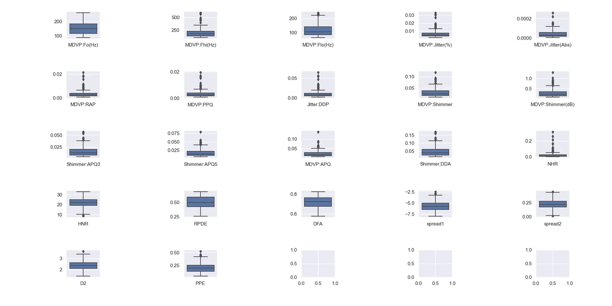
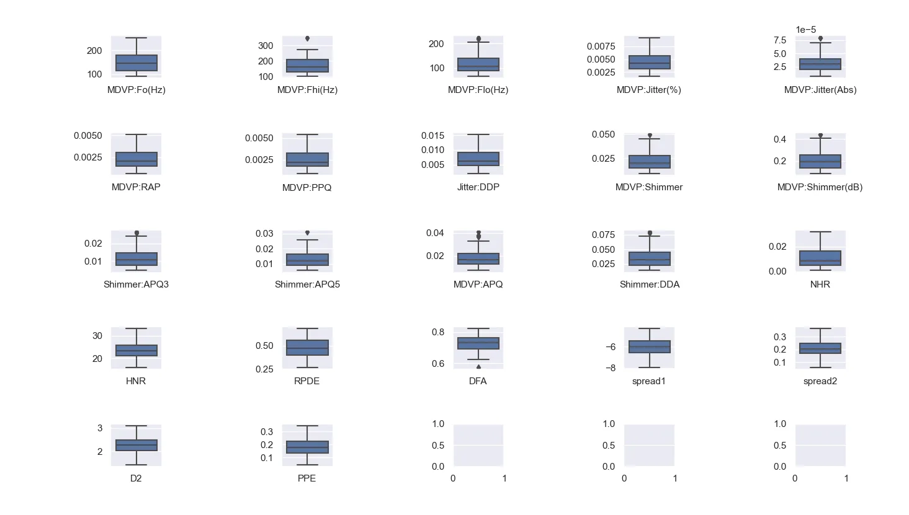

**Introduction**

Parkinson’s disease is a brain disorder that causes unintended or uncontrollable movements, such as shaking, stiffness, and difficulty with balance and coordination.

Symptoms usually begin gradually and worsen over time. As the disease progresses, people may have difficulty walking and talking. They may also have mental and behavioral changes, sleep problems, depression, memory difficulties, and fatigue.

#### What causes Parkinson’s disease?
The most prominent signs and symptoms of Parkinson’s disease occur when nerve cells in the basal ganglia, an area of the brain that controls movement, become impaired and/or die. Usually, these nerve cells, or neurons, produce an important brain chemical known as dopamine. When the neurons die or become impaired, they have less dopamine, which causes the movement problems associated with the disease. Scientists still do not know what causes the neurons to die.


**Parkinson's dataset**

The dataset is obtained from the Kaggle dataset with the link:

<https://www.kaggle.com/code/darshanjain29/parkinsons-disease-solution/data?select=parkinsons.names>

Before playing with data, import necessary libraries first and then read data.

```python
import pandas as pd
import numpy as np
import matplotlib.pyplot as plt
import seaborn as sns
pd.set_option('display.max_columns',None)

data = pd.read_csv('parkinsons.data')
print(data.head())
```



Let's remove the name column

```python
data = data.drop(['name'],axis = 1)
print(data.head())
```



In the dataset the status column is the target variable where its value is only 1 or 0. 1 means the patient has Parkinson's disease and 0 means the patient does not have Parkinson's disease.

Now get an idea about the dataset.

```python
# get idea about data types and presence of null values for each column.
print(data.info())

# Check/count total null values for each column.
print(data.isnull().sum())

# Get statistical idea of the data
print(data.describe())
```







From the images, we have an idea about the data types of data and there are no missing values so we do not need to handle it.

Let's plot a pair plot so we have an idea of the distribution of the dataset. All of the plots are not displayed here but most of the data are right-skewed. Now we need to check for outliers. For now, we will check if there are any outliers or not.



Let's check for outliers,

```python
targ = data['status']
data = data.drop(['status'],axis = 1)

label_name = ['MDVP:Fo(Hz)', 'MDVP:Fhi(Hz)', 'MDVP:Flo(Hz)', 'MDVP:Jitter(%)','MDVP:Jitter(Abs)', 'MDVP:RAP', 'MDVP:PPQ', 'Jitter:DDP',
       'MDVP:Shimmer', 'MDVP:Shimmer(dB)', 'Shimmer:APQ3', 'Shimmer:APQ5','MDVP:APQ', 'Shimmer:DDA', 'NHR', 'HNR', 'RPDE', 'DFA', 'spread1',
       'spread2', 'D2', 'PPE']

fig, axes = plt.subplots(5, 5)

ax = sns.boxplot(ax=axes[0,0], data = data.loc[:,label_name[0]])
ax.set_xticklabels([label_name[0]])

ax = sns.boxplot(ax=axes[0,1], data = data.loc[:,label_name[1]])
ax.set_xticklabels([label_name[1]])

ax = sns.boxplot(ax=axes[0,2], data = data.loc[:,label_name[2]])
ax.set_xticklabels([label_name[2]])

ax = sns.boxplot(ax=axes[0,3], data = data.loc[:,label_name[3]])
ax.set_xticklabels([label_name[3]])

ax = sns.boxplot(ax=axes[0,4], data = data.loc[:,label_name[4]])
ax.set_xticklabels([label_name[4]])

ax = sns.boxplot(ax=axes[1,0], data = data.loc[:,label_name[5]])
ax.set_xticklabels([label_name[5]])

ax = sns.boxplot(ax=axes[1,1], data = data.loc[:,label_name[6]])
ax.set_xticklabels([label_name[6]])

ax = sns.boxplot(ax=axes[1,2], data = data.loc[:,label_name[7]])
ax.set_xticklabels([label_name[7]])

ax = sns.boxplot(ax=axes[1,3], data = data.loc[:,label_name[8]])
ax.set_xticklabels([label_name[8]])

ax = sns.boxplot(ax=axes[1,4], data = data.loc[:,label_name[9]])
ax.set_xticklabels([label_name[9]])

ax = sns.boxplot(ax=axes[2,0], data = data.loc[:,label_name[10]])
ax.set_xticklabels([label_name[10]])

ax = sns.boxplot(ax=axes[2,1], data = data.loc[:,label_name[11]])
ax.set_xticklabels([label_name[11]])

ax = sns.boxplot(ax=axes[2,2], data = data.loc[:,label_name[12]])
ax.set_xticklabels([label_name[12]])

ax = sns.boxplot(ax=axes[2,3], data = data.loc[:,label_name[13]])
ax.set_xticklabels([label_name[13]])

ax = sns.boxplot(ax=axes[2,4], data = data.loc[:,label_name[14]])
ax.set_xticklabels([label_name[14]])

ax = sns.boxplot(ax=axes[3,0], data = data.loc[:,label_name[15]])
ax.set_xticklabels([label_name[15]])

ax = sns.boxplot(ax=axes[3,1], data = data.loc[:,label_name[16]])
ax.set_xticklabels([label_name[16]])

ax = sns.boxplot(ax=axes[3,2], data = data.loc[:,label_name[17]])
ax.set_xticklabels([label_name[17]])

ax = sns.boxplot(ax=axes[3,3], data = data.loc[:,label_name[18]])
ax.set_xticklabels([label_name[18]])

ax = sns.boxplot(ax=axes[3,4], data = data.loc[:,label_name[19]])
ax.set_xticklabels([label_name[19]])

ax = sns.boxplot(ax=axes[4,0], data = data.loc[:,label_name[20]])
ax.set_xticklabels([label_name[20]])

ax = sns.boxplot(ax=axes[4,1], data = data.loc[:,label_name[21]])
ax.set_xticklabels([label_name[21]])

fig.tight_layout()
plt.show()
```



From the box plot, we can conclude that there are a lot of outliers. So we need to remove these outliers.

```python
label_name = ['MDVP:Fo(Hz)','MDVP:Fhi(Hz)', 'MDVP:Flo(Hz)', 'MDVP:Jitter(%)','MDVP:Jitter(Abs)', 'MDVP:RAP', 'MDVP:PPQ', 'Jitter:DDP',
       'MDVP:Shimmer', 'MDVP:Shimmer(dB)', 'Shimmer:APQ3', 'Shimmer:APQ5','MDVP:APQ', 'Shimmer:DDA', 'NHR', 'HNR', 'RPDE', 'DFA', 'spread1',
       'spread2', 'D2', 'PPE']

for coln in label_name:
    q1 = data[coln].quantile(0.25)
    q3 = data[coln].quantile(0.75)
    iqr = q3 - q1

    low_limit = q1 - (1.5 * iqr)
    high_limit = q3 + (1.5 * iqr)
    feat = data[(data[coln] > low_limit) | (data[coln] < high_limit)]
    new_df = pd.DataFrame(data)

new_df.reset_index(inplace=True)
```

Now check if the outliers are removed or not.



Most of the outliers are removed, but the outliers in the image above are due to randomness. The values of the columns are of different scales so we have to change them to the same scale. For this, we will use the StandardScaler method.

```python
from sklearn.preprocessing import StandardScaler
scaler = StandardScaler()
df_scaled = pd.DataFrame(scaler.fit_transform(new_df),index=new_df.index,columns=new_df.columns)
```

As the problem is a binary classification type we will use logistic regression for now. First, we will make a hyperparameter tuning to get a good result.

```python
from sklearn.linear_model import LogisticRegression
from sklearn.model_selection import train_test_split
from sklearn.metrics import accuracy_score,classification_report,confusion_matrix
import numpy as np

lg_reg = LogisticRegression()

from sklearn.model_selection import GridSearchCV

param_grid = [
 {'penalty': ['l1','l2','elasticnet'],
'C': [0.001,0.01,0.1,1,10,100,1000],
'solver': [ 'lbfgs', 'liblinear', 'sag', 'saga'],               'max_iter': [100,200,500,1000,2500,5000,10000,25000], }]

# clf = GridSearchCV(estimator = lg_reg,param_grid = param_grid,cv=10,verbose=True,n_jobs = -1)
# clf.fit(df_scaled,targ)
# print("****************************** Best parameter is ",clf.best_params_)
```

And we got the following value after tuning. We will now use these values to make predictions.

```python
****************************** Best parameter is  {'C': 0.1, 'max_iter': 100, 'penalty': 'l2', 'solver': 'lbfgs'}
```

```python
lg_reg = LogisticRegression(C = 0.1, max_iter = 100, penalty = 'l2', solver = 'lbfgs')

X_train,X_test,y_train,y_test = train_test_split(df_scaled,targ,test_size=0.2,random_state=1)

lg_reg.fit(X_train,y_train)
predict = lg_reg.predict(X_test)

report = accuracy_score(y_test,predict)
clf_report = classification_report(y_test,predict)
cm = confusion_matrix(y_test,predict)

print("score on test: " + str(lg_reg.score(X_test, y_test)))
print("score on train: "+ str(lg_reg.score(X_train, y_train)))

print("Accuracy of our model is %0.2f" %(report)) #92%
print("-----------------------------------------------------")
print(clf_report)

print("-----------------------------------------------------")
print("Confusion matrix : ")
print(cm)
```

After modeling, we got the following results.

```python
score on test: 0.8974358974358975
score on train: 0.8525641025641025
Accuracy of our model is 0.90
-----------------------------------------------------
              precision    recall  f1-score   support

           0       0.88      0.70      0.78        10
           1       0.90      0.97      0.93        29

    accuracy                           0.90        39
   macro avg       0.89      0.83      0.86        39
weighted avg       0.90      0.90      0.89        39

-----------------------------------------------------
Confusion matrix :
[[ 7  3]
 [ 1 28]]
```
