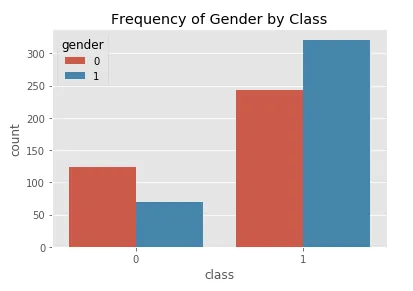
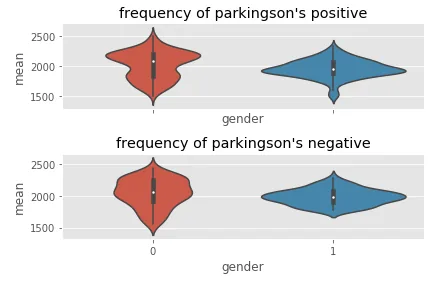
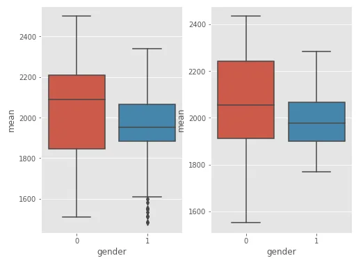
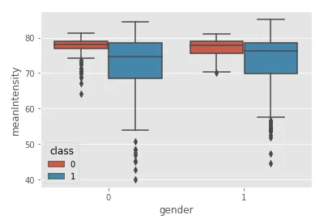
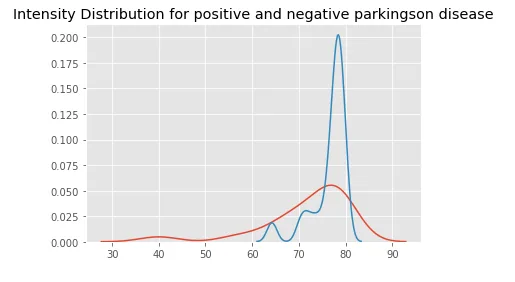

Parkinson's disease (PD), or simply Parkinson's is a long-term degenerative disorder of the central nervous system that mainly affects the motor system. The symptoms usually emerge slowly and, as the disease worsens, non-motor symptoms become more common.[1][4] The most obvious early symptoms are tremor, rigidity, slowness of movement, and difficulty with walking,[1] but cognitive and behavioral problems may also occur. Parkinson's disease dementia becomes common in the advanced stages of the disease. Depression and anxiety are also common, occurring in more than a third of people with PD.[2] Other symptoms include sensory, sleep, and emotional problems. The main motor symptoms are collectively called "parkinsonism", or a "parkinsonian syndrome". [1] In this lexture, we are going to perform and exploratory data analysis and code a machine learning model to predict if a person have this disease. 1- Dataset The dataset used is a dataset of the web site machine Learning repository[2] which contains a high quality of machine Learning dataset. The data is composed of the following features: - name - ASCII subject name and recording number - MDVP:Fo(Hz) - Average vocal fundamental frequency - MDVP:Fhi(Hz) - Maximum vocal fundamental frequency - MDVP:Flo(Hz) - Minimum vocal fundamental frequency -MDVP:Jitter(%),MDVP:Jitter(Abs),MDVP:RAP,MDVP:PPQ,Jitter:DDP – Several - measures of variation in fundamental frequency - MDVP:Shimmer,MDVP:Shimmer(dB),Shimmer:APQ3,Shimmer:APQ5,MDVP:APQ,Shimmer:DDA - Several measures of variation in amplitude - NHR,HNR - Two measures of ratio of noise to tonal components in the voice - status - Health status of the subject (one) - Parkinson's, (zero) – healthy - RPDE,D2 - Two nonlinear dynamical complexity measures DFA - Signal fractal scaling exponent spread1,spread2,PPE - Three nonlinear measures of fundamental frequency variation Separation of the dataset For analysis we separed the data in 2 sets.

Analysing Gender.

The gender in the dataset is distributed as follows:

ax = sns.countplot(x='class',data=data, hue = 'gender')

ax.set_title('Frequency of Gender by Class')

1- violin plot of Formant frequency

Analysis of Formant Frequencies by gender

We have obtained the following results:

frequency_ill= illness[['gender','f1','f2','f3','f4']]

frequency_health = healthy[['gender','f1','f2','f3','f4']]

frequency_ill.head() frequency_ill['mean'] = frequency_ill[['f1','f2','f3','f4']].mean(axis=1) frequency_health['mean'] = frequency_health[['f1','f2','f3','f4']].mean(axis=1)

fig, axes = plt.subplots(1,2, sharex = True)

sns.swarmplot(x='gender', y='mean',data=frequency_ill, ax = axes[0])

sns.swarmplot(x='gender', y='mean',data=frequency_health, ax = axes[1])

axes[0].set_title("frequency of parkingson's positive")

axes[1].set_title("frequency of parkingson's negative") plt.tight_layout() fig, axes = plt.subplots(2,1, sharex = True)

sns.violinplot(x='gender', y='mean',data=frequency_ill, ax = axes[0])

sns.violinplot(x='gender', y='mean',data=frequency_health, ax = axes[1]) axes[0].set_title("frequency of parkingson's positive")

axes[1].set_title("frequency of parkingson's negative")

plt.tight_layout()

2- Boxplot

fig, axes = plt.subplots(1,2, figsize=(8,6))

sns.boxplot(x='gender', y='mean',data=frequency_ill, ax = axes[0])

sns.boxplot(x='gender', y='mean',data=frequency_health, ax = axes[1])

plt.ticks_layouts()

plt.show()

Analysis of intensity parameters

sns.distplot(illness['meanIntensity'])

sns.distplot(healthy['meanIntensity'])

table = list(np.arange(0,100,5))

percentiles_i = []

percentile_h = []

for i in table :

perc = np.round(np.percentile(illness['meanIntensity'], i),2)

per = np.round(np.percentile(healthy['meanIntensity'],i),2)

percentiles_i.append(perc)

percentile_h.append(per)

sns.distplot(percentiles_i,hist=False)

sns.distplot(percentile_h,hist=False)

plt.title('Intensity Distribution for positive and negative parkingson disease')

II-predicting Parkinson’s disease with machine Learning.

1- Importing packages

from sklearn.ensemble import RandomForestClassifier

from sklearn.tree import DecisionTreeClassifier

from sklearn.feature_selection import VarianceThreshold

from sklearn.preprocessing import StandardScaler, LabelEncoder

from sklearn.model_selection import train_test_split,GridSearchCV

from sklearn.linear_model import LogisticRegression

from sklearn.metrics import accuracy_score,f1_score

from sklearn.svm import SVC

2- Prediction with logistic Regression

The data has been split with train_test_plit and standardized.

NB. Metrics used are f1_score and accuracy.

logistic = DecisionTreeClassifier(class_weight = 'balanced',random_state = 11) logistic.fit(X_train,y_train)

prediction = logistic.predict(X_test) accuracy_score(prediction, y_test).

The accuracy score with logistics regression is 0.86

f1_score(rf_prediction, y_test)

The f1_score with logistics regression is 0.87

3- Prediction with Random Forest Classifier

rf = RandomForestClassifier() rf.fit(X_train,y_train) rf_prediction = rf.predict(X_test) accuracy_score(rf_prediction, y_test)

Accuracy with random Forest is 0.92

f1_score(rf_prediction, y_test)

The f1_scoreis 0.95

4- Prediction with SVM.

sv = SVC(class_weight = 'balanced') sv.fit(X_train,y_train)

prediction = sv.predict(X_test) accuracy_score(prediction, y_test) f1_score(prediction,y_test)

With SVM we have obtained an accuracy of 0.86 and a f1_score of 0.92

5- Hyper parameters tuning

from scipy.stats import uniform

C = [1.0,1.5,2.0,2.5]

param_grid = dict(C=C)

lr = LogisticRegression(penalty='l2')

grid = GridSearchCV(estimator = lr, param_grid=param_grid,scoring = 'accuracy', cv = 4,n_jobs = -1)

grid.fit(X_train, y_train)

y_pred = grid.predict(X_test)

f1_score(prediction, y_test)

grids.score(X_test, y_test)

Accuracy: 0.81

F1_score:0.87

n_estimators = [10,100,200]

max_features = [4,5,8]

params_grid = dict(n_estimators = n_estimators, max_features = max_features)

rfc = RandomForestClassifier()

search = GridSearchCV(estimator = rfc, param_grid=params_grid, cv = 3, scoring = 'accuracy', n_jobs=-1)

search.fit(X_train,y_train)

search.score(X_test, y_test)

f1_score(pred, y_test) kernels

Accuracy:0.83

F1_score:0.88

['poly','rbf','sigmoid']

C = [0.1,10,100]

gamma = [1,0.1,0.01,0.001]

param_grid = dict(C=C, kernel = kernels, gamma = gamma)

svm = SVC()

grids = GridSearchCV(estimator = svm, param_grid = param_grid, scoring='accuracy', cv = 3, n_jobs = -1)

grids.fit(X_train,y_train)

prediction =grids.predict(X_test)

grids.score(X_test, y_test)

f1_score(prediction, y_test)

Accuracy: 0.95

F1_score:0.96.

After a grid search we conclude that the Best model is a support vector machine with and accuracy of 0.95 and a F1_score of 0.96.

6- Conclusion.

We have implemented a model which can predict the presence of Parkinson’s disease with a accuracy of 0.95 and with F1_score of 0.96.

Bibliography:

1. Wikipedia.com/Parkinson’s disease

2. https://archive.ics.uci.edu/ml/datasets/Parkinsons
