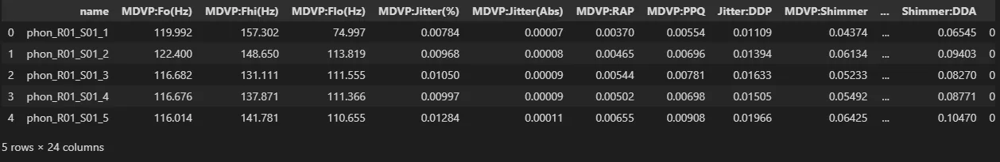
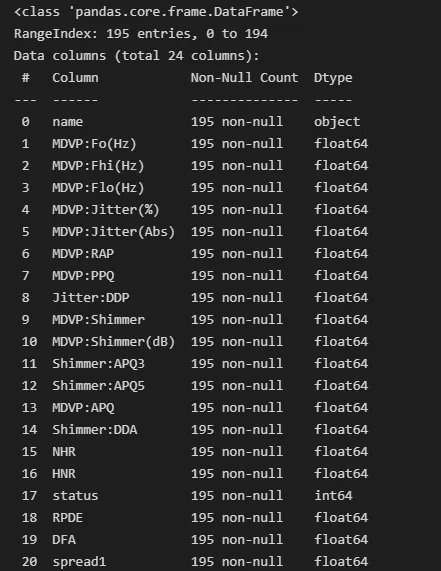
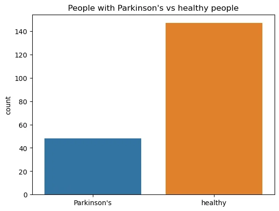
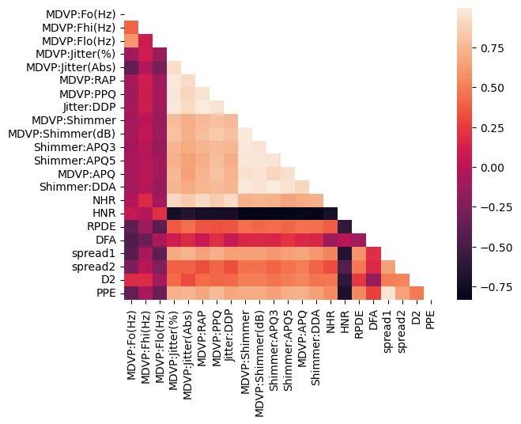
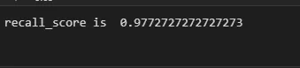
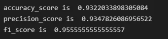
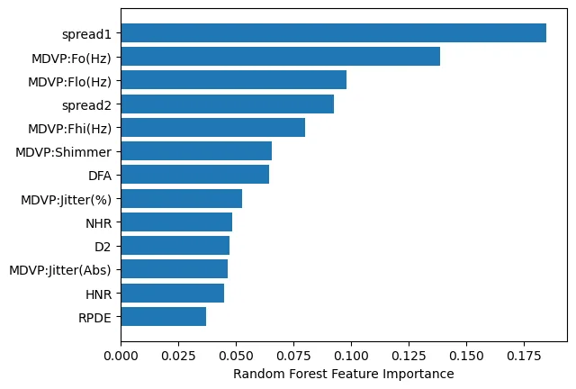

Dealing with any form of disease is traumatizing enough. From history early detection have proven to have a huge impact on patients and Parkinson's disease is no exemption.

Parkinson's disease usually develop gradually and are mild at first. The order of the symptoms and their severity are normally peculiar based on the individual case. Some of the main symptoms are:

- Tremor: This the shaking which occurs mostly at the limbs and is visible when relaxing or at rest.

- Slowness of movement (bradykinesia): physical movements for people with Parkinson's are usually much slower.

- Muscle stiffness (rigidity): stiffness and tension in the muscles, which can make it difficult to move around and make facial expressions, and can result in painful muscle cramps.

They are other symptoms including cognitive and psychiatric.

In the paper 'Exploiting Nonlinear Recurrence and Fractal Scaling Properties for Voice Disorder Detection' by Little MA, et. al. in 2007 it was suggested that audio signals could be analyzed and used for early detection of some neurodegenerative diseases. The data set is provided on the UCL ML dataset repository for Parkinson's disease and this blog shows the process of creating a classification model.

Reading in the data and import necessary modules.

Inspecting the dataset

There are no null values in the dataset, columns are in the correct data type apart from the target column ('status') that can be represented as a categorical variable so it's considerably clean.

Separating the features and target

Visualizing correlation

We have 24 columns which is considerably a lot compared to the rows (195) so dimensionality reduction is needed.

**Questions:**

1. what are the features necessary in building the model

- MDVP:Fo(Hz) - Average vocal fundamental frequency

- MDVP:Fhi(Hz) - Maximum vocal fundamental frequency

- MDVP:Flo(Hz) - Minimum vocal fundamental frequency

- MDVP:Jitter(%) - measures of variation in fundamental frequency

- MDVP:Jitter(Abs) - measures of variation in fundamental frequency

- MDVP:Shimmer - measures of variation in fundamental amplitude

- NHR - measures of ratio of noise to tonal components in the voice

- HNR - measures of ratio of noise to tonal components in the voice

- RPDE - nonlinear dynamical complexity measures

- DFA - Signal fractal scaling exponen

- spread1 - nonlinear measures of fundamental frequency variation

- spread2 - nonlinear measures of fundamental frequency variation

- D2 - nonlinear dynamical complexity measures

2. what features are the most important

3. What type of algorithms can you try:

this is a classification problem so good classifiers are suitable e.g random forest classifiers, logistic regressors and boosting algorithmns

References

'Exploiting Nonlinear Recurrence and Fractal Scaling Properties for Voice Disorder Detection', Little MA, McSharry PE, Roberts SJ, Costello DAE, Moroz IM. BioMedical Engineering OnLine 2007, 6:23 (26 June 2007)

Max A. Little, Patrick E. McSharry, Eric J. Hunter, Lorraine O. Ramig (2008), 'Suitability of dysphonia measurements for telemonitoring of Parkinson's disease', IEEE Transactions on Biomedical Engineering (to appear).

[Parkinson's disease - Symptoms - NHS (www.nhs.uk)](https://www.nhs.uk/conditions/parkinsons-disease/symptoms/) (checked 11/11/2022)
