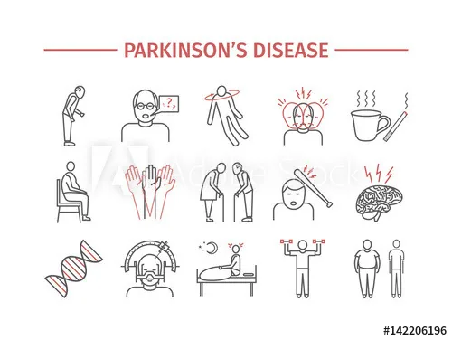
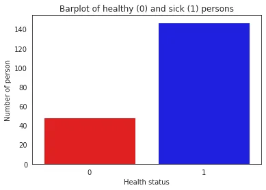
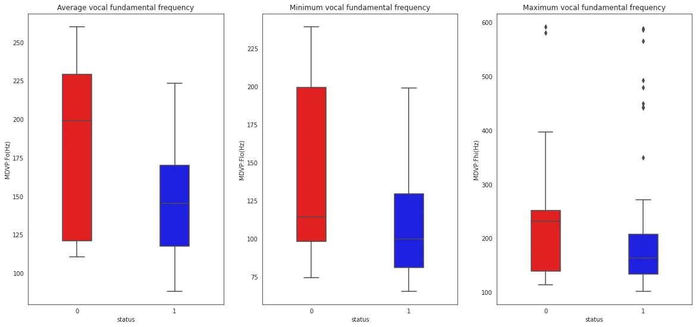
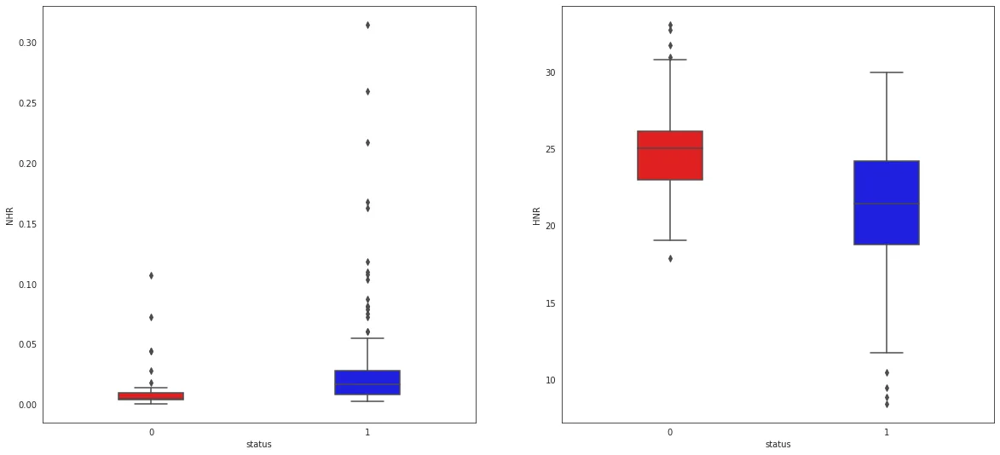
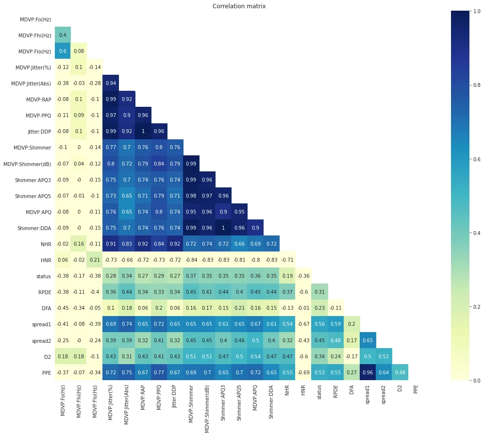
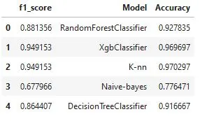

**1. Summary**



Parkinson’s disease (PD) is the second most common neurodegenerative disorder with a current life time risk of 2% for men and 1.3% for women, which is predicted to increase in the next decades. Parkinson's disease is a brain disorder that leads to shaking, stiffness, and [difficulty with walking, balance, and coordination](https://www.nia.nih.gov/health/topics?field_a_to_z_topics_index_target_id=Movement%20disorders%20and%20problems%20%283762%29).

**What are the symptoms of PD ?**

Parkinson's disease has four main symptoms:

- Tremor (trembling) in hands, arms, legs, jaw, or head
- Stiffness of the limbs and trunk
- Slowness of movement
- Impaired balance and coordination, sometimes leading to falls

Parkinson's symptoms usually begin gradually and get worse over time. As the disease progresses, people may have difficulty walking and talking. They may also have mental and behavioral changes, sleep problems, depression, memory difficulties, and fatigue.

**Objectives of Predicting PD's Project**

The goal of this project is to build a model to accurately predict the presence of a PD in an individual as early detection of this disease could be useful for the identification of people who can participate in trials of neuroprotective agents, or ultimately to try and halt disease progression once effective disease-modifying interventions have been identified.

To perform this work, the data was downloaded from the following [link](https://archive.ics.uci.edu/ml/datasets/Parkinsons).

**Questions**

1. What is the proportion of healthy and sick people in this study?
2. Do fundamental voice frequency (MDVP:Fo(Hz), MDVP:Fhi(Hz), MDVP:Flo(Hz) ) parameters affect people's health status?
3. Is there any different proportion of two measures ( NHR,HNR) of ratio of noise to tonal components in the voice on the health status of individuals?
4. What are the parameters which have a significant relationship on people's health status?
5. What is the best model for predicting the presence or absence PD?

**Results**

The analysis of this data ([available here](https://github.com/Espipi/DataInsightProgram/blob/master/script_parkinson.ipynb)) indicated that the target variable "status" has a weak positive correlation with all the others variables and the best model was the **KNeighborsClassifier** with an accuracy of about 95%.

**2. Exploratory Data Analysis**

- **Description of the data set**

```python
#Load package
import os, sys
import pandas as pd
import random
import numpy as np
import matplotlib.pyplot as plt
import seaborn as sns
print(os.listdir())
##Load the dataset and the 3 first lines 
df = pd.read_csv('/content/sample_data/parkinsons.data')
df.head(3)
df.info()
```

```python
#Read dataset information
with open('/content/sample_data/parkinsons.names', 'r') as f:
    data = f.read()
print(data)
```

**Data Set Information**

This dataset is composed of a range of biomedical voice measurements from 31 people, 23 with Parkinson's disease (PD). Each column in the table is a particular voice measure, and each row corresponds one of 195 voice recording from these individuals ("name" column). The main aim of the data is to discriminate healthy people from those with PD, according to "status" column which is set to 0 for healthy and 1 for PD.

- **Proportion of healthy and sick people**

```python
###Plotting number of healthy (0) and sick (1) persons
sns.set_style("white")
a = sns.countplot(df['status'], 
              palette=["red", "blue"])
a.set(title = "Barplot of healthy (0) and sick (1) persons", 
     xlabel = 'Health status', 
     ylabel ='Number of person')
#plt.xlabel('Health status')
#plt.ylabel('Number of person')
###Print
h = df[df['status']==0]['status'].count()
s = df[df['status']==1]['status'].count()

print('Healthy :',h ,'Proportion:', round((h*100/(h+s)),2),"%")
print('Sick:',s,'Proportion:' ,round((s*100/(h+s)), 2),"%" )
plt.show()
```



The number of sick individuals is 147, i.e. nearly 75% of the total and 48 for healthy people.

- **Incidence of fundamental voice frequency parameters on people's health status**

```python
##set plot parameters
fig, ax = plt.subplots(1,3,figsize=(15,9))

##Boxplot for the average vocal fundamental frequency
sns.boxplot(x='status',y='MDVP:Fo(Hz)', data=df, width=0.3,
                palette=["red", "blue"], 
            ax=ax[0]).set(title = 'Average vocal fundamental frequency')

##Boxplot for the minimum vocal fundamental frequency
sns.boxplot(x='status',y='MDVP:Flo(Hz)', data=df, width=0.3,
                palette=["red", "blue"], 
            ax=ax[1]).set(title = "Minimum vocal fundamental frequency")

##Boxplot for the maximum vocal fundamental frequency
sns.boxplot(x='status',y='MDVP:Fhi(Hz)', data=df, width=0.3,
                palette=["red", "blue"], 
            ax=ax[2]).set(title = "Maximum vocal fundamental frequency")
plt.show()
```



For the average vocal fundamental frequency (MDVP:Fo(Hz)), the median value is around 199 Hz for people who are normal. For people who are affected with Parkinsons the median value comes around 145 Hz. For the maximum vocal fundamental frequency (MDVP:Fhi(Hz)), there are probably many outliers such for the 2 kind of status.\

For the 3 parameters we can note that the number of healthy people are higher than the number of sick people.

- **Incidence of the measures of ratio of noise to tonal components in the voice on the health status of individuals**

```python
fig, axs = plt.subplots(ncols = 2, figsize = (20,9))
col_names = ["NHR","HNR"]
for i in range(0, len(col_names)):
    sns.boxplot(x='status', y=col_names[i], data=df, 
                width=0.3, palette=["red", "blue"], ax = axs[i])
plt.show()
```



People who have the disease have higher levels of Noise to Harmonic ratio. Looking to the second box plot, the HNR ratio for people who have PD are lower levels than healthy individuals.

- **Relationship between all parameters and people's heath status**

```python
correlation = round(df.corr(), 2)
mask = np.zeros_like(correlation)
mask[np.triu_indices_from(mask)] = True
with sns.axes_style("white"):
    f, ax = plt.subplots(figsize=(20, 14))
    ax = sns.heatmap(correlation, cmap="YlGnBu", annot = True, mask=mask, square=True, vmin=0, vmax=1).set(title = 'Correlation matrix')
```



MDVP:Jitter(%) has a very high correlation with MDVP:Jitter(Abs),MDVP:RAP,MDVP:PPQ,Jitter:DDP.
MDVP:Shimmer has a very correlation with MDVP:Shimmer(dB),Shimmer:APQ3,Shimmer:APQ5,MDVP:APQ,Shimmer:DDA this may be because they are related to each other.
The target variable status has a weak positive correlation with all the other variables

**3. Machine Learning Approach to Predict PD**

In this section, we test a range of models: ***KNeighborsClassifier***, ***RandomForestClassifier***, ***Naives vayes***, ***XgboostClassifier*** et ***DecisionTreeClassifier***.

The best model chosen will be the one with better accuracy and better f1_score.

- **Models Building**

*Packages loading*

```python
#Load packages
from sklearn.model_selection import train_test_split
from sklearn.neighbors import KNeighborsClassifier
from sklearn.preprocessing import StandardScaler
from sklearn.model_selection import GridSearchCV
from sklearn.ensemble import RandomForestClassifier
from sklearn.metrics import accuracy_score
from sklearn.naive_bayes import GaussianNB
from sklearn.tree import DecisionTreeClassifier
import xgboost as xgb
from xgboost import XGBClassifier
from sklearn.metrics import accuracy_score, f1_score
```

*Data preprocessing*

```python
#Data preprocessing
df = df.dropna()
X = df.drop(['name', 'status'],axis=1)
y = df["status"].astype("bool")
print(X.shape)
print(y.shape)

#Rescaling and transforming data
scaler = StandardScaler()
X_scaled = scaler.fit_transform(X)

#Data splitting and selection
X_train, X_test, y_train, y_test = train_test_split(X_scaled, y, 
                                                    test_size = 0.3, 
                                                    random_state = 150)
```

*Random Forest Classification Model*

```python
##RandoForestClassification Model
model = RandomForestClassifier(n_jobs=-1, random_state=50)
parameters={'max_depth':[1,2,3,4,5,10],
 'n_estimators':[1,2,3,4,5,10],
 'max_features':[1,2,3,4,5,10],
 'criterion':['gini'],
 'bootstrap':[True],
 'min_samples_leaf':[1,2,3,4]
             }
## GridSearchCV for finding the best parameters
mod_forest = GridSearchCV(estimator=model,param_grid=parameters, cv=5)

##Train the RDF model
%%timeit
mod_forest.fit(X_train,y_train)
#get best parameter of RDF model
print(mod_forest.best_params_)
```

*Testing all models*

```python
##Add best parameters of RandomForest 
##Test others models: Xgboost, KNN, Naive bayes, Decision Tree

ESTIMATORS = {"RandomForestClassifier": RandomForestClassifier(bootstrap=True, criterion='gini', 
                                     max_depth=5, max_features=10, 
                                     min_samples_leaf=2, n_estimators=10, random_state=50),
 "XgbClassifier": xgb.XGBClassifier(max_depth = 3, 
                                       n_estimators = 10, objective = 'binary:logistic'),
 "K-nn": KNeighborsClassifier(n_neighbors=3),
 "Naive-bayes": GaussianNB(),                     
 "DecisionTreeClassifier": DecisionTreeClassifier(criterion='entropy', random_state=10, max_depth=6)
}
```

*Get accuracy and f1_score*

```python
##Get accuracy and f1_score
y_test_predict = dict()
accur = dict()
f_score = dict()

for name, estimator in ESTIMATORS.items():     
    estimator.fit(X_train, y_train)                  
    y_test_predict[name] = estimator.predict(X_test)   
    accur[name] = accuracy_score(y_test, estimator.predict(X_test))
result = pd.DataFrame(f_score.items(), accur.values(), columns=['Model', 'Accuracy'])
result.index.name = "f1_score"
result.reset_index(inplace = True)
print(result)
```



- **Best model for predicting the presence or absence PD**

##### As KNN and Xgboost model accuracy are equal, the choice is base on their F1 score. For this study, model with KNN present most accuracy and F1 score.

##### 4. References

- <https://archive.ics.uci.edu/ml/datasets/Parkinsons>
- <https://www.nia.nih.gov/health/topics?field_a_to_z_topics_index_target_id=Movement%20disorders%20and%20problems%20%283762%29>
- https://www.frontiersin.org/research-topics/7681/the-role-of-lipids-in-the-pathogenesis-of-parkinsons-disease
