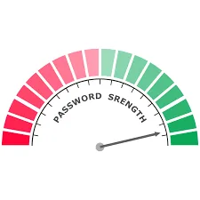
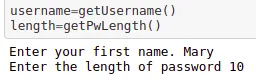

Generating a strong password is very much important in today's world. It is peculiar to secure our digital privacy from hackers and being victims of their malicious activities.

So, let's get started by creating a strong password according to the user the first name.

**Step 1:** Import the necessary model

**import** **numpy** **as** **np**

**import** **random**

**Step 2:** Initialize the necessary symbols for creating a strong password

```python
operators="!@£$%^&*?+-#%{}[]<>,."
num="1234567890"
chars='abcdefghijklmnopqrstuvwxyzABCDEFGHIJKLMNOPQRSTUVWXYZ'
```

Here I have included all the operators, characters and numerical data to include in the password for making it strong.

**Step 3:** Get the username from the user

```python
def getUsername():
    username=input("Enter your first name. ")
    if username== '' or username.isalpha()==False :
        print("The username can't be empty and should
        contain character.")
        username=getUsername()
    return username
```

Here I created a recursive function if the username is empty or have any numerical numbers, then it asks the user to re-enter the name. This function is made to ensure a non-empty and non-numerical input name.

**Step 4**: Get the desired length of the password.

The length must be greater than 8.

```python
def getPwLength():
    length=int(input("Enter the length of password "))
    if 8>length<16:
        while(length<8):
            print("The length of password must be
            greater or equal to 8 and less than 16 ")
            length=int(input("Re-enter the length of
            password ")
    return length
```

The username and password can be given as:



**Step 5**: Generate a random password

Then I generated the random password from the set the symbols we assigned before and concatenate with the username. Then converting it into the list I shuffled the password and returned the output in a form of a string as a strong generated password.

```python
pwd=operators+num+chars
pw=''
for i in range(length-len(username)):
    pw += random.choice(pwd)
pw=username+pw
pword =ConvertToList(pw)
random.shuffle(pword)
password=ConvertToString(pword)
print("The final password having the username is" , password)
```

The final output is

```python
The final password having the username is M<#ZyryTaM
```

You can get the [repo from here](https://github.com/Ayushma00/DataInsight_Project/blob/main/Password%20generator%20from%20first%20name.ipynb).
