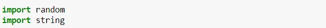
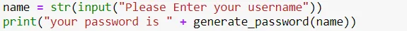
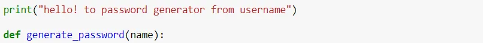
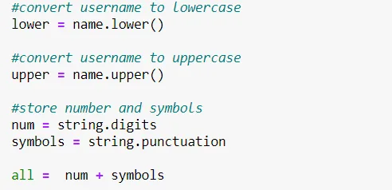
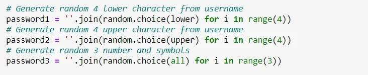
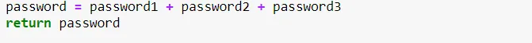
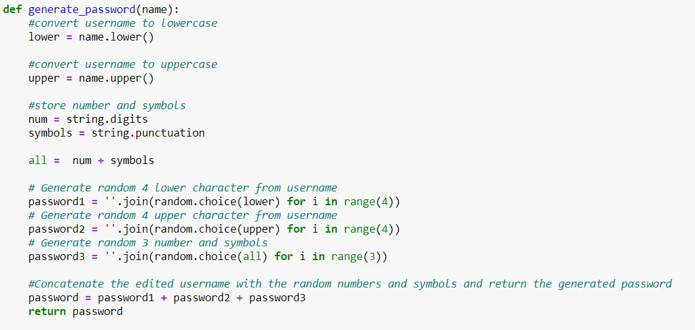
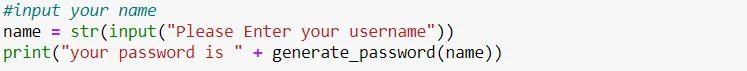
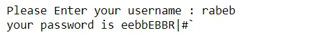

In this post, you will learn how to create a random string passwords in Python. Using a random and string module, we can write our own password generator.

## Steps to Create a Random String

**1- Import String and Random modules**

**2- Use the string constant digits and symbols and the function upper() and lower()**

**3- Use a for loop and random.choice() function to choose characters from a source**

**4- Generate a password generator**

Let's code a function that generates a password from the username.

1- Import modules

2- Input the username to generate the password

3- Define our function generate_password

3-1 Convert the username to uppercase and lowercase letters.

store numbers and symbols

"digits contain '0123456789'

punctuation contain all special symbols '!”#$%&'()\*+,-./:;<=>
 @[\]^_`{|}~.' "

3-2 Generate random characters from lowercase, uppercase
 username and all (numbers and symbols)

3-3 Concatenate and return password from username, numbers and symbols

## There is our function below

## Let's test our funtion

## Output:

You can find the whole project on [my Github](https://github.com/rabebbenothmen/Data-Insight2021/tree/main/Assignments)
