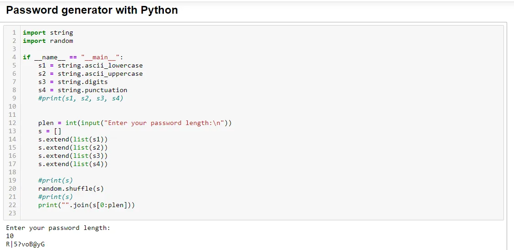

A random password generator is a software program, hardware device, or online tool that automatically generates a password using parameters that a user sets, including mixed-case letters, numbers, symbols, pronounceability, length, and strength.

To do this in Python, you have to knowledge of the subsequent Python programming topics:

- Python string method
- Python random modules
- Python import, input, output

**Import Modules**

```python
import string
import random
```

**Generate a password**

Here we use common string methods that provide us with all capital letters, small letters, digits & punctuation. We need our password strong so we need all of these things. You can also print s1-s4 individuals to understand better.

```python
if __name__ == "__main__":
    s1 = string.ascii_lowercase
    s2 = string.ascii_uppercase
    s3 = string.digits
    s4 = string.punctuation
    #print(s1, s2, s3, s4)
```

We want to generate our password with a certain length. So we take integer password length(plen) from the input method. After that, we created an empty list and extend all the variables (s1, s2, s3, s4) as a list into s.

```python
    plen = int(input("Enter your password length:\n"))
    s = []
    s.extend(list(s1))
    s.extend(list(s2))
    s.extend(list(s3))
    s.extend(list(s4))
```

**Shuffle and print**

At this stage, we have all the letters(uppercase & lowercase), digits and punctuations into s. Then we need to shuffle. Because if we don't shuffle randomly this appears like 'abcdef'. It's so unfair and also a very weak password. We want a password with the combination.Finally after shuffle we join letters/digits/punctuation into ("") delimiter.And the length of the password is selected by the user. It's print 0 to 'plen' index. Enjoy the code! Happy Coding!

```python
    random.shuffle(s)
    print("".join(s[0:plen]))
```


