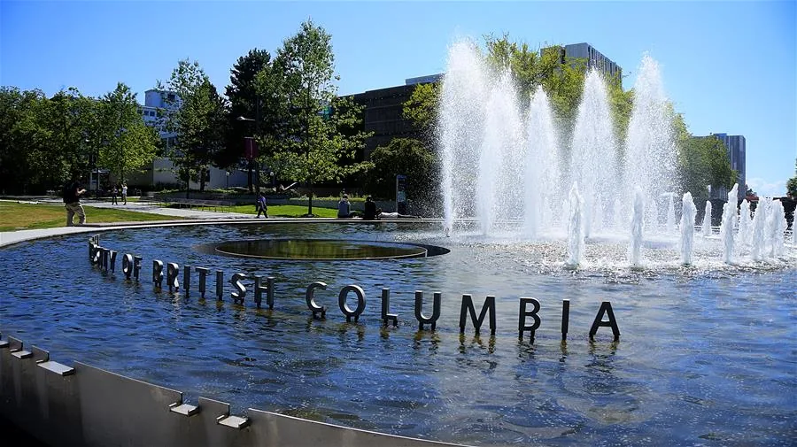

[Aina Adekunle](https://linktrest.io/aina)

Department of Physics, Memorial University of Newfoundland, St. John’s, A1B 3X7, Canada.

In this statement, I will give information about my academic and research experience as well as my goal and interest in pursuing a PhD in Physics at the University of British Columbia (UBC).

I am generally interested in computational soft matter and biophysics. My immediate goal is to become an independent researcher in this field. Under the supervision of Dr Stefan Wallin at University of Newfoundland, I currently use Monte Carlo-based methods with a coarse-grained model to study proteins. Consequently, I show here my interest in working with Dr Steven Plotkin and/or Dr Joerg Rottler. It is my sincere desire that you will find me adequately prepared towards achieving this goal at UBC.

## 1. Research Experience

Since the beginning of fall 2016 I have been working on a research project that brings to me every single day something fascinating and each night one thing that provokes suggestive thoughts. I am working in the field of biophysics and I use computational tools mainly computer simulations to study proteins and specific phenomena such as protein folding.

Proteins are biomolecules, present in all living organisms, which perform wide spectrum of functions necessary for the continuous existence of any organism (1). When proteins are synthesized in living cells, they are usually long sequences of tens or hundreds or sometimes thousands of amino acid residues. However, something remarkable happens afterwards, on biological time scale i.e. within seconds, a protein undergoes a biophysical process in which it falls over itself – a process termed protein folding to form a compact three dimensional structure; the so called native structure (2).

Since many biologically motivated problems, e.g. determining the molecular mechanism for specificity in protein-protein interaction (3), require the comparison of many molecules, Dr Wallin and I have been using a Monte Carlo-based algorithm with the inherent capability of calculating the thermodynamics of many protein sequences in a single simulation. This is contrary to standard algorithms like simulated tempering (4) which simulate one sequence at a time. We have tested the multisequence algorithm in a coarse grained model for protein folding (5) and applied it to set of model sequences that fold into very different structures.

The thermodynamic data provided by this algorithm has enabled us, more than before, to systematically investigate how proteins switch or change from one fold to another (6).

**Publication and Presentation**

Some of the work I have been doing with Dr Wallin in this past year has been published in the Journal of Chemical Physics. The title of the paper is “Multisequence algorithm for coarse-grained biomolecular simulations: exploring the sequence-structure relationship of proteins” (6). In this work, all computer simulations were performed by me. I did the data analysis and wrote the section on the computational efficiency of the multisequence algorithm. Moreover, I produced most of the figures and was largely involved in proof reading and editing the whole manuscript.

Furthermore, I had the opportunity to present part of our work in a poster at the Engineering Conferences International (ECI), Association in Solution IV Conference, Canada 2017, where I won the Royal Society of Chemistry Soft Matter poster prize. It is also noteworthy that I was among the organizers and the audio-visual person for the conference.

It is my belief that these activities in the last one year including data collection and analysis, research, manuscript preparation and conference presentation are contributing immensely to my knowledge and potential in becoming an independent researcher in the field of computational biophysics and soft materials. I have gained not only analytical, research and computational skills but also presentation, organizational and interpersonal skills.

## 2. Statement of Academic Goals

It is now 15 years since I first sat in a physics class as a fresh high school student. Not only is my interest consistently growing in this fundamental subject that provides the tools required to understand the world around us but also my curiosity has continued to intensify over these years. Now, I believe my experience and unwavering interest have prepared and positioned me rightly to begin and ultimately complete a PhD in Physics at UBC.

My goal, if given the opportunity at your university, is to develop research skills and become an independent researcher after my studies. I plan to work in any research institution; university, industry or government. My “UBC” decision, besides other non academic reasons, is born out of the fact that UBC, in particular, researchers at the Department of Physics and Astronomy, conduct cutting edge research that the entire world attests to.

Given the research experience that I have had in the past one year, which has horn my abilities in data analysis, computation, scientific writing and presentation, I have no doubts that one day, in the nearest future, I will join the scientific community in unraveling the mysteries that still belie our understanding of biomolecules and soft materials. For instance, how do new protein folds arise in evolution? (7) Does protein folding follow theoretically hypothesized many-pathway model or the

experiment-based defined-pathway model? (8) How can we develop new algorithms that will consistently predict the structures of proteins to high accuracy? (9)

Although the answers to these questions and many more still elude our understanding, they are not beyond our reach. I want to be part of the scientific community that sets out to provide these answers, I want UBC to be part of my journey.

**Computation and Biophysics**

I became interested in computational soft matter and biophysics when I arrived at Memorial University in the fall of 2016 for my master’s degree. I was particularly motivated and intellectually intrigued by the question raised by Cyrus Levinthal in his 1968 paper (10) after Christain Afinsen *et al.* (11, 12) showed, experimentally, that some proteins can fold reversibly which implies the native structures are thermodynamic favorable states (13). How can such proteins achieve global free energy minimum and do so quickly? He asked. Since then, I have been using computer simulations to study these molecular machines known as proteins, their physical and biological implications.

Due to the large size and flexible nature of these biomolecules, they are known to be relatively difficult to study computationally (14). However, under the supervision of Dr Wallin, I am using Monte Carlo-based methods (simulated tempering (4) and multisequence algorithms (6)) with an intermediate resolution coarse-grained protein model (5) to study protein evolution, protein folding and protein fold switching.

In spite of the numerous algorithms and models available for studying biomolecules like proteins, my current research focuses on improving and developing new ones with better sampling efficiency to speed up biomolecular simulations. More so at the core of my research is to understand how new protein folds arise in evolution. The question is, can protein fold switching (a recently discovered phenomenon exhibited by some proteins) (15, 16) explain the evolution of new folds? This is an important question because of its potential biotechnological applications.

**Interest in Dr Plotkin and Dr Rottler**

My interest lies in computational soft matter and biophysics which is one of the core areas of research at the Department of Physics and Astronomy, UBC. I am particularly interested in the work of Dr Plotkin and Dr Rottler, each of whom I have contacted. While Dr Plotkin’s group explores theoretical and computational problems in biophysics including protein misfolding and aggregation (17), Dr Rottler’s group employs computer simulations and the tools of statistical mechanics to understand and predict the behavior of soft materials in and out of equilibrium (18, 19).

The two research groups therefore seek to see if the theoretical predictions from their studies agree with experimental observation. This incredible ability of theory computation to make such predictions is what fascinates me. I think there is a fundamental overlap between my current study and what they are doing in their respective group, which is to use theory and computation to study and predict the behavior of biomolecules and soft materials. I will indeed appreciate and utilize the

opportunity to work with any of them.

## 3. Leadership Experience

After careful investigation, when I arrived at Memorial University, I noticed that students in the Department of Physics have not been represented at the Graduate Student Union for many years. This I considered utterly unacceptable. Immediately, I brought this to the awareness of all the students and gave them reasons why it is important for us to be part of the decisions made by the Union. Most importantly is the fact that first, every student obligatorily contribute financially to the union and second, the union’s decisions affect all students as well. Consequently, after an electioneering process, I was elected to be their representative in the Board of Directors of the union.

This has given me the opportunity to be an advocate for the prudent spending of students’ money and the need to be more focus in providing students with programs that affords them more support in their graduate studies experience. In the past, as an undergraduate student, I utilized my position as the President of the National Association of Physics Students to organize tutorials and computer training sessions to 50 students. Something that was unprecedented.

Moreover, during my one year national youth service to my home country (Nigeria), I served as the Secretary of the Millennium Development Goals (MDGs) Group, where I helped, among other things, facilitate and publicize the MDGs among high school students.

Furthermore, I am currently volunteering by representing all graduate students at the Faculty of Science Faculty Council meetings because I belief graduate students need to be abreast with the necessary information and carried along in Faculty decisions. So besides my studies at Memorial University, I hold both Teaching and Research Assistantships, I represent the Department of Physics at the Graduate Student Union Board of Directors and sit on Faculty of Science Faculty Council as the Graduate Studies Representative. The ability to simultaneously combine all of these duties with optimum performance is an evidence, I think, of my leadership and time-management skills.

**Academic Achievement**

Indeed the year 2004 is a remarkable year of my life. The year that sparked the light of physics in me, a eureka moment that ushered my inquiry into the nature of matter. I was in final year of my secondary education when Mr. Afolabi who was my physics teacher started with topics in modern physics. My curiosity instantly arose when he stated that “all the classical laws we had studied hitherto is not the complete story, there is more! The quantum ideas”, which he introduced.

Prior to that time, I thought what I had learned about classical laws is the ultimate. I was wrong but that particular moment put me on a path to search and know more about physics. Since then my knowledge of physics has continued to grow every step in my life. I went on to make a distinction in ordinary level physics and major in physics at the University of Lagos, Nigeria. I started brilliantly with a grade point average of 4.80 out of the possible 5.00 (a rare achievement in the physics program) and was awarded the university’s endowment scholarship for outstanding

performance.

During my undergraduate studies, I offered and had ‘A’ grade in each of the following specialized courses; classical mechanics, quantum mechanics, statistical mechanics, electrodynamics, solid state physics, and mathematical methods. Consequently, I retained the university scholarship every year throughout my studies for a consistent academic performance which culminated to a First Class bachelor’s degree in physics and electronics.

I also won the best student prize in physics at graduation and was as a result employed as a Teaching and Research Assistant in the Department of Physics. There, I had the experience of teaching first year introductory physics courses and participated in the research (chaos theory) that was going on at the Theoretical Physics Research Group for one year before coming to Memorial University.

At Memorial, my average is currently 90.5 percent after taking thermodynamics and statistical physics, condensed matter physics, electrodynamics and scientific programming. This is a consistency I am proud of.

## 4. Expectation

I want to continue my studies and research at the University of British Columbia because of its transformational research, innovation and strong connections to industry which bring exciting applied research opportunities. With my background, experience and passion for physics, I know I am prepared for your PhD in physics program. I am also optimistic that by using the powerful tool of computation your program will lead me through the path of unraveling the mysteries that still belie our understanding of the behavior of soft matter. It is my sincere hope that you will find me adequately prepared and suitable to further my studies at UBC.

Thank you for your time.

This was my statement (without the images) to the admissions committee at the Department of Physics and Astronomy, University of British Columbia to study for a PhD in Physics.

Share your own graduate (Masters or PhD) experience [here](http://www.datainsightonline.com/blog/categories/life).

**References**

1. Finkelstein, A., and O. Ptitsyn. 2002. Protein Physics. USA: Academic press, Elsevier science.

2. Creighton, T. 1993. Proteins: Structure and Molecular Properties. New York: Freeman.

3. Hakes, L., S.C. Lovell, S.G. Oliver, and D.L. Robertson. 2007. Specificity in protein interactions and its relationship with sequence diversity and coevolution. Proc. Natl. Acad. Sci. U. S. A. 104:7999–8004.

4. Marinari, E., and G. Parisi. 1992. Simulated Tempering: A New Monte Carlo Scheme. Europhys.Lett. 19: 451–458.

5. Bhattacherjee, A., and S. Wallin. 2012. Coupled folding-binding in a hydrophobic/polar protein model: impact of synergistic folding and disordered flanks. Biophys. J. 102: 569–78.

6. Aina, A., and S. Wallin. 2017. Multisequence algorithm for coarse-grained biomolecular simulations: Exploring the sequence-structure relationship of proteins. J. Chem. Phys. 147:95102.

7. Bornberg-Bauer, E., A.-K. Huylmans, and T. Sikosek. 2010. How do new proteins arise? Curr.Opin. Struct. Biol. 20: 390–396.

8. Englander, S.W., and L. Mayne. 2017. The case for defined protein folding pathways. Proc. Natl.Acad. Sci. 114: 8253–8258.

9. Dill, K.A., and J.L. MacCallum. 2012. The Protein-Folding Problem, 50 Years On. Science (80-. ). 338: 1042–1046.

10. Levinthal, C. 1968. Are there pathways for protein folding? J. Chim. Phys. 65: 44–45.

11. Anfinsen, C.B., E. Haber, M. Sela, and F.H. White. 1961. The kinetics of formation of native ribonuclease during oxidation of the reduced polypeptide chain. Proc. Natl. Acad. Sci. U. S. A. 47: 1309–14.

12. Anfinsen, C.B. 1973. Principles that Govern the Folding of Protein Chains. Science (80-. ). 181:223–230.

13. Dill, K.A., and H.S. Chan. 1997. From Levinthal to pathways to funnels. Nat. Struct. Mol. Biol. 4: 10–19.

14. Dai, Z., and D. Becerra. 2017. Research Article On Stable States in a Topologically Driven Protein Folding Model. 24: 1–12.

15. Bryan, P.N., and J. Orban. 2010. Proteins that switch folds. Curr. Opin. Struct. Biol. 20: 482–488.

16. Bernhardt, N.A., W. Xi, W. Wang, and U.H.E. Hansmann. 2016. Simulating Protein Fold Switching by Replica Exchange with Tunneling. J. Chem. Theory Comput. 12: 5656–5666.

17. Cashman, N.R., S.S. Plotkin, and C.G. William. 2010. Methods and Systems for Predicting Misfolded Protein Epitopes. Invention. Application #: 12/574,637, Publication #: US 2010/0233176 A1

18. Makke, A., M. Perez, J. Rottler, O. Lame, and J.-L. Barrat. 2011. Predictors of Cavitation in Glassy Polymers under Tensile Strain: A Coarse-Grained Molecular Dynamics Investigation. Macromol. Theory Simul. 20: 826–836.

19. Rottler, J., and M.O. Robbins. 2003. Shear yielding of amorphous glassy solids: effect of temperature and strain rate. Phys. Rev. E. Stat. Nonlin. Soft Matter Phys. 68: 11507.
